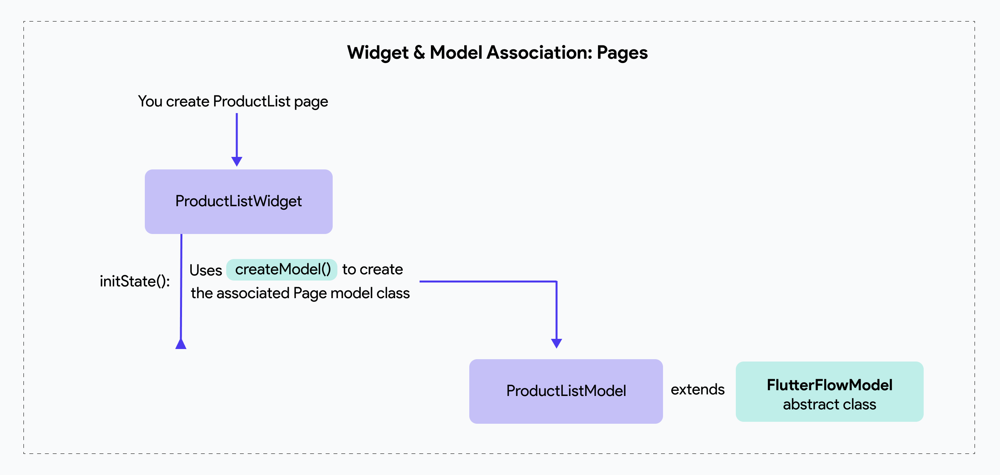
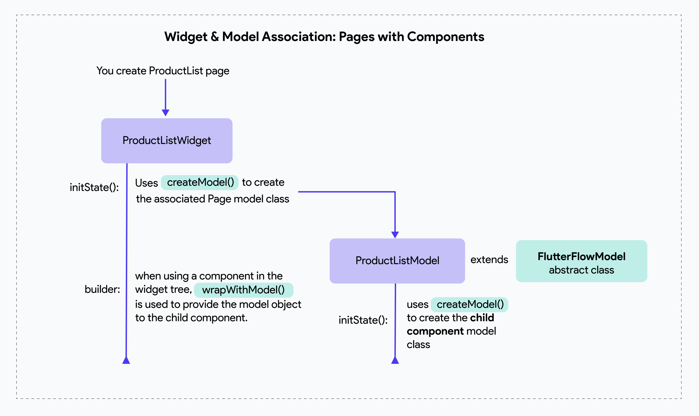

# FlutterFlow Model

The `FlutterFlowModel` class is an abstract class used in FlutterFlow to provide a unified and extensible structure for managing state and behavior of widgets (both pages and components). It encapsulates **initialization, state management,** and **disposal** logic, making it easier to handle the lifecycle of widgets and their models. 

FlutterFlow automatically generates the `flutter_flow_model.dart` file, which contains the `FlutterFlowModel` class and utility methods like `wrapWithModel()` and `createModel()`.

The diagram below illustrates how these utility classes and methods are utilized in a widget or model class:




When a component is added to your page (and every component you create [generates both a widget and a model class)](component-gen-code.md), the flow below explains how the utility classes are used when there is a child component:



<p></p>

Here’s a breakdown of the lifecycle of `FlutterFlowModel` class:

## Initialization
Ensures the model is initialized **only once** and is tied to the `BuildContext` and the widget it is associated with.

```js
abstract class FlutterFlowModel<W extends Widget> {
  // Initialization methods
  bool _isInitialized = false;
  void initState(BuildContext context);
  void _init(BuildContext context) {
    if (!_isInitialized) {
      initState(context);
      _isInitialized = true;
    }
    if (context.widget is W) _widget = context.widget as W;
    _context = context;
  }
```


## Widget & Context references 

Provides references to the associated widget and its `BuildContext`.

```js
  // The widget associated with this model. This is useful for accessing the
  // parameters of the widget, for example.
  W? _widget;
  W? get widget => _widget;

  // The context associated with this model.
  BuildContext? _context;
  BuildContext? get context => _context;
```

`_widget` and `_context` (private fields) store the widget and context references. `widget` and `context` (getters) are the public accessors for `_widget` and `_context`.

## Disposal

Manages the cleanup of resources when the model or widget is disposed.

```js
 bool disposeOnWidgetDisposal = true;
  void dispose();
  void maybeDispose() {
    if (disposeOnWidgetDisposal) {
      dispose();
    }
    // Remove reference to widget for garbage collection purposes.
    _widget = null;
  }
```
The `disposeOnWidgetDisposal` determines whether the model should be disposed when the widget is removed. This defaults to `true` for **pages** and `false` for **components** (as parent models typically manage their child components).

The `maybeDispose()` checks `disposeOnWidgetDisposal` before disposing. It removes the widget reference to aid garbage collection.

## Updates and Change Notification

Allows the model to notify the associated widget or parent component/page when updates occur.

```js
 // Whether to update the containing page / component on updates.
  bool updateOnChange = false;
  // Function to call when the model receives an update.
  VoidCallback _updateCallback = () {};
  void onUpdate() => updateOnChange ? _updateCallback() : () {};
  
  FlutterFlowModel setOnUpdate({
    bool updateOnChange = false,
    required VoidCallback onUpdate,
  }) =>
      this
        .._updateCallback = onUpdate
        ..updateOnChange = updateOnChange;
  
  // Update the containing page when this model received an update.
  void updatePage(VoidCallback callback) {
    callback();
    _updateCallback();
  }
```

## wrapWithModel() 

The `wrapWithModel()` method in FlutterFlow links a model to a widget and its child widgets, allowing them to access and manage state. It wraps the widget with a Provider, making the model available throughout the widget tree.