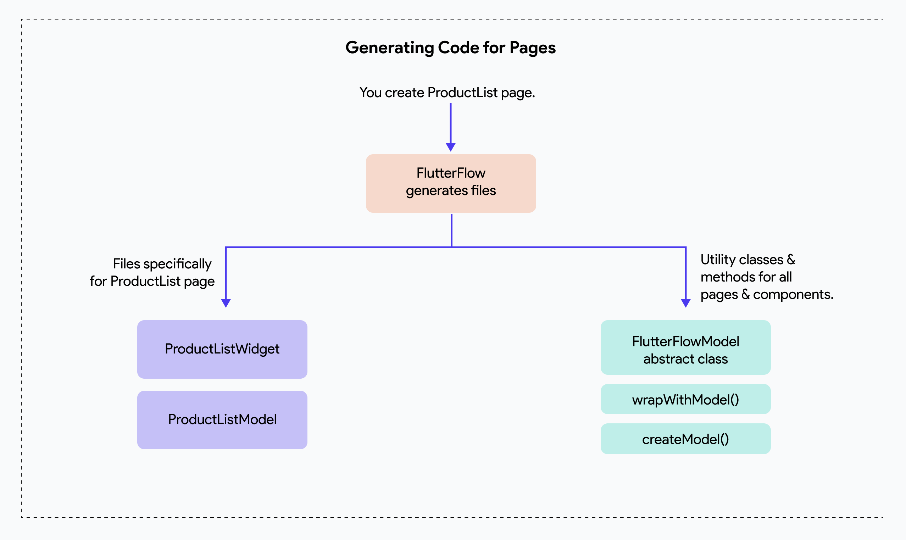

# Generated Code: Pages

When you create a new Page in FlutterFlow, it automatically generates two files: a `Widget` class and a `Model` class. So if the name of the page you created is called **ProductListPage**, FlutterFlow generation backend will automatically create **ProductListPageWidget** class and **ProductListPageModel** class. 

:::info[Prerequisites]
This guide uses examples from the generated code of the **[EcommerceFlow demo app](https://bit.ly/ff-docs-demo-v1)**. To view the generated code directly, check out the **[Github repository](https://github.com/FlutterFlow/sample-apps/tree/main/ecommerce_flow)**.
:::

## PageModel class

 The `PageModel` classes are responsible for managing the state of individual pages and initializing the components used in these Pages. These classes extend the `FlutterFlowModel` class, which provides a consistent structure and shared functionality across all page models.

The following diagram shows how FlutterFlow generates the model and widget class when you create a new Page in FlutterFlow: 


:::tip[FlutterFlow Model]
To learn more about the utility classes and methods that FlutterFlow generates for all pages & components, see [**the FlutterFlowModel document**](flutterflow-model.md). 
:::


#### Managing Local State

A `PageModel` class typically holds local state fields specific to the page, which correspond to the **[Page State variables](../resources/ui/pages/page-lifecycle.md#page-state)**. 

For example, in the ProductListPage, user may create a Page State variable called `searchString`. Correspondingly, in the `product_list_page_model.dart` [file](https://github.com/FlutterFlow/sample-apps/blob/main/ecommerce_flow/lib/product/product_list_page/product_list_page_model.dart) (which is the `Model` file for the `ProductListPage`), the corresponding state field would be `_searchString`. This private field stores the current search string and includes a getter and setter to manage its value while logging any changes.

```js
String? _searchString;
set searchString(String? value) {
  _searchString = value;
  debugLogWidgetClass(rootModel);
}
String? get searchString => _searchString;
```

:::tip[Private variables in Dart]
In Dart, variables that start with an underscore (`_`), such as `_searchString`, are private to the class. This means they cannot be accessed outside the class or its scope.
:::

In addition to managing local state, the given `PageModel` class also contains fields for handling the state of widgets on the page. For instance, `_dropDownValue` is a private field that stores the current value of a dropdown widget (if it is added to the current Page). Similar to `_searchString`, it has a getter and setter that logs changes to this field.

```js
String? _dropDownValue;
set dropDownValue(String? value) {
  _dropDownValue = value;
  debugLogWidgetClass(rootModel);
}
String? get dropDownValue => _dropDownValue;
```

#### Initializing child component models
The `PageModel` class is also responsible for initializing the models of components used on the page. For example, if the page includes a `CartCounter` component, the model for this component is initialized within the page's model class.

```js
// Model for CartCounter component.
  late CartCounterModel cartCounterModel;

@override
void initState(BuildContext context) {
    cartCounterModel = createModel(context, () => CartCounterModel()..parentModel = this);
    
}
```
:::info
Only the model class of a child component is initialized inside the page or parent model class. In the case of page model classes, they are initialized within the widget’s state class itself. See the **[Widget class section](#pagewidget-class)** for more details.
:::

When dealing with dynamic lists of components, such as those in a `ListView`, Row, or Column widget, the `PageModel` initializes a `Map<String, FlutterFlowModel>` to manage the state of each component instance. For example, if the page includes a list of `CategoryAvatar` components, the initialization might look like this:

```js
// Models for CategoryAvatar dynamic component.
  Map<String, FlutterFlowModel> categoryAvatarModels = {};
```

#### dispose()

Finally, the `dispose` function in the `ProductListPageModel` class is used to clean up resources when they are no longer needed. This is a common practice in Flutter to prevent memory leaks.  In this class, the `dispose` function is overridden to dispose of the `cartCounterModel`, `searchQueryFocusNode`, and `searchQueryTextController`.

```js

  @override
  void dispose() {
    cartCounterModel.dispose();
    searchQueryFocusNode?.dispose();
    searchQueryTextController?.dispose();
  }
```


## PageWidget class

The `PageWidget` classes are responsible for creating the UI of individual pages and holding the widget tree as designed in the FlutterFlow canvas. These classes always extend Flutter's `StatefulWidget` class utilizing Flutter's built-in state management through `setState` to handle dynamic updates and interact with the app's lifecycle.

```js
class ProductListPageWidget extends StatefulWidget {
    const ProductListPageWidget({super.key});

    @override
    State<ProductListPageWidget> createState() => _ProductListPageWidgetState();
}
```

#### PageModel Initialization
Within the State class, the `PageModel` object is initialized. [This class](#pagemodel-class) serves as a centralized place to manage the page’s state, handle business logic, and interact with the data layer.

```js
class _ProductListPageWidgetState extends State<ProductListPageWidget> {
    late ProductListPageModel _model;

    @override
    void initState() {
        super.initState();
        _model = createModel(context, () => ProductDetailPageModel());

    }

```

#### PageModel Dispose
Similarly, the [`dispose` method](#dispose) of the `PageModel` class is invoked from the **overridden** `dispose` method of the widget's **State** class. This ensures that any resources managed by the `PageModel`, such as listeners or controllers, are properly released when the widget is removed from the widget tree.

```js
  @override
  void dispose() {
    _model.dispose();
    super.dispose();
  }
```

#### Global Scaffold Key
Each page includes a `GlobalKey` for the `Scaffold`, which can be used to manage the scaffold's state, such as opening or closing drawers or snackbars programmatically.

```js
final scaffoldKey = GlobalKey<ScaffoldState>();

return Scaffold(
    key: scaffoldKey,
    ...)
```

#### Keyboard Dismissal
Moreover, the root widget of every page is a `GestureDetector` with an `onTap` callback that unfocuses the current input field. This approach ensures that tapping anywhere outside an input field dismisses the keyboard or removes focus, creating a better user experience.

```js
return GestureDetector(
    onTap: () {
    FocusScope.of(context).unfocus();
    FocusManager.instance.primaryFocus?.unfocus();
    },
...)
```

These functionalities are automatically added by FlutterFlow to ensure seamless navigation and proper keyboard handling across pages.

### onPageLoad Action: Generated Code

When you define actions for the `onPageLoad` action trigger of a Page, these actions are added inside an `addPostFrameCallback` method within the page's `initState` method. This ensures that the **on Page Load** actions are executed after the widget is fully built and rendered. This avoids issues caused by trying to update the UI before it is ready.

```js
 @override
  void initState() {
    super.initState();
    _model = createModel(context, () => ProductListPageModel());

    // On page load action.
    SchedulerBinding.instance.addPostFrameCallback((_) async {
      _model.searchString = null;
      safeSetState(() {});
      ... // more actions
    });
    
  }
```

:::tip[safe Set State]
The `safeSetState` method is a custom implementation built on top of Flutter's `setState` method. It ensures that `setState` is only called when the widget is currently mounted, preventing potential runtime errors.
:::