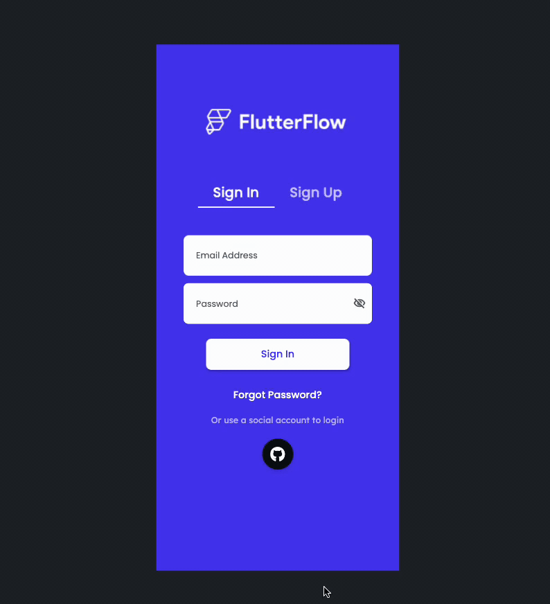
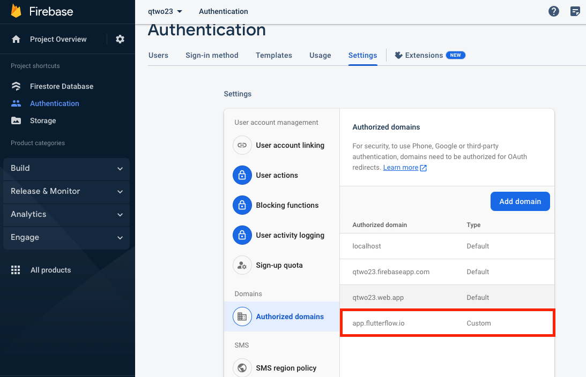
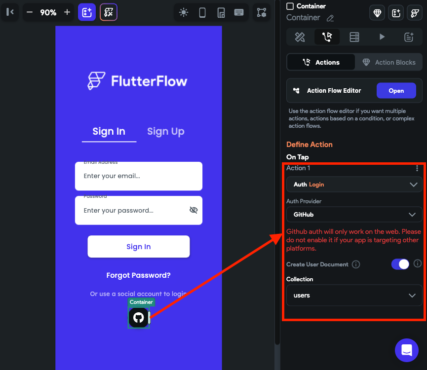

# GitHub Login
The GitHub auth provides a convenient way for users to authenticate and log in to your application using their GitHub accounts.

:::info[Prerequisites]

Before getting started with this section:

- Complete [**Firebase Setup**](#).
- Complete [**Initial setup**](initial-setup.md) required for authentication.
:::

## Adding GitHub auth

Adding GitHub auth comprises of following steps:

1. [Enabling GitHub authentication in Firebase](#1-enabling-github-authentication-in-firebase)
2. [Adding GitHub login action](#2-adding-github-login-action)

### 1. Enabling GitHub authentication in Firebase

To enable GitHub authentication in the Firebase:

1. Open the [Firebase console](https://console.firebase.google.com/), Click on **Authentication** ( in the left side menu).
2. Select the **Sign-in method** tab, and select **GitHub**. If you have already added another provider, click on the **Add new provider**, select **GitHub**, and **Enable** it.
3. To get the **Client ID** and **Client Secret**, [register your app](https://github.com/settings/applications/new) as a developer application on GitHub, and while doing so, paste the authorization callback URL to your GitHub app configuration.
4. Click **Save**.

    <iframe 
        src="https://www.loom.com/embed/b970983169dc4240a979a2d74ec63450?sid=8a91fa0b-eabd-4e76-bfaf-37011c807421"
        title=""
        style={{
            position: 'absolute',
            top: 0,
            left: 0,
            width: '100%',
            height: '100%',
            colorScheme: 'light'
        }}
        frameborder="0"
        loading="lazy"
        webkitAllowFullScreen
        mozAllowFullScreen
        allowFullScreen
        allow="clipboard-write">
    </iframe>

5. To test the app in Run Mode, add our domain to **Authorized domains**.
    

    

### 2. Adding GitHub login action

Follow the steps below to add GitHub login action:

1. Select the widget (e.g., Button) on which you want to add the action.
2. Select **Actions** from the properties panel (the right menu), If it's the first action, click **+ Add Action** button. Otherwise, click the "**+**" button below the previous action tile (inside *Action Flow Editor*) and select **Add Action**.
3. Search and select the **Login** (under *Backend/Database > Firebase Authentication*) action.
4. Set **Auth Provider** to **GitHub**.

:::info
To let users log out of your app, you can use [**this**](../../logout-action.md) action.
:::