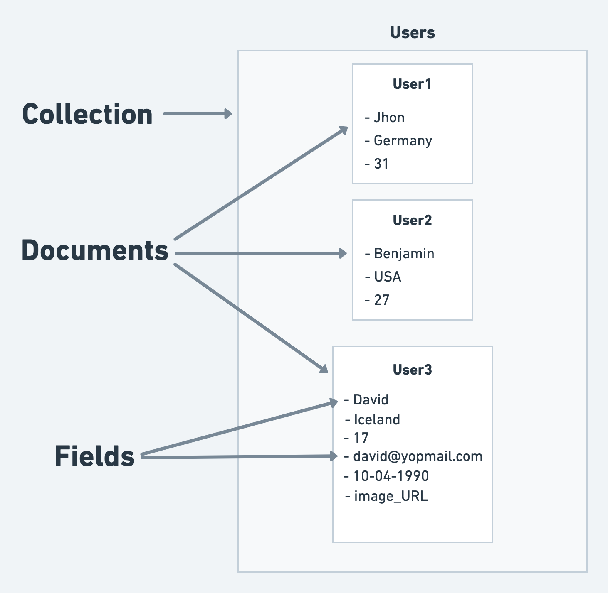

# Creating Collections

A collection is a group of documents. For example, you could have a 'users*'* collection that contains a list of documents, each representing a single user.

<figure>
    
  <figcaption class="centered-caption">User collection document model</figcaption>
</figure>

:::info[Getting Started: Things to Know First]

- Get to know how to [**structure the Firebase Database**](getting-started.md#structuring-the-database).
- Ensure you've gone through and completed every step in the [**Firebase Setup**](../../firebase/connect-to-firebase-setup.md) 
  for your project.
:::

## Creating a collection

Here are the steps to create a collection:

2. Click on the **Firestore** from the Navigation Menu (left side of your screen).

5. Click on the **(+)** Plus sign button.
8. A popup will appear, Enter the collection name and click **Create** Button.
11. Next, [define the collection schema](#define-schema-creating-fields) (create Fields) and 
[add some data](firestore-actions.md#create-document-action) to the collection.

:::info
A collection will only appear on [**Firebase Console**](https://console.firebase.google.com/u/0/) if it contains at least one document.
:::

<iframe src="https://www.loom.
com/embed/14d7680203494e2bbbffef58535a6499?sid=6a4620bc-0195-4c24-93b3-e5bcd9fd4c94" frameborder="0" allow="accelerometer; autoplay; clipboard-write; encrypted-media; gyroscope; picture-in-picture; web-share" referrerpolicy="strict-origin-when-cross-origin" allowfullscreen></iframe>

### Define Schema (Creating Fields)

A document represents a single item or entity, such as a user, post, animal, etc. To add data inside the document, you must define the document schema by creating Fields. Creating Fields helps you know what kind of data a document can contain.

Although you can add more fields later on, it's always a good idea to add fields from the start.

:::caution
Field names cannot be changed, so ensure that you have used the correct Field names.
:::

To define the schema (create fields) for the document:

1. Select your collection from the list on the left side.
5. If you haven't added any fields yet:

	1. You can choose from the template collections that have common fields needed in most 
       applications. This will auto-add all the fields.
	5. Click on **Start from scratch** to define your own schema.
	8. Or, use [AI Gen Schema](#create-schema-using-ai-gen).
8. To add a new field, start typing its name (e.g., title, description, date, etc.) and choose the suitable **Data Type**.
11. While choosing the Data Type, you can set if it will be a list or not using **Is List?** toggle.

	1. You can keep it disabled for storing only a single value. For example, fields such as title,
    description, price, etc., can have only one value. You can't have multiple titles for a single post.
	5. You can enable it to store multiple values of the same data type. For example, to store the list of accessory names for the field accessories.
14. Click on the **Done** icon.

:::tip
You can also use *Tab* and *Enter* keys to navigate quickly while creating fields.
:::

<iframe src="https://www.loom.
com/embed/7e7f80567cae477fbf97d937a76c4042?sid=84cbccd3-d084-4f9c-8dae-eff833cd2310" frameborder="0" allow="accelerometer; autoplay; clipboard-write; encrypted-media; gyroscope; picture-in-picture; web-share" referrerpolicy="strict-origin-when-cross-origin" allowfullscreen></iframe>

### Create schema using AI Gen

With **AI Gen Schema**, you can automatically generate a schema for your Firebase collection from a 
simple prompt.

:::tip[To get better results...]
...you can try optimizing your prompt. i.e., make it more descriptive.
:::

Example prompts:

- Generate a collection for books, their reviews, and their purchase history.
- Create a database schema for music albums, their ratings, and sales records.
- Generate a collection for video games, their user reviews, and purchase history.
- Create a collection for art exhibits, visitor reviews, and ticket bookings.
- Generate a collection for online courses, student feedback, and enrollment records.

<iframe src="https://www.loom.
com/embed/f3a3c7ad69194342926f83036f07b243?sid=e4ed8f7c-6465-42c3-a46e-0e80a4d1e202" frameborder="0" allow="accelerometer; autoplay; clipboard-write; encrypted-media; gyroscope; picture-in-picture; web-share" referrerpolicy="strict-origin-when-cross-origin" allowfullscreen></iframe>

---

:::note
To learn more about custom data types within FlutterFlow, [check this doc](../../../resources/data-representation/data-types#built-in-data-types)
