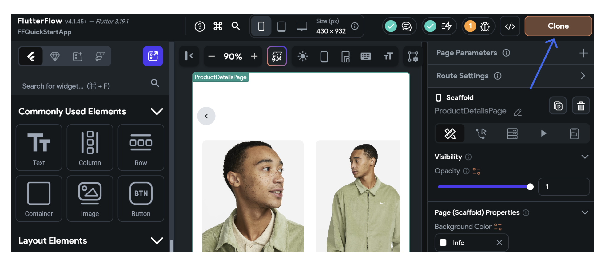

# **Build your first app**

This guide will walk you through creating and running your first FlutterFlow app. In this app, users can adjust the quantity of a product before adding it to their shopping cart.

It’s very straightforward yet introduces you to some fundamental concepts in app development. Here's how it looks when completed:

<iframe src="https://demo.arcade.software/YXXxpSfeOUgkt9JAOxUL?embed&show_copy_link=true" title="Update product quantity" frameborder="0" loading="lazy" webkitallowfullscreen mozallowfullscreen allowfullscreen allow="clipboard-write" width="100%" height="800"></iframe>

> **What you'll learn**
> - Creating layouts (add widgets)
> - Adding interactivity to UI elements
> - Handle app behavior in response to user interactions (manage state).
> - Running your app

#### The steps to build the app are as follows:

1. [Clone or create project](#clone-project)
2. [Building UI](#build-ui)
3. [Customize style](#customize-style)
4. [Add state](#add-state)
5. [Run the app](#run-app)

## 1. Clone or create project {#clone-project}

To kick off your project, the first step is to [create a new project](#). However, to make things easier, we've already created a starter app for you. Simply open [this link](https://app.flutterflow.io/project/f-f-quick-start-app-umu392), click the '**Clone**' button, and the project will be instantly added to your account. 

After cloning the project, you’ll see a page with product images and description and you’ll add a feature that allows users to update the product quantity.

## 2. Building UI {#build-ui}

In this section, we will see how to build the user interface (UI) for this feature. This involves creating a layout and adding various widgets to our page.

To build the UI:

1. We'll begin by adding a [Container](#) widget. This will serve as the parent widget for our buttons and labels.
2. Within the Container, add the [Row](https://www.notion.so/Build-your-first-app-20528f5391f94848aee85e01f2959cd1?pvs=21) > [Text](https://www.notion.so/Build-your-first-app-20528f5391f94848aee85e01f2959cd1?pvs=21) widget to display the ‘Quantity’ label. The Row widget is used to arrange its children (in this case, the Text widget) in a horizontal row.
3. Next, add another Row widget containing two [IconButtons](#). Users will interact with these to increase or decrease the product quantity. Also, include a Text widget to display the updated quantity.
    1. Adjust the padding of the widgets to create a spacious and balanced layout.
    2. Change the icon of the decrease button to a minus symbol.

> You can learn more about creating layouts [here](#).

<iframe src="https://demo.arcade.software/5CNFKTzhvnHPrLyZNzgZ?embed&show_copy_link=true" title="Update product quantity" frameborder="0" loading="lazy" webkitallowfullscreen mozallowfullscreen allowfullscreen allow="clipboard-write" width="100%" height="500"></iframe>

## 3. Customize Style {#customize-style}

The next step is to customize the style of UI elements. This includes changing the colors, fonts, and sizes of your buttons and labels. In FlutterFlow, you can do this via the [properties panel](#) which provides a range of options for customization.

To customize the style:

1. Adjust the height and color of the Container, and add a border radius.
2. Change the font weight, size of the quantity label and its value.
3. Change the color of the increase and decrease buttons to match your design.

<iframe src="https://demo.arcade.software/MGpg8TSzMGBusCGyOk89?embed&show_copy_link=true" title="Update product quantity" frameborder="0" loading="lazy" webkitallowfullscreen mozallowfullscreen allowfullscreen allow="clipboard-write" width="100%" height="600"></iframe>

## 4. Add State {#add-state}

Once your UI is set up, it's time to make your app interactive by adding a state. This means setting up your app to respond to user interactions. For example, when a user clicks the button to increase the quantity, the number displayed on the label should increase accordingly.

We can achieve this behavior by adding the state variables. A state variable that represents a piece of data that can change over time. For this specific use case, Let’s add a [page state variable](https://www.notion.so/Build-your-first-app-20528f5391f94848aee85e01f2959cd1?pvs=21) that will hold the current quantity value. When a user interacts with the buttons, we update this variable, which in turn updates the UI.

Here's how to add and use state variables:

1. Add a page state variable named ‘productQuantity’ with the *Type* set to Integer and an *Initial Field Value* of 1.
2. Bind this newly created variable to the Text widget that displays the current product quantity.
3. When buttons are tapped, add actions to [update the value of the page state variable](#).

<iframe src="https://demo.arcade.software/UI92tJF6DX0lOVuidaSH?embed&show_copy_link=true" title="Update product quantity" frameborder="0" loading="lazy" webkitallowfullscreen mozallowfullscreen allowfullscreen allow="clipboard-write" width="100%" height="600"></iframe>

## 5. Run the App {#run-app}

Now that you've built and customized your app, it's time to run it. FlutterFlow allows you to test a fully-functional version of your app in [Test](#) and [Run](https://www.notion.so/Build-your-first-app-20528f5391f94848aee85e01f2959cd1?pvs=21) mode. The Run mode typically requires around 2-4 minutes (or more, depending on the size of your project). However, to see your changes immediately, you can run your app in a Test mode that uses Flutter's "[Hot Reload](https://docs.flutter.dev/development/tools/hot-reload)" feature.

<iframe src="https://demo.arcade.software/TxetiPgtHe50ZcLsHyFH?embed&show_copy_link=true" title="Update product quantity" frameborder="0" loading="lazy" webkitallowfullscreen mozallowfullscreen allowfullscreen allow="clipboard-write" width="100%" height="600"></iframe>

Congratulations! You've built your first app with FlutterFlow.

## **Problems?**

If you're experiencing any issues with the app, ensure that you have followed the instructions correctly. For troubleshooting, refer to our [comprehensive guide](#) or seek assistance from the [Community Forum](https://flutterflow.bettermode.io/). If you're still encountering problems, don't hesitate to report the issue to our support team.