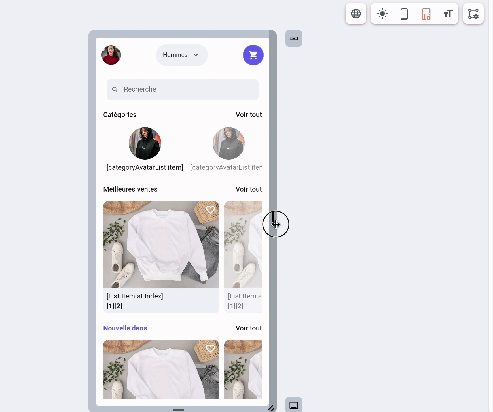

# Canvas
The Canvas shows the selected device screen, such as mobile, tablet, web, or desktop. It allows you to add widgets via drag-and-drop. You can select, move, and position widgets anywhere on the Canvas.

The Canvas also includes zoom controls, light and dark previews, multi-language preview, App Bar and Nav Bar controls, text size simulation, and more.

## Show or Hide Navigation Menu

From here, you can open or close the 
[Navigation Menu](../../../docs/intro/ff-ui/builder.md#navigation-menu).

## Zoom Controls

There are zoom in (+) and zoom out (-) buttons to control the zoom level of the Canvas. While working on complex UI designs, this comes in handy when you want to zoom in on a specific area or zoom out for an overview.

## Preview Screen

The Preview Screen is where you build the UI for the selected device. You can customize the screen by adding widgets using drag and drop from the [Widget Palette](../../intro/ff-ui/widget-palette.md) and by applying properties from the [Properties Panel](../../intro/ff-ui/builder.md#properties-panel).

## Set Preview Screen Size

Use the screen size controls at the top of the Canvas to preview your app at different dimensions. Select the mobile, tablet, or desktop icon to switch between device types and test how your layout responds on each screen size.

You can also set a custom preview size by clicking the current size box, entering the desired **Width (px)** and **Height (px)** values, and then clicking **Save**.

    <iframe 
        src="https://demo.arcade.software/DfBQoBkkkRX68CIYoWwD?embed&show_copy_link=true"
        title="Set Preview Screen Size"
        style={{
            position: 'absolute',
            top: 0,
            left: 0,
            width: '100%',
            height: '100%',
            colorScheme: 'light'
        }}
        frameborder="0"
        loading="lazy"
        webkitAllowFullScreen
        mozAllowFullScreen
        allowFullScreen
        allow="clipboard-write">
    </iframe>

## Add App Bar

From here, you can add an [App Bar](../../resources/ui/pages/page-elements.md#appbar) to your page. Clicking this button opens a popup displaying different App Bar styles for you to choose from. Select an App Bar style from the list, and it will appear in the Preview Screen.

## Designer Import/Export

Use this menu to copy screens between FlutterFlow and FlutterFlow Designer.

- **Export to Designer:** Copy pages from your FlutterFlow project into Designer, where you can explore new styles and continue refining the layouts. See [Import from FlutterFlow](../../ff-designer/import-export/import.md) for detailed instructions.
- **Paste from Designer:** Copy designs from Designer into your FlutterFlow project. In Designer, use **Export to FlutterFlow** to copy the frames, then select **Paste from Designer** on the Canvas. See [Export from Designer](../../ff-designer/import-export/export.md#export-options) for more information.

## Dark/Light Mode

Use this toggle to switch your app preview between light and dark mode, so you can ensure your design looks great in both modes. This feature is only available if you've enabled dark mode support in your project.

## Builder Settings
Builder Settings let you adjust how the FlutterFlow builder, Canvas, preview screen, and Property Panel behave while you design.

### Platform Settings

#### Set Builder to Dark Mode

Use this option to switch the FlutterFlow builder between light and dark mode. This changes the appearance of the FlutterFlow platform, not the theme of your app.

    <iframe 
        src="https://demo.arcade.software/95jb2CKZJKfviZqPsXKt?embed&show_copy_link=true"
        title="Set Builder to Dark Mode"
        style={{
            position: 'absolute',
            top: 0,
            left: 0,
            width: '100%',
            height: '100%',
            colorScheme: 'light'
        }}
        frameborder="0"
        loading="lazy"
        webkitAllowFullScreen
        mozAllowFullScreen
        allowFullScreen
        allow="clipboard-write">
    </iframe>

### Canvas Settings

#### Enable Snapping

Enable snapping to make widget width and height snap to multiples of the specified value while resizing. This helps keep widget sizes consistent as you adjust layouts on the Canvas.

    <iframe 
        src="https://demo.arcade.software/xdE4cilXUV1P7krYEJFg?embed&show_copy_link=true"
        title="Enable Snapping"
        style={{
            position: 'absolute',
            top: 0,
            left: 0,
            width: '100%',
            height: '100%',
            colorScheme: 'light'
        }}
        frameborder="0"
        loading="lazy"
        webkitAllowFullScreen
        mozAllowFullScreen
        allowFullScreen
        allow="clipboard-write">
    </iframe>

#### Show Resize Bars

Show resize bars to display handles on the right and bottom sides of the preview screen. You can use them to resize the preview screen to a custom size and test how your layout responds at different screen sizes.

#### Set Canvas Color

Use this option to change the background color of the Canvas. This can be helpful when creating components or previewing widgets against a different page background. For example, if a component uses dark text, setting a lighter canvas color can make it easier to see while designing.

    <iframe 
        src="https://demo.arcade.software/XoUnydzOgh3Uc2EruRo0?embed&show_copy_link=true"
        title="Set Canvas Color"
        style={{
            position: 'absolute',
            top: 0,
            left: 0,
            width: '100%',
            height: '100%',
            colorScheme: 'light'
        }}
        frameborder="0"
        loading="lazy"
        webkitAllowFullScreen
        mozAllowFullScreen
        allowFullScreen
        allow="clipboard-write">
    </iframe>

### Device Preview Settings

#### Show Safe Area

Enable this option to show the device safe area in the builder. Safe areas help you preview where content may be affected by device notches, rounded corners, status bars, or other screen insets.

:::note
If the device bezel is displayed, the safe area is always enabled in the preview.
:::

    <iframe 
        src="https://demo.arcade.software/mhjqT9pmmyxEprnF5YOY?embed&show_copy_link=true"
        title="Show Safe Area"
        style={{
            position: 'absolute',
            top: 0,
            left: 0,
            width: '100%',
            height: '100%',
            colorScheme: 'light'
        }}
        frameborder="0"
        loading="lazy"
        webkitAllowFullScreen
        mozAllowFullScreen
        allowFullScreen
        allow="clipboard-write">
    </iframe>

#### Adjust Text Sizing

Use this option to preview your app with different text scale settings. This helps you test how your UI responds when users increase text size from their device accessibility settings.

    <iframe 
        src="https://demo.arcade.software/uodCNZIibPCNQIfXPSKg?embed&show_copy_link=true"
        title="Adjust Text Sizing"
        style={{
            position: 'absolute',
            top: 0,
            left: 0,
            width: '100%',
            height: '100%',
            colorScheme: 'light'
        }}
        frameborder="0"
        loading="lazy"
        webkitAllowFullScreen
        mozAllowFullScreen
        allowFullScreen
        allow="clipboard-write">
    </iframe>

#### Display Keyboard

Enable this option to show the keyboard on the preview screen. This is useful for checking how form fields, buttons, and bottom-aligned content appear when the keyboard is open.

    <iframe 
        src="https://demo.arcade.software/xoat6tc8gNwwPPWsHG0t?embed&show_copy_link=true"
        title="Display Keyboard"
        style={{
            position: 'absolute',
            top: 0,
            left: 0,
            width: '100%',
            height: '100%',
            colorScheme: 'light'
        }}
        frameborder="0"
        loading="lazy"
        webkitAllowFullScreen
        mozAllowFullScreen
        allowFullScreen
        allow="clipboard-write">
    </iframe>

#### Display Device Bezel

Use this option to show the device frame in the preview. This is particularly useful for checking how your screen will look with device-specific features such as the safe area or notches on iPhones and Android devices.

    <iframe 
        src="https://demo.arcade.software/pCZChdW9S252zmOfnD2t?embed&show_copy_link=true"
        title="Display Device Bezel"
        style={{
            position: 'absolute',
            top: 0,
            left: 0,
            width: '100%',
            height: '100%',
            colorScheme: 'light'
        }}
        frameborder="0"
        loading="lazy"
        webkitAllowFullScreen
        mozAllowFullScreen
        allowFullScreen
        allow="clipboard-write">
    </iframe>

#### Show Overflows

Enable this option to show overflow errors in the builder as they will appear in Test Mode. This can help you catch layout issues before running or testing your app.

    <iframe 
        src="https://demo.arcade.software/dXXZAlLs0wMEj1E5SBAX?embed&show_copy_link=true"
        title="Show Overflows"
        style={{
            position: 'absolute',
            top: 0,
            left: 0,
            width: '100%',
            height: '100%',
            colorScheme: 'light'
        }}
        frameborder="0"
        loading="lazy"
        webkitAllowFullScreen
        mozAllowFullScreen
        allowFullScreen
        allow="clipboard-write">
    </iframe>

#### Display Language

If you've enabled multi-language support for your project, you can use this to preview your app in different languages. Open **Canvas Settings** and change the **Display Language** to preview the translated text in your app.

:::tip
This feature is valuable for testing your app across multiple locales without needing to run your app.
:::

    <iframe 
        src="https://demo.arcade.software/Wt1s0IIxQXNQ5cdAMIIf?embed&show_copy_link=true"
        title="Display Language"
        style={{
            position: 'absolute',
            top: 0,
            left: 0,
            width: '100%',
            height: '100%',
            colorScheme: 'light'
        }}
        frameborder="0"
        loading="lazy"
        webkitAllowFullScreen
        mozAllowFullScreen
        allowFullScreen
        allow="clipboard-write">
    </iframe>

### Property Panel Settings

#### Keep Common Properties Collapsed

Enable this option to keep common sections in the Property Panel collapsed by default, such as **Visibility**, **Padding**, and **Alignment**. This can make the Property Panel easier to scan when you only want to open the sections you need.

    <iframe 
        src="https://demo.arcade.software/iXj6ebaDiAZjr0WLSzkQ?embed&show_copy_link=true"
        title="Keep Common Properties Collapsed"
        style={{
            position: 'absolute',
            top: 0,
            left: 0,
            width: '100%',
            height: '100%',
            colorScheme: 'light'
        }}
        frameborder="0"
        loading="lazy"
        webkitAllowFullScreen
        mozAllowFullScreen
        allowFullScreen
        allow="clipboard-write">
    </iframe>

## Add Nav Bar

Use this button to add the [Nav Bar](../../resources/ui/pages/page-elements.md#nav-bar) to your page. Clicking it opens a popup where you can enable the Nav Bar for your project. Once the Nav Bar is enabled, you can customize it to match your design.

## Video Guide

Watch this video if you prefer watching a video tutorial.

<iframe width="760" height="428" src="https://www.youtube.com/embed/NDrte4nOXYc" title="The Canvas | FlutterFlow University" frameborder="0" allow="accelerometer; autoplay; clipboard-write; encrypted-media; gyroscope; picture-in-picture; web-share" referrerpolicy="strict-origin-when-cross-origin" allowfullscreen></iframe>

