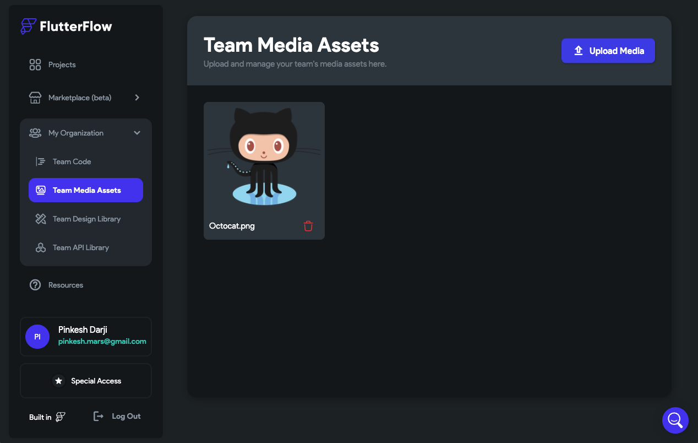
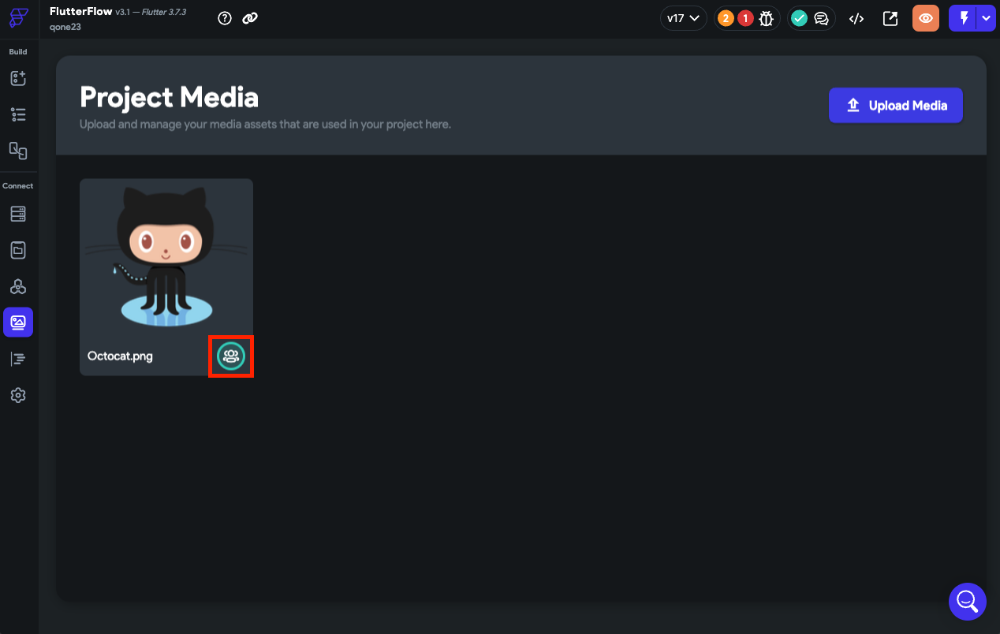

import Tabs from '@theme/Tabs';
import TabItem from '@theme/TabItem';

# My Organization
From here, you can manage billing for your team, edit projects simultaneously, and share code, design systems, APIs, and assets. This makes collaboration between team members much easier and helps to keep everyone on the same page. Even if you don't have team members, you can still benefit from this feature by using it to share resources between your own projects, keeping your development process organized and efficient.

With the ability to easily collaborate and share resources, you can create amazing apps faster than ever before.

:::info
Learn [**how to create a team**](../../accounts-billing/subscriptions/flutterflow-for-teams.md) to get started.
:::

<figure>
    
  <figcaption class="centered-caption">Sharing resources between users and across their projects</figcaption>
</figure>

## Team code

:::warning
**Team Code Libraries are now deprecated**. Please use the new [**Libraries**](../../resources/projects/libraries.md) to share and reuse projects across multiple projects.
:::

Imagine you are working on multiple apps. As the project progresses, you realize that some of the custom code can be used across multiple apps. With *Team Code*, you can create [Custom Functions](../../ff-concepts/adding-customization/custom-functions.md), [Widgets](../../resources/ui/widgets/composing-widgets/rows-column-stack.md), and [Actions](../../resources/control-flow/functions/action-flow-editor.md) that will be shared between your team members and their projects.

This helps you reduce building time, effort, and costs by allowing members to reuse existing code. Furthermore, shared code is easier to maintain as changes only need to be made in one place.

Here's how you can share the custom code:

1. Navigate to **My Organization > Team Code**.
2. Click **+ Add** and select what you want to create and share. See how to create [*Custom Function*](../../ff-concepts/adding-customization/custom-functions.md), [*Custom Widget*](../../ff-concepts/adding-customization/custom-widgets.md), and [Custom Action](../../ff-concepts/adding-customization/custom-actions.md).

    <iframe 
        src="https://demo.arcade.software/ZBQK4f3KhcR0wA5vvJ7f?embed&show_copy_link=true"
        title=""
        style={{
            position: 'absolute',
            top: 0,
            left: 0,
            width: '100%',
            height: '100%',
            colorScheme: 'light'
        }}
        frameborder="0"
        loading="lazy"
        webkitAllowFullScreen
        mozAllowFullScreen
        allowFullScreen
        allow="clipboard-write">
    </iframe>

3. To use the shared custom code, open the project in which you want to use the code and click on **Custom Functions** from the Navigation Menu.
    1. Click **+ Add** and select from the *Team Function*, *Team Widget*, and *Team Action*.
    2. A pop will open displaying the list of custom code names, click on it to add it to your project.

    <iframe 
        src="https://demo.arcade.software/TzSyFkSwGM5A4PZDCwO6?embed&show_copy_link=true"
        title=""
        style={{
            position: 'absolute',
            top: 0,
            left: 0,
            width: '100%',
            height: '100%',
            colorScheme: 'light'
        }}
        frameborder="0"
        loading="lazy"
        webkitAllowFullScreen
        mozAllowFullScreen
        allowFullScreen
        allow="clipboard-write">
    </iframe>

4. You can't edit the shared custom code directly in your project. To do so, you can duplicate it and modify it as per your requirement.

    <iframe 
        src="https://demo.arcade.software/Yk1uQVokPuizdWUU4UTd?embed&show_copy_link=true"
        title=""
        style={{
            position: 'absolute',
            top: 0,
            left: 0,
            width: '100%',
            height: '100%',
            colorScheme: 'light'
        }}
        frameborder="0"
        loading="lazy"
        webkitAllowFullScreen
        mozAllowFullScreen
        allowFullScreen
        allow="clipboard-write">
    </iframe>

## Team media assets

Your team might be working on multiple projects simultaneously, and they may require the same icons, images, audio files, and other graphic resources for each project. If each project has its own set of assets, the team will have to upload the same resources multiple times.

However, if the team shares their assets library between their projects, they can save time, increase productivity, and ensure consistency in design. Moreover, if any changes need to be made to an asset, the team can update it in one place, and the changes will reflect across all projects.

Here's how you can share the media assets:

1. Navigate to **My Organization > Team Media Assets** and click **Upload Media**.
2. The uploaded media will be accessible via **Project / Media Assets** from the **Navigation Menu**.
:::info
The shared media assets will have the 'teams' icon at the bottom right side.
:::

<Tabs>
<TabItem value="1" label="Upload sharable media assets" default>

</TabItem>
<TabItem value="2" label="Access media assets">

</TabItem>
</Tabs>

## Team design library

A company may have a website, a mobile app, and a desktop app, each with its own user interface and user experience. In such a case, rather than creating the same UI configuration for each project, creating a shared design system can help speed up the work and ensure consistency across all projects.

A design system includes colors, typography, fonts, icons, app assets, a nav bar, and an app bar.

:::tip
To store pre-designed UI components, we highly recommend using [**Libraries**](../../resources/projects/libraries.md) for easy reuse across projects.
:::

Here's how you can share the design library:

1. Navigate to **My Organization > Team Design Library** and click **+ Create New**.
2. Provide a name to the **Design System Project**.
3. A new project will open where you can configure the Theme, [NavBar](../../resources/ui/pages/page-elements.md#nav-bar) & [AppBar](../../resources/ui/pages/page-elements.md#appbar), and [App Assets](../../resources/projects/settings/general-settings.md#app-assets).

    <iframe 
        src="https://demo.arcade.software/wKuA4fKRkxiNXCkESJJt?embed&show_copy_link=true"
        title=""
        style={{
            position: 'absolute',
            top: 0,
            left: 0,
            width: '100%',
            height: '100%',
            colorScheme: 'light'
        }}
        frameborder="0"
        loading="lazy"
        webkitAllowFullScreen
        mozAllowFullScreen
        allowFullScreen
        allow="clipboard-write">
    </iframe>

4. To use the shared design library, open the project in which you want to use the design system and navigate to **Theme Settings** (navigation menu) **> Design System**.
5. Click on the **No Design System Selected**.
6. A pop will open displaying the list of the shared design systems, click on it to add it to your project.

    <iframe 
        src="https://demo.arcade.software/JvWQRp2yZHIAJqHu4Lfm?embed&show_copy_link=true"
        title=""
        style={{
            position: 'absolute',
            top: 0,
            left: 0,
            width: '100%',
            height: '100%',
            colorScheme: 'light'
        }}
        frameborder="0"
        loading="lazy"
        webkitAllowFullScreen
        mozAllowFullScreen
        allowFullScreen
        allow="clipboard-write">
    </iframe>

## Team API library
:::warning
**Team API Libraries are now deprecated**. Please use the new [**Libraries**](../../resources/projects/libraries.md) to share and reuse projects across multiple projects.
:::
Imagine a company that has multiple mobile apps for different purposes, such as a shopping app, a loyalty app, and a delivery app. All these apps require similar functionalities, such as user authentication, product information, and order management. However, each app is developed by a different team.

To ensure consistency and efficiency across all the apps, the company decides to create a centralized API that can be used and modified as per the team's requirements. Sharing API calls also allows for easier testing and debugging, as any issues can be traced back to a single source.

Here's how you can share APIs:

1. Navigate to **My Organization > Team API Library**.
2. Click on the **+** button and select [**Create API Call**](../../resources/control-flow/backend-logic/api/create-test-api-calls.md).
3. To use the shared API, open the project in which you want to use the API and click on **API Calls** from the Navigation Menu.
    1. Click **+** and select **Use Team API**.
    2. A pop will open displaying the list of shared APIs, click on it to add it to your project.

    <iframe 
        src="https://demo.arcade.software/2ALaTBUoWnyeZHAqi5wR?embed&show_copy_link=true"
        title=""
        style={{
            position: 'absolute',
            top: 0,
            left: 0,
            width: '100%',
            height: '100%',
            colorScheme: 'light'
        }}
        frameborder="0"
        loading="lazy"
        webkitAllowFullScreen
        mozAllowFullScreen
        allowFullScreen
        allow="clipboard-write">
    </iframe>

4. You can't edit the shared APIs directly in your project. To do so, you can duplicate it and modify it as per your requirement.

    <iframe 
        src="https://demo.arcade.software/mT2NXzQoIYcsRP0XBVdG?embed&show_copy_link=true"
        title=""
        style={{
            position: 'absolute',
            top: 0,
            left: 0,
            width: '100%',
            height: '100%',
            colorScheme: 'light'
        }}
        frameborder="0"
        loading="lazy"
        webkitAllowFullScreen
        mozAllowFullScreen
        allowFullScreen
        allow="clipboard-write">
    </iframe>

## Add domains

We allow you to add more custom domains and share them with all team members. This makes it simple to connect domains to the right projects and collaborate seamlessly.

To do so, click on **Add Domains** (under My Organization).

