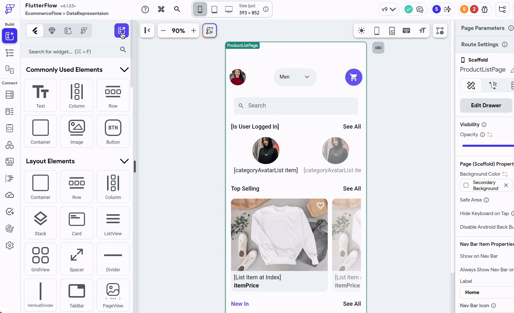

# Widget Palette

The Widget Palette in FlutterFlow provides access to all UI elements. These are essentially FlutterFlow widgets that can be dragged and dropped onto the canvas. You can use the search bar to quickly locate a specific widget for your application.

## 1. Widgets

From the Widgets tab, you can access all standard FlutterFlow widgets. They are organized into different categories based on their purpose, making it easier to navigate and find the appropriate widget for your app.

## 2. Components

Components are widgets with certain functionalities that can be reused throughout your app. They are constructed from either standard or custom widgets. Once you have created a [component](../../resources/ui/components/creating-components.md) or [custom widget](../../ff-concepts/adding-customization/custom-widgets.md), you can access it from here.

## 3. Templates

Templates are predefined and ready-to-use widgets. These include UI elements that are commonly used in most apps and can serve as a starting point in creating parts of the user interface. You can also create your own templates from the standard widget.

## 4. Theme Widgets

Theme Widgets enable you to customize the visual appearance of individual widgets and reuse them consistently throughout your app. They are an integral part of the design system, allowing you to build widgets based on your theme. Once you [create a theme widget](../../ff-concepts/design-system/design-system.md#theme-widgets), you can access it from here.

## 5. Floating Widget Palette

The Floating Widget Palette gives you quick access to widgets directly from the canvas. This feature is useful for swiftly adding widgets without the need to open the Widget Palette via the navigation menu.

