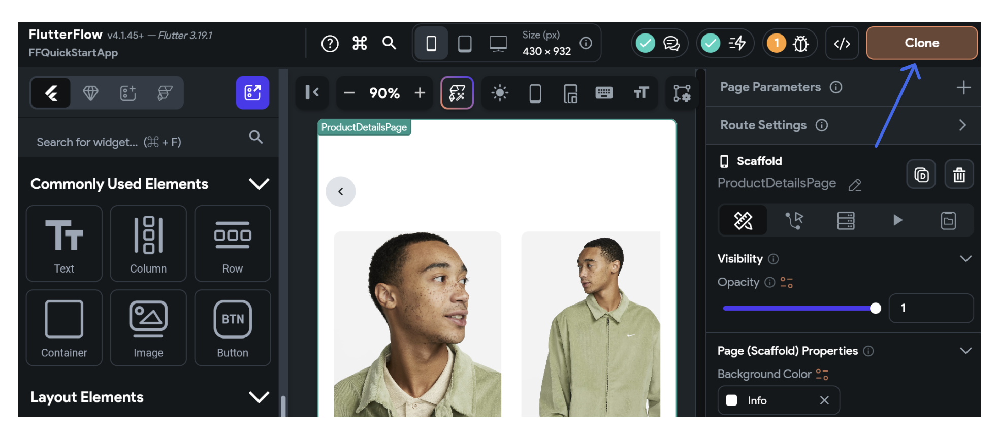
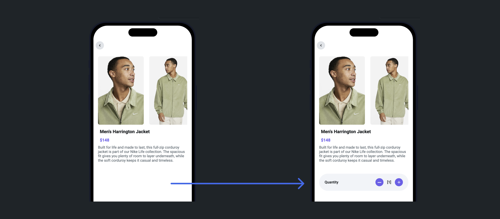

# **Quick Start Guide**

Welcome to the FlutterFlow Quickstart Guide! This guide is tailored for those eager to dive right into building their first FlutterFlow application. Here, you'll build a screen that lets users adjust the quantity of a product before adding it to their shopping cart.

This quickstart is designed to be straightforward and accessible, introducing you to basic FlutterFlow concepts quickly. For those seeking a deeper understanding of FlutterFlow's capabilities, we recommend reading through the FlutterFlow concepts pages.
<!-- TO DO: add links to resource section later on -->

Below is a preview of what your app will look like once completed:

## **What you'll learn**
- Creating layouts (add widgets)
- Adding interactivity to UI elements
- Handle app behavior in response to user interactions (manage state).
- Running your app

 
The steps to build the app are as follows:

1. [Clone or create project](#1-clone-or-create-project)
2. [Building UI](#build-ui)
3. [Customize style](#customize-style)
4. [Manage state](#manage-state)
5. [Run the app](#run-app)

## 1. Clone or create project

To kick off your project, the first step is to [create a new project](../resources/projects/how-to-create-find-organize-projects.md#how-to-create-a-project). However, to make things easier, we've already created a starter app for you. Simply open [this link](https://app.flutterflow.io/project/f-f-quick-start-app-umu392), click the '**Clone**' button, and the project will be instantly added to your account. 

After cloning the project, you’ll see a page with product images and descriptions. You’ll add a feature that allows users to update the product quantity.

## 2. Building UI {#build-ui}

In this section, we'll see how to build the user interface (UI) for this feature. This involves creating a layout and adding various widgets to our page.

To build the UI:

    <iframe 
        src="https://demo.arcade.software/5CNFKTzhvnHPrLyZNzgZ?embed&show_copy_link=true"
        title="Sharing a Project with a User"
        style={{
            position: 'absolute',
            top: 0,
            left: 0,
            width: '100%',
            height: '100%',
            colorScheme: 'light'
        }}
        frameborder="0"
        loading="lazy"
        webkitAllowFullScreen
        mozAllowFullScreen
        allowFullScreen
        allow="clipboard-write">
    </iframe>

:::info
You can learn more about creating layouts [here](../ff-concepts/layout/building-layout.md).
:::

## 3. Customize Style {#customize-style}

The next step is to customize the style of UI elements. This includes changing the colors, fonts, and sizes of your buttons and labels. In FlutterFlow, you can do this via the [Properties Panel](../intro/ff-ui/builder.md#properties-panel) which provides a range of options for customization.

To customize the style:

    <iframe 
        src="https://demo.arcade.software/MGpg8TSzMGBusCGyOk89?embed&show_copy_link=true"
        title="Sharing a Project with a User"
        style={{
            position: 'absolute',
            top: 0,
            left: 0,
            width: '100%',
            height: '100%',
            colorScheme: 'light'
        }}
        frameborder="0"
        loading="lazy"
        webkitAllowFullScreen
        mozAllowFullScreen
        allowFullScreen
        allow="clipboard-write">
    </iframe>

## 4. Manage State {#manage-state}

Once your UI is set up, it's time to make your app interactive by adding a state. This means setting up your app to respond to user interactions. For example, when a user clicks the button to increase the quantity, the number displayed on the label should increase accordingly.

### 4.1 Add state variable

We can achieve this behavior by adding state variables. A state variable stores data that can change over time. For this specific use case, let's add a [page state variable](../resources/ui/pages/page-lifecycle.md) that will hold the current quantity value. When a user interacts with the buttons, we update this variable, which in turn updates the UI.

Here's how to add and use state variables:

    <iframe 
        src="https://demo.arcade.software/UI92tJF6DX0lOVuidaSH?embed&show_copy_link=true"
        title="Sharing a Project with a User"
        style={{
            position: 'absolute',
            top: 0,
            left: 0,
            width: '100%',
            height: '100%',
            colorScheme: 'light'
        }}
        frameborder="0"
        loading="lazy"
        webkitAllowFullScreen
        mozAllowFullScreen
        allowFullScreen
        allow="clipboard-write">
    </iframe>

### 4.2 Update state variable

To update the state variable, we will need to add actions. Actions are essentially functions that are triggered by the user's interaction, in this case, by clicking either the "Increase" or "Decrease" buttons. You can add actions to your buttons via the [Actions Panel](../resources/control-flow/functions/action-flow-editor.md). 

Here's how to add actions to your buttons and update the state variable:

    <iframe 
        src="https://demo.arcade.software/6UIpWtPzuhEmK3rdZ7QI?embed&show_copy_link=true"
        title="Sharing a Project with a User"
        style={{
            position: 'absolute',
            top: 0,
            left: 0,
            width: '100%',
            height: '100%',
            colorScheme: 'light'
        }}
        frameborder="0"
        loading="lazy"
        webkitAllowFullScreen
        mozAllowFullScreen
        allowFullScreen
        allow="clipboard-write">
    </iframe>

## 5. Run the App {#run-app}

Now that you've built and customized your app, it's time to run it. FlutterFlow allows you to test a fully-functional version of your app in [**Test**](../testing-deployment-publishing/running-your-app/run-your-app.md#test-mode) and [**Run**](../testing-deployment-publishing/running-your-app/run-your-app.md#run-mode) mode. The Run mode requires 2-4 minutes (or more, depending on the size of your project). However, to see your changes immediately, you can run your app in a Test mode that uses Flutter's "[**Hot Reload**](https://docs.flutter.dev/tools/hot-reload)" feature.

    <iframe 
        src="https://demo.arcade.software/TxetiPgtHe50ZcLsHyFH?embed&show_copy_link=true"
        title="Sharing a Project with a User"
        style={{
            position: 'absolute',
            top: 0,
            left: 0,
            width: '100%',
            height: '100%',
            colorScheme: 'light'
        }}
        frameborder="0"
        loading="lazy"
        webkitAllowFullScreen
        mozAllowFullScreen
        allowFullScreen
        allow="clipboard-write">
    </iframe>

Congratulations! You've built your first app with FlutterFlow.

## **Problems?**

If you're experiencing any issues with the app, ensure that you have followed the instructions correctly. 
<!-- For troubleshooting, refer to our comprehensive guide or -->
To seek assistance from the [Community Forum](https://community.flutterflow.io/). If you're still encountering problems, don't hesitate to report the issue to our support team.