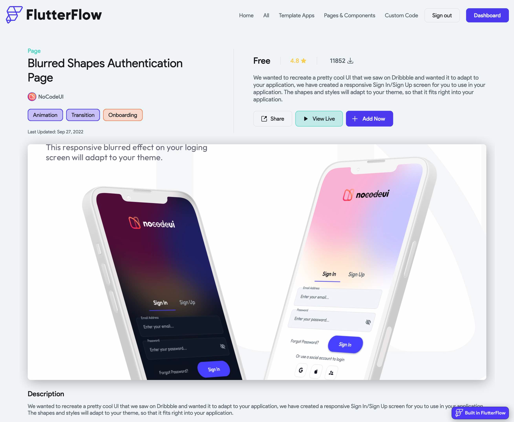
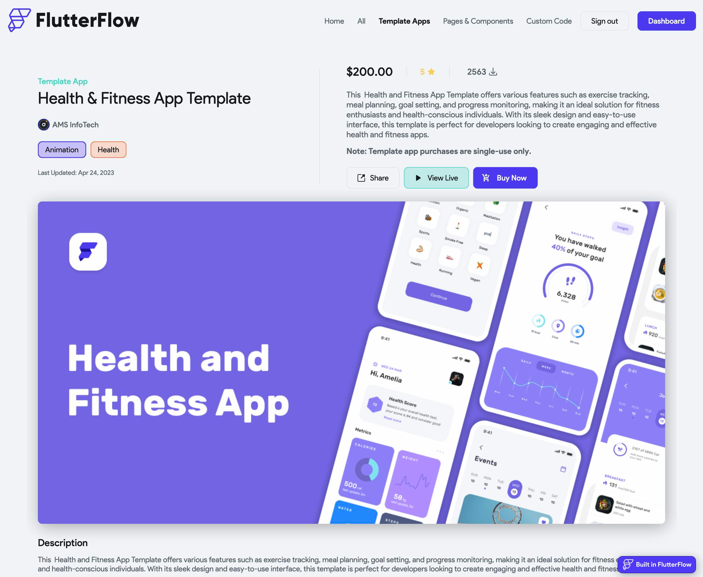

import Tabs from '@theme/Tabs';
import TabItem from '@theme/TabItem';

# Adding & Purchasing Items

## Adding a Marketplace Item

Add new functionality to your app in seconds! The FlutterFlow Marketplace features user-built components and templates that you can add directly to your FlutterFlow project. These items allow you to add functionality that is not currently available or easy to build in FlutterFlow.

### 1. Open FlutterFlow Marketplace

To add a Marketplace Item to your project, head to your FlutterFlow dashboard and select **Marketplace** or head over to [marketplace.flutterflow.io](https://marketplace.flutterflow.io/). In Marketplace, click on any item to learn more about it. 

:::tip
You can directly search for an item or filter by item type at the top (e.g., Template Apps).
:::

:::warning[Important]
You must view item details to see supported platforms (iOS, Android, Web).
:::

### 2. Add an item to your FlutterFlow project
To add a Marketplace item to your project, go to the item details page.

<Tabs>
<TabItem value="1" label="Free Items" default>

1. Click **+ Add Now**
2. Navigate to the **Owned Items** tab in your [dashboard](https://marketplace.flutterflow.io/dashboard)
3. Click **+ Add to Project** next to the item
4. Select the project you'd like to add the item to, and FlutterFlow will automatically import the item

:::tip
You will need to add the item to each individual project that you want to use the item in.
:::
</TabItem>
<TabItem value="2" label="Paid Items">

1. Click **+ Buy Now**
2. You will be redirected to Stripe for check out. Fill in payment details and click **Pay**.
3. Upon successful payment, navigate to the **Owned Items** tab in your [dashboard](https://marketplace.flutterflow.io/dashboard)
4. You can now start a new project using the template

**Note:** Template App purchases are single-use only and non-refundable. See [Marketplace Terms of Service](https://flutterflow.io/tos-marketplace) and our [Refund Policy](refund-policy.md) for details.
</TabItem>
</Tabs>
