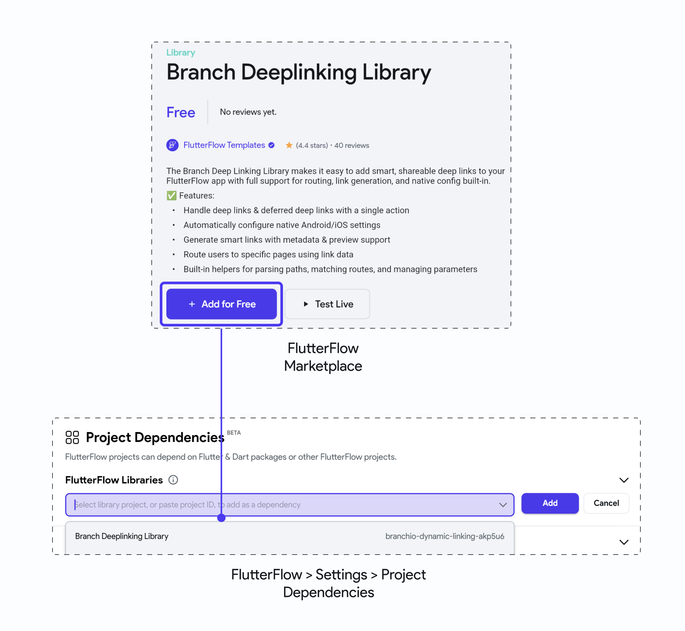

import Tabs from '@theme/Tabs';
import TabItem from '@theme/TabItem';

# Adding & Purchasing Items

The **FlutterFlow Marketplace** lets you add new features to your app in just a few clicks. It includes ready-made components, templates, and libraries built by other users. These items can help you add things that are not yet available in FlutterFlow or would take more time to build from scratch.

To add a Marketplace item, go to your FlutterFlow dashboard and click **Marketplace**, or visit [marketplace.flutterflow.io](https://marketplace.flutterflow.io/) directly. Click on any item to view its details.

- For **free items**, click **+ Clone for Free**, then choose the project you want to add it to.
- For **paid items**, click **Buy Now** and complete the purchase.

Once added, the item will be available in your selected project for immediate use.

<Tabs>
<TabItem value="1" label="Free Item" default>

</TabItem>
<TabItem value="2" label="Paid Item">

</TabItem>
</Tabs>

## Add Library Item

To install a library item from the Marketplace, search for the library, open its details page, and click **+ Add for Free**. This adds the library to your FlutterFlow account, meaning you can reuse it in any of your projects.

To add it to a specific project, go to **Settings > Project Dependencies**, click **Add Library**, and search for your library.

