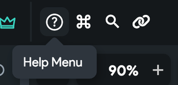

# Additional Resources To Get Help

### FlutterFlow community forum

The [FlutterFlow Community](https://community.flutterflow.io/) is a place for you to share ideas, ask questions, and troubleshoot issues with other FlutterFlow builders. The community shares a lot of amazing ideas!

To join the FlutterFlow community,

1. Go to your account at [app.flutterflow.io](https://app.flutterflow.io)
2. Next Navigate to Resources tab on the left side
3. Click on "FlutterFlow Community". This will automatically log you in to the community.

Alternatively,

If you are already in your project view, you can also find the **Help Menu** and click on **Community Forum**.

### YouTube

Our [YouTube channel](https://www.youtube.com/channel/UC5LueiosDVInA6yXE_38i9Q/featured) contains a variety of tutorials and how-to videos.

### Flutter community

Questions about Flutter? The [Flutter Community](https://flutter.dev/community) is a great resource!

### Flutter performance best practices

[Here are some tips](https://docs.flutter.dev/perf/rendering/best-practices) on how to write the most performant Flutter app possible.