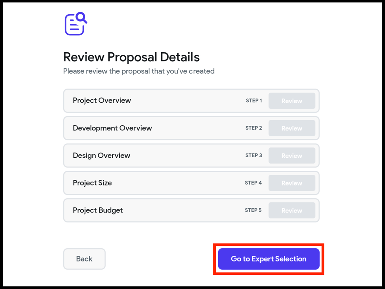
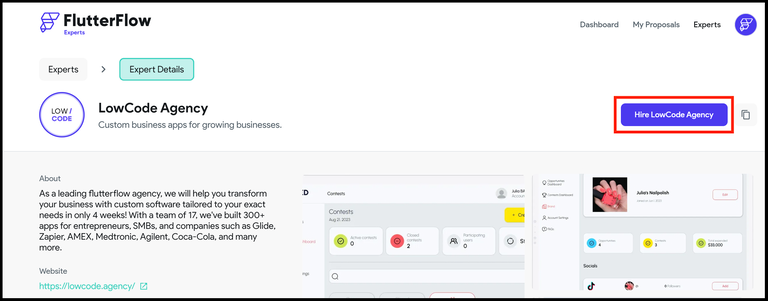
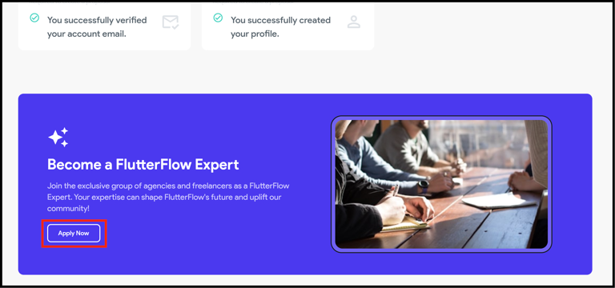

# FlutterFlow Experts

The FlutterFlow Experts is a platform that [connects](#connect-with-an-expert) users with independent professionals and agencies who have expertise in FlutterFlow. It also allows users to apply to [become experts](#become-an-expert) themselves.

To get started, go to `<https://experts.flutterflow.io/>` and create an account.

:::warning[Please Note]
Please note that 
- Experts are independent professionals and not employees, agents, or affiliates of FlutterFlow, and
- any services provided to you are solely the responsibility of the Expert and not FlutterFlow.
:::

### Connect with an expert

Before reaching out to an expert, it's important to create a detailed and clear proposal about your project. Make sure to clearly convey your needs, objectives, and any specific requirements. This information is crucial for the expert to provide you with an accurate timeline and quote.

To connect with an expert:

1. From the [Dashboard](https://experts.flutterflow.io/dashboard) or [My Proposal](https://experts.flutterflow.io/proposals) page, click on the **+ Create Proposal** button.

2. Click **Continue,** and you will be asked to enter details about your project, including key features, preferred tools or platforms, project size, and budget.

3. Once completed, you can review the proposal details and **Go to Expert Selection**.

4. To invite experts to view your proposal, click on the **Send Invite** button, write a personalized message, and send the invite. You can send up to three invites at a time.

5. Alternatively, you can browse through expert profiles on the [experts page](https://experts.flutterflow.io/experts), see their details, and click the **Hire** button to send them a personalized project proposal.

:::warning[]
Please do not send the proposal to many experts at the same time.
:::

### Become an expert

As a FlutterFlow expert, you'll have the opportunity to assist users in implementing complex features, troubleshooting issues, and even designing and building entire apps. To apply, navigate to our [Dashboard](https://experts.flutterflow.io/dashboard) and click the **Apply Now** button.

### FAQs

#### **Do experts work for FlutterFlow?**

No, experts are independent professionals, such as designers, developers, and consultants, with extensive knowledge and expertise in FlutterFlow.

#### **Am I obligated to work with an expert after contacting them?**

No, there is no obligation to engage with an expert simply by filling out the contact form.

#### **How are contracts and payments managed?**

Contracts and payments are directly negotiated between you and the expert. The scope of work, costs, and timelines will be mutually agreed upon, and payments will be processed through the expert's preferred billing system.

