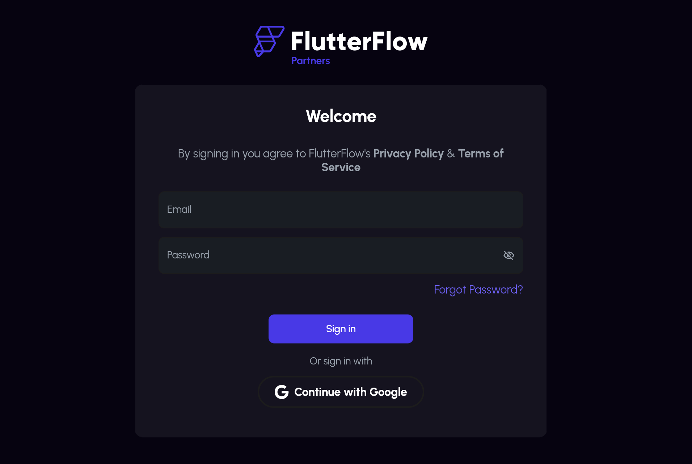
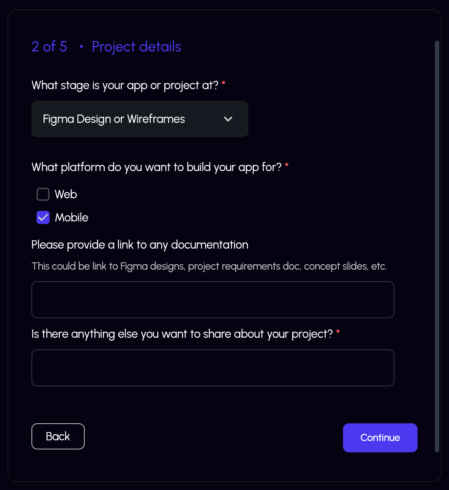
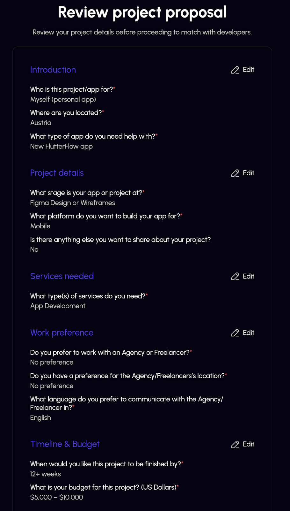
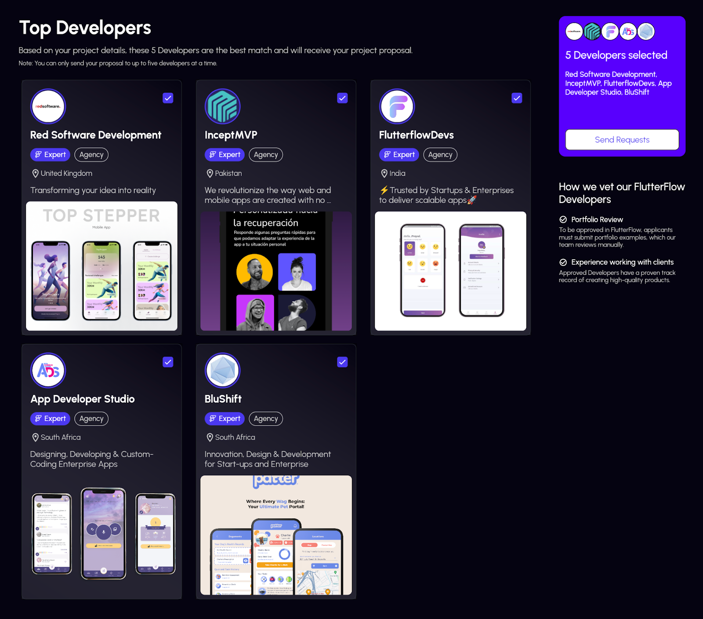
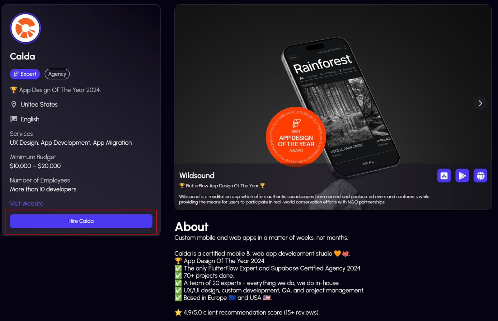

# Hire FlutterFlow Developer

You can hire a skilled FlutterFlow Developer to build your app at: https://www.flutterflow.io/hire-developer.

**FlutterFlow Developers** include agencies and freelancers skilled in building apps using FlutterFlow. Many of them have the **FlutterFlow Expert** badge, awarded to those who demonstrate advanced technical proficiency. To earn this recognition, they must pass the FlutterFlow Expert training and submit a portfolio of their work for our evaluation.

:::warning[Please Note]

- FlutterFlow Developers are independent professionals, not employees, agents, or affiliates of FlutterFlow.
- Any services provided are solely the responsibility of the Developer, not FlutterFlow.
- We recommend signing a contract with the Developer before making any payments to ensure clarity on deliverables and timelines.

:::

Visit https://www.flutterflow.io/hire-developer to get started.

There are two ways to find a Developer:

- **Get matched**: Receive recommendations based on your project requirements and preferences (*recommended*).
- **Browse Developers**: Explore available Developers, view their details, and reach out to specific ones.

In both cases, you’d need to make an account with FlutterFlow, and fill out a project proposal about your project. Make sure to clearly convey your needs, objectives, and any specific requirements. This information is crucial for the Developer to provide you with an accurate timeline and quote.

## Get Matched With Developers

To get matched with developers based on your project requirements, follow the steps below:

1. Create or log into your FlutterFlow account.

    
    
2. Fill out your project details, including features, budget, geo, and language preferences.
    
    
    
3. Review your project proposal for accuracy and completeness.
    
    
    
4. Confirm your project details to get matched with Developers based on your requirements.
    
   
    

:::info[Please Note]

You can send your request upto 5 Developers at a time.

:::

Alternatively, you can browse Developers, view their profiles, and use the **Hire** button to send a personalized project proposal.

## FAQs

Do FlutterFlow Developers work for FlutterFlow?

No, FlutterFlow Developers are independent professionals, including designers, developers, and consultants with expertise in FlutterFlow.

How are Developers selected for my project?

Developers are matched based on your requirements, such as geo, language, budget, and project scope. Priority is given to Developers with the FlutterFlow Expert badge.

Am I obligated to work with a Developer after contacting them?

No, contacting a Developer does not obligate you to engage their services.

How are contracts and payments managed?

Contracts and payments are directly negotiated between you and the Developer. FlutterFlow does not handle contracts or payments. All terms, including scope, costs, and timelines, are agreed upon by both parties. Payments are processed through the Developer’s preferred billing system.

