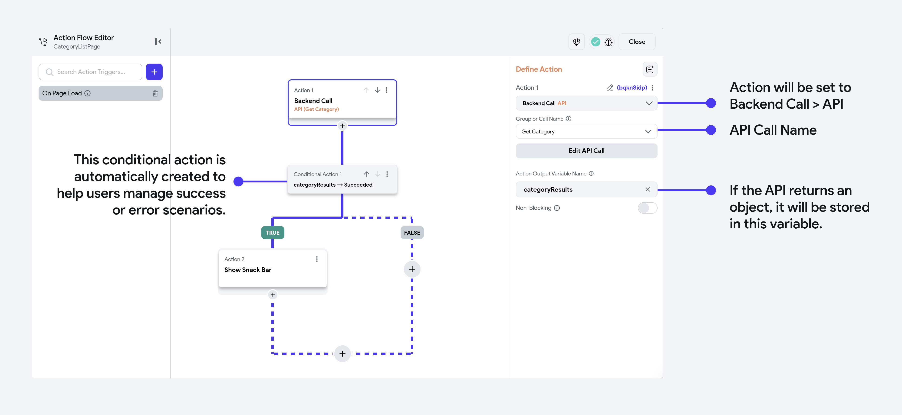

# Create & Test API Call

In this guide, you'll learn how to create and test API calls in FlutterFlow. Integrating API calls allows your app to interact with external services, bringing in real-time data and functionality that enhances your app's capabilities.

## Create API Call
To use an API in your app, you first need to create the API call in FlutterFlow.

Simply select API Calls from the left navigation menu, click the **+ Add** button, and choose **Create API Call**. Enter an **API Call Name**, select the **Method Type** (GET, POST, DELETE, PUT, or PATCH), and input the API URL of the service you wish to access.

    <iframe 
        src="https://demo.arcade.software/JbgiAq8d2VzqYHuXH4DN?embed&show_copy_link=true"
        title=""
        style={{
            position: 'absolute',
            top: 0,
            left: 0,
            width: '100%',
            height: '100%',
            colorScheme: 'light'
        }}
        frameborder="0"
        loading="lazy"
        webkitAllowFullScreen
        mozAllowFullScreen
        allowFullScreen
        allow="clipboard-write">
    </iframe>

:::tip[Method Types]
The Method Type specifies the type of operation the API call will perform. Here’s a breakdown of common method types:

- **GET:** Retrieves data from the server.
- **POST:** Sends data to create or update a resource.
- **DELETE:** Removes a resource from the server.
- **PUT:** Updates or creates a resource with full data.
- **PATCH:** Partially updates a resource.
:::

### Dynamic API URLs

If you want to use a dynamic URL, for example, `<https://reqres.in/api/users/2>` where 2 is dynamic and `<https://reqres.in/api/users?page=5>` where 5 is dynamic:

1. Replace the hard-coded value with a meaningful name inside the brackets (e.g., from `https://reqres.in/api/users/2`to `https://reqres.in/api/users/[user_id]`).
2. And then, [**create a new variable**](rest-api.md#creating-variables) with the same name you provided inside the brackets.

The further instructions are based on the **Method Type** you selected.

### For `GET` & `DELETE` call

If you selected `GET` or `DELETE` as the method type, follow the steps below:

1. Optional: If the API call requires request headers such as an authorization token, [add a header](rest-api.md#passing-request-headers).
2. Optional: If the API call requires query parameters such as page number or user id, [add query parameters](rest-api.md#passing-query-parameters).
3. Click **Add Call** to save the API Call.

:::warning
After making any changes, you must save the API call.
:::

<iframe src="https://www.loom.
com/embed/ec61a02366504d12a3200426d4738c54?sid=3f41c946-6e53-4e0b-97e2-878178e546bd" frameborder="0" allow="accelerometer; autoplay; clipboard-write; encrypted-media; gyroscope; picture-in-picture; web-share" referrerpolicy="strict-origin-when-cross-origin" allowfullscreen></iframe>

In the above demo, a `GET` API call is defined to fetch users' data from [REQ | RES](https://reqres.in/) (which provides hosted REST API to try out HTTP requests).

A demo of using a dynamic URL in a GET request is as follows:

<iframe src="https://www.loom.
com/embed/e19f05e3fc6542b78c2871bff1997033?sid=d688dbb6-dc4d-4dc1-bb3f-438069b5f6cb" frameborder="0" allow="accelerometer; autoplay; clipboard-write; encrypted-media; gyroscope; picture-in-picture; web-share" referrerpolicy="strict-origin-when-cross-origin" allowfullscreen></iframe>

To add such an API call:

1. Replace the hard-coded value with a meaningful name inside the brackets (e.g., from `https://reqres.in/api/users/2`to `https://reqres.in/api/users/[user_id]`).
2. And then, [create a new variable](rest-api.md#creating-variables) with the same name you provided inside the brackets.

The DELETE API Call can also be defined similarly; just make sure you select the **Method Type** as ***DELETE***.

### For `POST`, `PUT` & `PATCH` call

If you have selected **POST request**, follow the steps below:

1. Optional: If the API call requires request headers such as an authorization token, [add a header](rest-api.md#passing-request-headers).
2. [Create a request body](rest-api.md#creating-request-body) for the API call.
3. Click **Add Call** to save the API Call.

:::warning
After making any changes, you must save the API call.
:::

<iframe src="https://www.loom.
com/embed/4d421b9a216d4655aed57fb63a963dc3?sid=1a86b3dd-4f06-43e8-a771-3e35a6fb2308" frameborder="0" allow="accelerometer; autoplay; clipboard-write; encrypted-media; gyroscope; picture-in-picture; web-share" referrerpolicy="strict-origin-when-cross-origin" allowfullscreen></iframe>

In this demo, a POST API call is defined with two variables, `userName` and `userJob`. The variables are used inside the JSON request body.

The PUT and PATCH API calls can be defined similarly; make sure you enter a valid API URL endpoint and select the correct Method Type.

## Grouping API calls

You can create a group of API calls that share the same base URL. Grouping the API calls helps you add all request headers (e.g., auth token) at once, and they will be automatically added for all the API calls inside the group.

:::warning
For [**private APIs**](rest-api.md#private-api-calls), headers defined within the group will not be automatically included. You'll need to manually add headers for APIs marked as private.
:::

To create the API Group:

1. Click on the **+** button (top left side) and select the **Create API Group**.
2. Enter the **API Group Name**.
3. Enter the **API Base URL**. This should be the portion that is common in all the APIs. **Note**: Do not keep the '/' in the end.
4. You can add request headers by clicking on the **+ Add Header** button. See detailed instructions on how to [add headers](rest-api.md#headers).
5. Click **Add Group**. This will display the group on the left side.
6. Open the newly created API group, and click on the **+ Add API Call**.
7. Add the API call as you would normally do. **Note**: Inside the API endpoint, enter the URL portion that starts after the base URL.

<iframe src="https://www.loom.
com/embed/081572e9e1a94d1ea83bee59f87a5125?sid=6ddb47aa-0054-47e8-8a5b-4bc03c8fb0c0" frameborder="0" allow="accelerometer; autoplay; clipboard-write; encrypted-media; gyroscope; picture-in-picture; web-share" referrerpolicy="strict-origin-when-cross-origin" allowfullscreen></iframe>

## Import API definitions

We allow you to add multiple API call definitions by importing them directly from the [Swagger/OpenAPI](https://swagger.io/) in bulk. With just a simple click, you can add a large number of APIs, significantly reducing the time and effort needed to create them manually.

Furthermore, the ability to import Swagger/OpenAPI definitions directly into FlutterFlow eliminates the risk of errors that may occur when creating API definitions manually, ensuring that applications are reliable and efficient.

:::info
We also add all settings that are required to run the API, such as [headers](rest-api.md#headers), [query parameters](rest-api.md#query-parameters), [variables](rest-api.md#variables), and body as they are defined in the Swagger file. However, you might need to replace the hard-coded values in [Body](rest-api.md#body) text with the [variables](rest-api.md#variables).
:::

:::warning
Please note that while it is possible to import APIs created with OAS 2.0 in FlutterFlow, you might face some issues, such as the body request being lost during the import process. Our import functionality is built based on the OAS 3.0 standard, so for the best experience and compatibility, it is recommended to use APIs that adhere to OAS 3.0 or above.
:::

To import API call definitions:

1. Click the **Import OpenAPI** icon. This will open a new popup.
2. Click **Upload File**. Here you can upload your swagger file available in `.yml` or `.json` file format.
3. After the import is successful, you will see the list of all APIs created and added as a [group](#grouping-api-calls).

Here's an example of importing API calls in bulk, taken from [here](https://editor.swagger.io/).

<iframe src="https://www.loom.
com/embed/074601859ba4430e97047dcdc60eabf6?sid=0446b026-eb75-4a3d-bb51-543668a06bfe" frameborder="0" allow="accelerometer; autoplay; clipboard-write; encrypted-media; gyroscope; picture-in-picture; web-share" referrerpolicy="strict-origin-when-cross-origin" allowfullscreen></iframe>

## Testing API calls

You should always test your API call before using it inside your app. We make it easy for you to try the API call inside our builder.

To test the API call along with its response, follow the steps below:

1. Select an API call you have already created or are currently defining, and go to the **Response & Test** tab.
2. On the left side, you will see the **Variables** section, where you can enter the values for the variables defined for your API call.
3. On the right, the **Preview** section lets you check the API URL, request headers, request body, and response. In the **Test Response** tab, you can view the full API response, including both the JSON format and raw body text, as well as the response header.
4. Click **Test API Call** to trigger the API call. You'll notice that the status of the GET request is displayed, and if it's successful (status code `200`), the result returned from that request will also be displayed below.
5. Any value of the JSON result can be accessed by [defining the JSON path](rest-api.md#json-path).

<iframe src="https://www.loom.
com/embed/7b84e0e372924547b4779bfae3c4daeb?sid=22f42516-d522-4362-9ae4-b4aac4947fc7" frameborder="0" allow="accelerometer; autoplay; clipboard-write; encrypted-media; gyroscope; picture-in-picture; web-share" referrerpolicy="strict-origin-when-cross-origin" allowfullscreen></iframe>

The demo below shows the testing of creating a new user using a POST request. The API Call takes two variables: `userName` and `userJob`. The successful POST request returns a status code of `201`.

:::info
The testing of `PUT` and `PATCH` requests would also be similar to this.
:::

<iframe src="https://www.loom.
com/embed/4cd816e67a044604b80fb83748312a03?sid=e4ffd651-f97c-4478-94a4-e81f0931ef08" frameborder="0" allow="accelerometer; autoplay; clipboard-write; encrypted-media; gyroscope; picture-in-picture; web-share" referrerpolicy="strict-origin-when-cross-origin" allowfullscreen></iframe>

## API Call [Action]

Once the API calls are defined in your FlutterFlow project, you can use them wherever needed.

Open the Action Flow Editor on the widget where the API call should be triggered. After selecting the desired Action Trigger, search for "API Calls" in the Actions dropdown and select the API call you want to use.

:::tip
You can also add the API Call as a [**Backend Query**](../backend-query/api-call-query.md) that gets triggered automatically when the page or widget is loaded on the screen.
:::

Go to your project and follow the steps below to define the Action to any widget.

1. Select the **Widget** (e.g., Button) on which you want to define the action.
2. Select **Actions** from the Properties panel (the right menu), and click **Open**. This will open an **Action Flow Editor** in a new popup window.
3. Click on the **+ Add Action**.
4. On the right side, search and select the **API Call** (under *Backend/Database*) action.
    1. Select the **Group or Call Name** from the dropdown.
    2. Optional: If your API call requires variables (e.g., auth token, query parameters, user id, etc.), pass their value by clicking on the **+ Variable** button.
    3. The **Action Output Variable Name** helps you retrieve the response of an API call. By default, we set it to any random name. However, you can change it to a meaningful name if you wish to. (e.g., loginResponse).
    4. You can add a conditional action that checks if the API call is succeeded.
    5. If the API call is succeeded, all actions under the TRUE path will be executed. For example, [navigate](../../../../ff-concepts/navigation-routing/page-navigation.md#navigate-to-action) to the home page if the login is successful.
    6. If the API call is failed, all actions under the FALSE path will be executed. For example, [showing a snackbar](../../../ui/pages/page-elements.md#snackbar) if the login is unsuccessful.

    <iframe 
        src="https://www.loom.com/embed/4c3412e806844b048dc8eb388bca45e0?sid=1408359c-f167-4b21-a8b4-d5803a21adb1"
        title=""
        style={{
            position: 'absolute',
            top: 0,
            left: 0,
            width: '100%',
            height: '100%',
            colorScheme: 'light'
        }}
        frameborder="0"
        loading="lazy"
        webkitAllowFullScreen
        mozAllowFullScreen
        allowFullScreen
        allow="clipboard-write">
    </iframe>

