# Handle API Call Errors

Proper error handling in API calls helps ensure reliable app behavior and a better user experience. This guide walks through how to manage different API response outcomes in FlutterFlow.

:::info[Prerequisites]
- A configured API call in your project.
- Basic understanding of FlutterFlow actions and variables.
:::

1. **Add the API Call Action**

    Start by adding the API call action to your desired trigger (e.g., a button press).

    :::note
    Ensure that you name the **Action Output Variable** when configuring the API call. This allows referencing the API response throughout the workflow.
    :::

    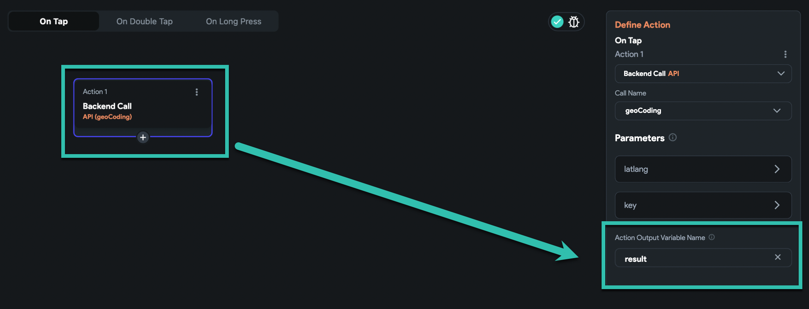

2. **Check API Call Success Status**

    Add a **Conditional Action** to determine if the call was successful.

    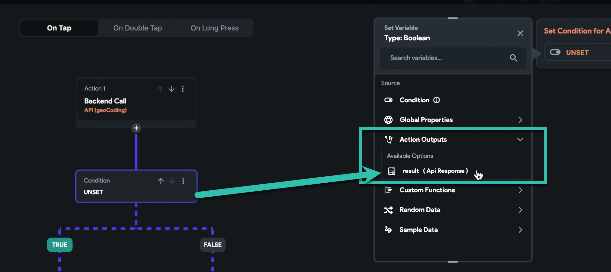

    Select the output variable of the API call, then use the built-in boolean field `Succeeded`. This value is `true` if the API call succeeded.

    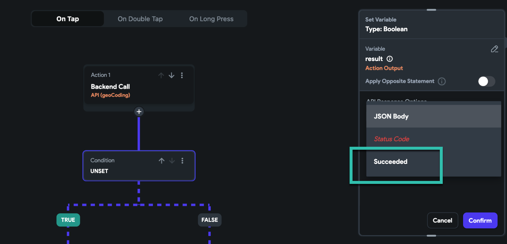

    :::tip
    To handle specific failure cases, use the `Status Code` field in the condition. For example, check if the response returns a `400` status to handle a specific error scenario.
    :::

    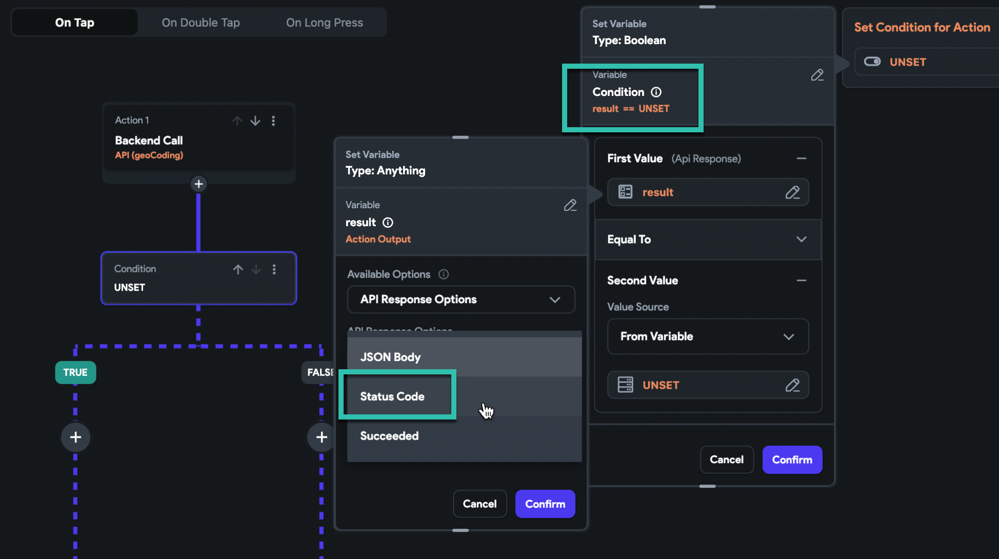

    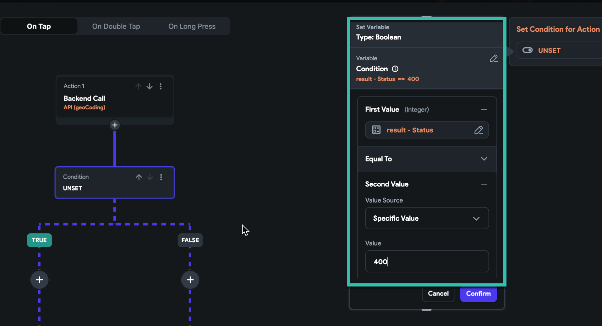

3. **Add Actions for API Failure**

    If the call fails, display a message to the user. You can use a `Show SnackBar` action and include the status code in the message.

    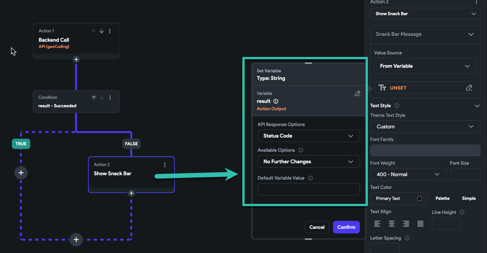

    Customize the fallback behavior as needed. You may choose to:
    - Show an alert dialog
    - Navigate to a fallback page
    - Retry the request

4. **Check If the Response Is Valid**

    Sometimes an API returns a `200 OK` status but the response body is not usable due to incorrect input (e.g., an invalid API key).

    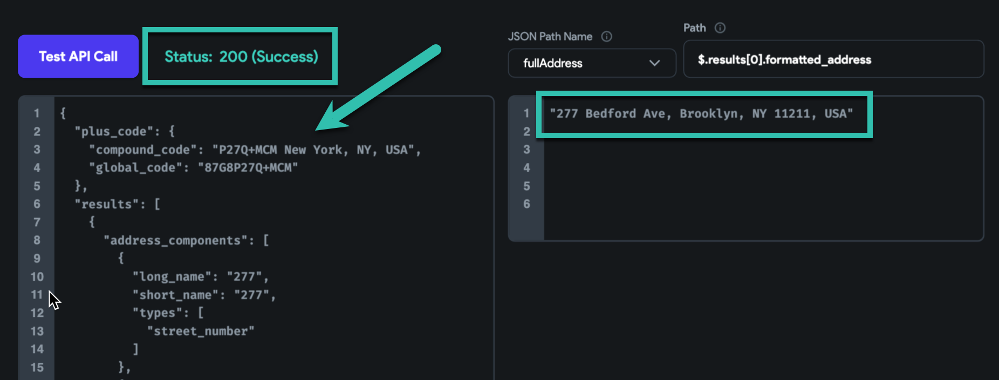

    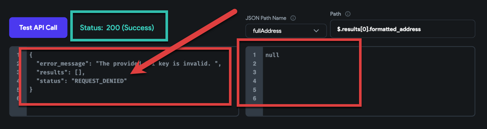

    In this example, the call succeeds but returns no useful data. To handle this:

        1. Add another conditional action after confirming success.
        2. Check whether a key path in the response (e.g., `full_address`) is set.

        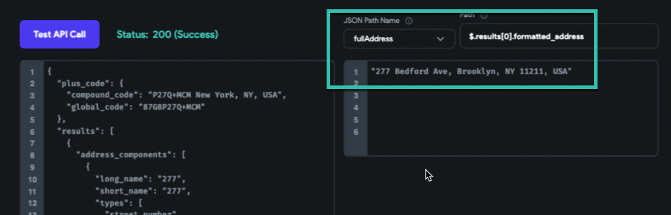

        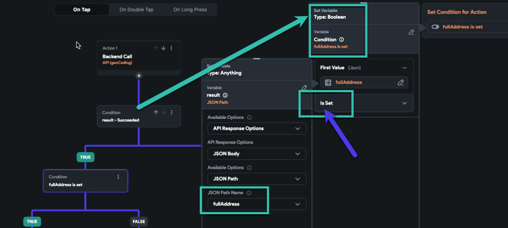

        Use the “Set / Not Set” condition to verify that expected fields contain data. Based on this, take appropriate follow-up actions.

        :::warning
        APIs behave differently—some always return a success code even when there's an error. Always validate the content of your response, not just the status.
        :::

5. **Handle Valid and Invalid Responses**

    If the expected path is set, proceed with displaying or using the data.

    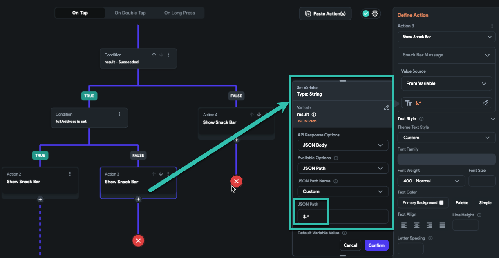

    If it is not set, display the entire response body for debugging purposes. This can help identify root issues such as authentication errors or misconfigured paths.

**Example Flow**

    Here is an example of a complete action flow for error handling:

    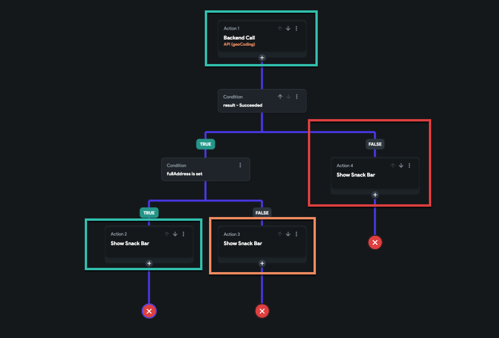

    This flow ensures:
    - The call status is checked.
    - The response body is validated.
    - Appropriate feedback is shown to the user in every scenario.

**Output Scenarios**

    - **Failed API Call (e.g., 400 Error)**

        

        Displays the error code and allows further investigation.

    - **Success Call with Invalid Response**

        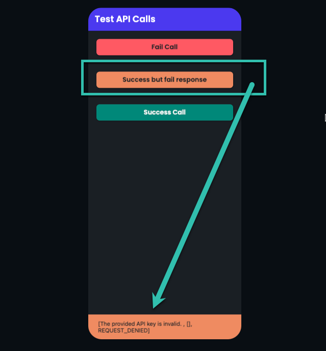

        Shows a fallback message or error details if expected data is missing.

    - **Success Call with Valid Data**

        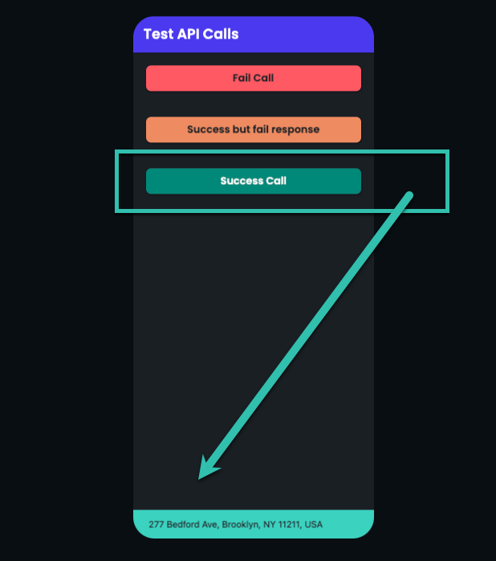

        Data is used with confidence, and the app behaves as expected.

        
