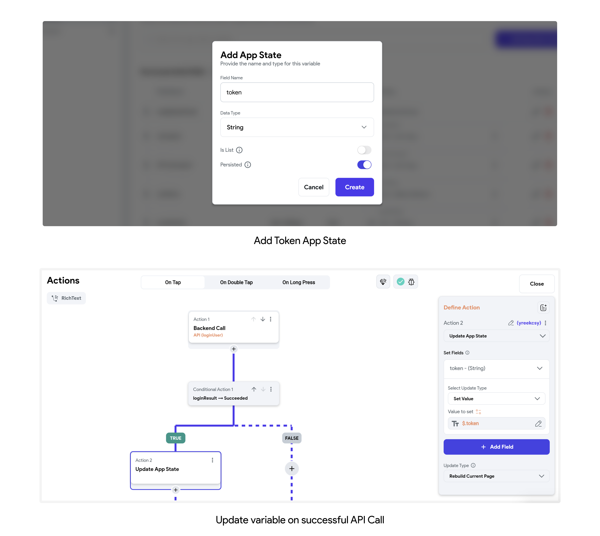
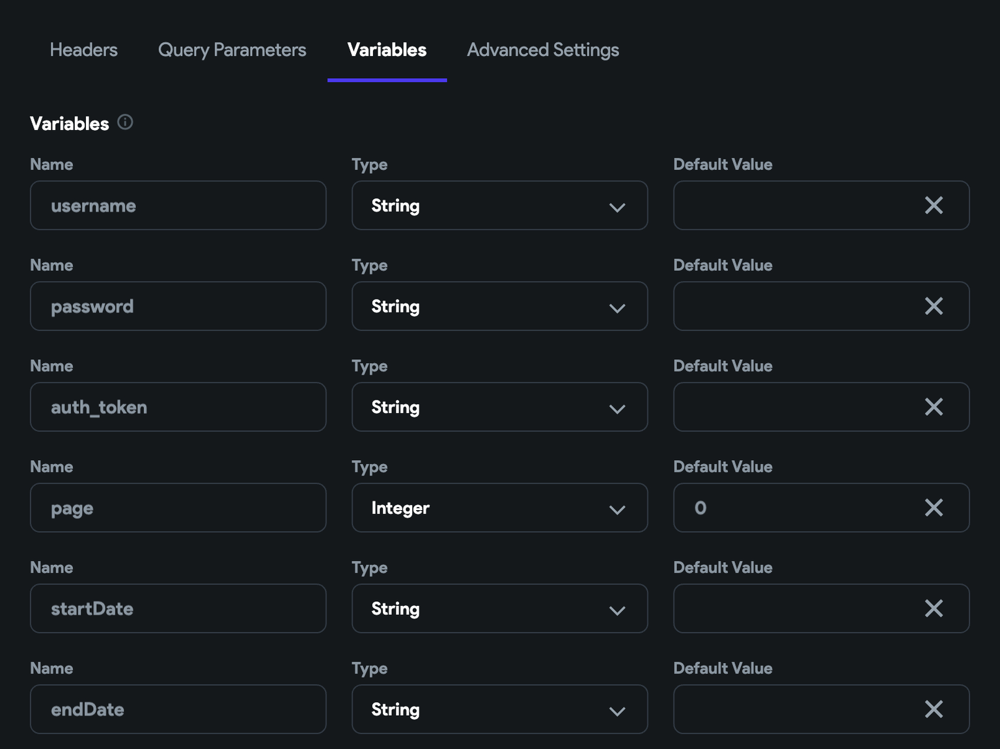
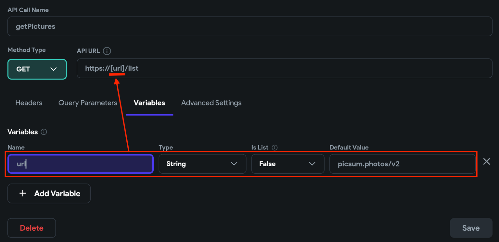
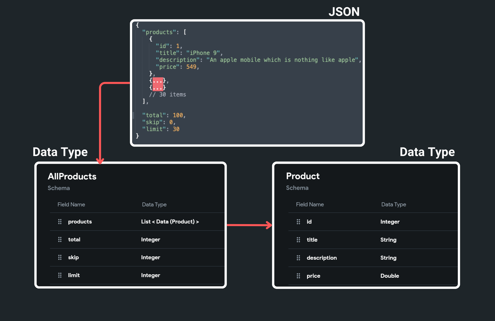
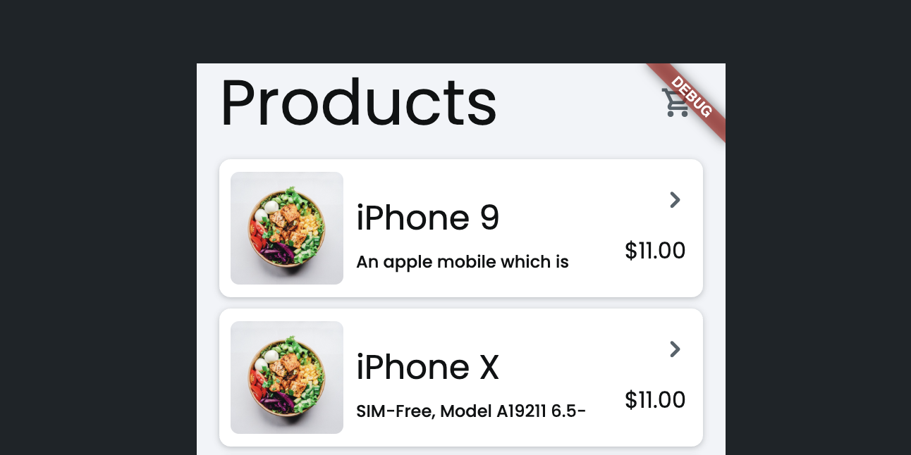
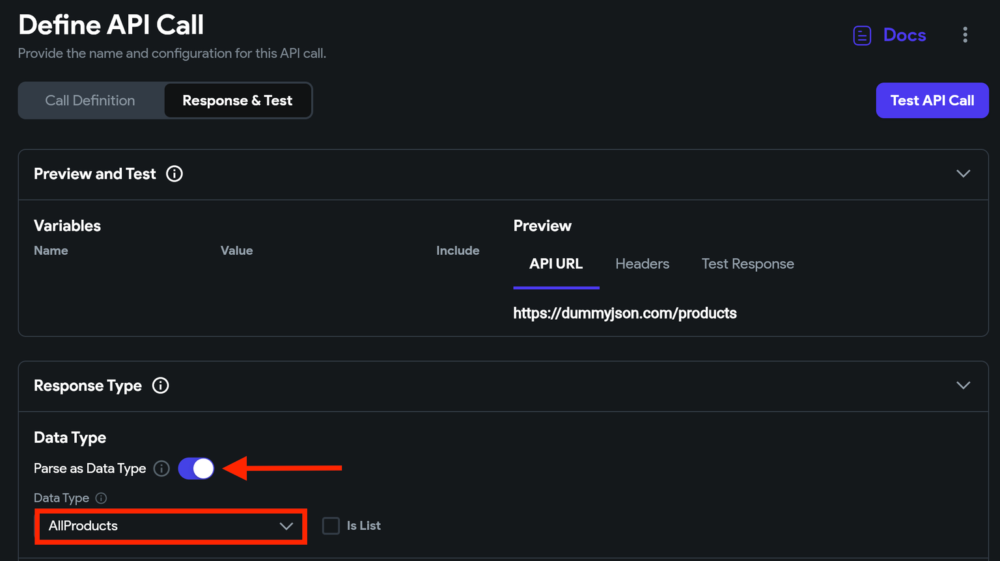
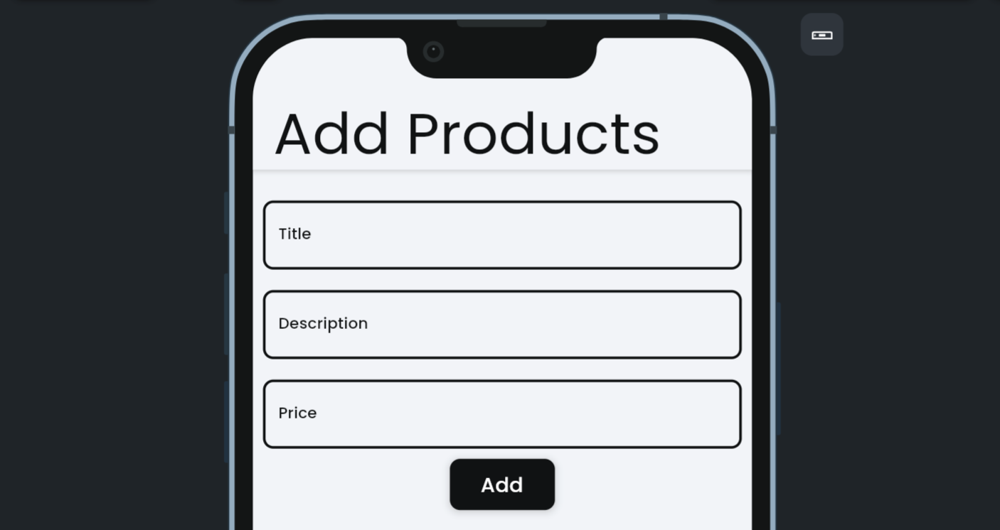
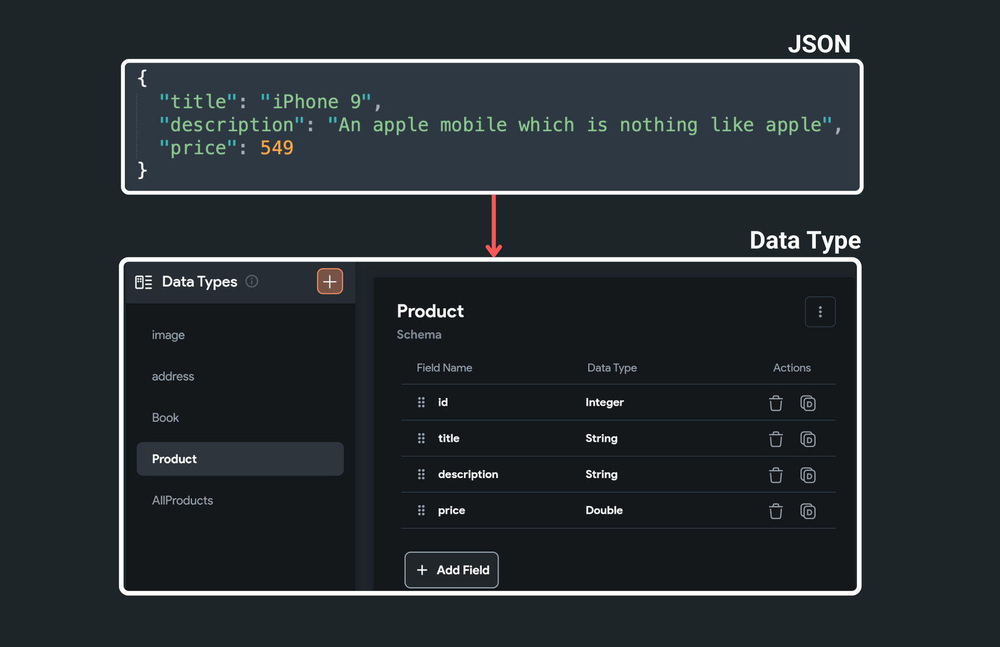
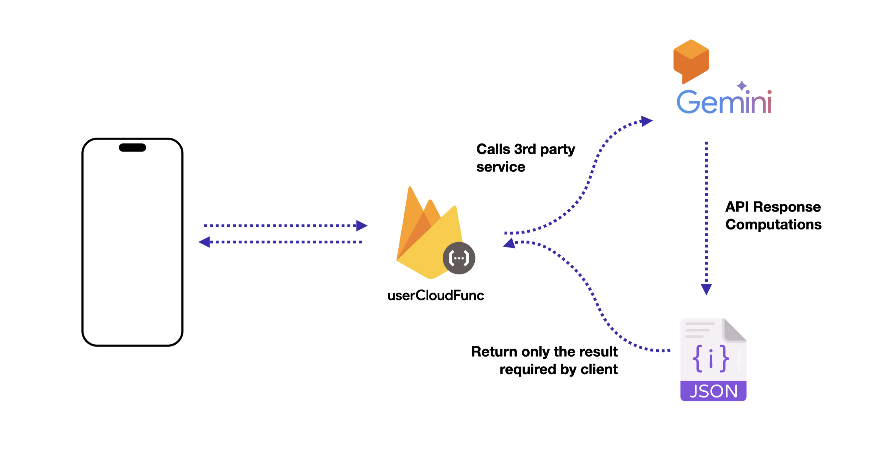
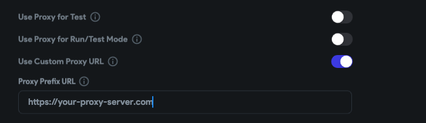

# API Calls

On this page, you will learn the most basic knowledge on various concepts for adding an API call to your project. They are the building blocks of adding an API call. Depending on the API's definition, you may utilize some or all of these concepts to successfully implement the API call in your project.

Here are they:

* [Headers](#headers)
* [Query Parameters](#query-parameters)
* [Variables](#variables)
* [Body](#body)
* [API response (JSON) to/from Data Type](#api-response-json-tofrom-data-type)
* [JSON Path](#json-path)
* [Advanced Settings](#advanced-settings)

## Headers

Headers typically carry the metadata associated with an HTTP request or response of an API call. HTTP headers are mainly grouped into two categories:

* **Request headers** contain more information about the resource to be fetched or the client requesting the resource.
* **Response headers** hold additional information about the response that the server returns.

### Passing request headers

Some of the common request headers that you might need while sending a request are:

* **Authorization**: Used for authenticating the request.
* **Content-Type**: Used while sending a POST/PUT/PATCH request containing a message body.

To pass the request header:

1. Select the **Headers** tab and click on the **+ Add Header** button.
2. Inside the input box, enter the header name followed by the colon(:) and its value (e.g., **Content-Type: application/json**).

<div style={{
    position: 'relative',
    paddingBottom: 'calc(56.67989417989418% + 41px)', // Keeps the aspect ratio and additional padding
    height: 0,
    width: '100%'
}}>
    <iframe 
        src="https://demo.arcade.software/AGgxnI4qdOL9veyDRVV1?embed&show_copy_link=true"
        title=""
        style={{
            position: 'absolute',
            top: 0,
            left: 0,
            width: '100%',
            height: '100%',
            colorScheme: 'light'
        }}
        frameborder="0"
        loading="lazy"
        webkitAllowFullScreen
        mozAllowFullScreen
        allowFullScreen
        allow="clipboard-write">
    </iframe>
</div>

<p></p>

:::info
The default **Content-Type** for any HTTP POST request is `application/json`, so if your data body is in JSON, you can skip defining the Content-Type.
:::

### Passing auth token (as request header)

You might need to add an API that is secured. That means it only gives results if you pass the authorization token (aka auth token) in the header parameter. This is usually done to prevent abuse. Let's see how you can add the auth token.

#### Passing static auth token

Some services provide you with a static auth token. Such a token never changes until you manually generate the new one.

To pass the static auth token:

1. Select the **Headers** tab and click on the **+ Add Header** button.
2. Inside the input box, enter the header name as **Authorization** followed by colon (:) and its value (e.g., **Authorization: Bearer YOUR_TOKEN**).

<div style={{
    position: 'relative',
    paddingBottom: 'calc(56.67989417989418% + 41px)', // Keeps the aspect ratio and additional padding
    height: 0,
    width: '100%'
}}>
    <iframe 
        src="https://demo.arcade.software/lMEvyl0gjA7qMOLu8XAq?embed&show_copy_link=true"
        title=""
        style={{
            position: 'absolute',
            top: 0,
            left: 0,
            width: '100%',
            height: '100%',
            colorScheme: 'light'
        }}
        frameborder="0"
        loading="lazy"
        webkitAllowFullScreen
        mozAllowFullScreen
        allowFullScreen
        allow="clipboard-write">
    </iframe>
</div>

#### Passing dynamic auth token

You would probably want to pass the auth token returned as a response in the login API call. Such a token changes every time when you log in. Hence, you need a way to pass the dynamic token.

:::warning[How to save an authentication token?]
After the login call is succeeded, ensure you save the authentication token in an app state variable (with Persisted -> True). Check the visuals below:


:::

Now you can pass the dynamic token:

1. Select the **Headers** tab and click on the **+ Add Header** button.
2. Inside the input box, enter the header name as **Authorization** followed by a colon (:) and then enter any variable name inside the brackets (e.g., **Authorization: Bearer [auth_token]**).
3. Select the **Variables** tab and [create a new variable](#creating-variables) with the same name you provided inside the brackets. This will be used to pass the token value from the app state variable to the API call.

Now from the API call (that requires an authentication token), pass the token value from the app state variable.

<div class="video-container"><iframe src="https://www.loom.
com/embed/d351c77ba3c1421ea78acb4bc6ae3544?sid=0c57a700-048f-40e5-804c-42f589451712" frameborder="0" allow="accelerometer; autoplay; clipboard-write; encrypted-media; gyroscope; picture-in-picture; web-share" referrerpolicy="strict-origin-when-cross-origin" allowfullscreen></iframe></div>


### Accessing response headers

Sometimes you might want to retrieve the values of the response headers. For example, retrieving the auth token from the response headers of the Login API call.

To access the response header:

1. Ensure you have added the [API call action](../api/rest-api.md) and 
provided the **Action Output Variable Name**.
2. Now, whenever/wherever the **Value Source** is set to **From Variable**, select the **Action Outputs > [Action Output Variable Name]** (e.g., Action Outputs > loginResponse).
3. Set the **API Response Options** to **Get Response Header**.
4. Enter the **Header Name**. Note that this must match the name of the response header from your API call.
5. Click **Confirm**.

## Query Parameters

They are optional parameters you can pass with an API call; they help format the response data returned by the server. Usually, they are concatenated at the end of the URL with a question mark (`?`) as the delimiter and are represented as key-value pairs.

An example of an URL with query parameters looks like this ([NASA Open API](https://api.nasa.gov/)):

[https://api.nasa.gov/neo/rest/v1/feed?**start_date=2015-09-07&end_date=2015-09-08&api_key=DEMO_KEY**](https://api.nasa.gov/neo/rest/v1/feed?start_date=2015-09-07&end_date=2015-09-08&api_key=DEMO_KEY)

Here, `start_date`, `end_date`, and `api_key` are the query parameters passed to receive the specific data.

Here's another example, this API call `<https://www.breakingbadapi.com/api/characters?limit=20&offset=0>` has two query parameters. The `limit` parameter specifies 20 items to load per page, and the `offset` specifies the number of items to skip. This is called offset-based pagination.

### Passing query parameters

To pass the query parameters for `GET` or `DELETE` API call:

1. Select the **Query Parameters** tab and click the **+ Add Query Parameter** button.
2. Enter the **Name** of the query parameter.
3. Set the **Value Source** to **Specific Value** or **From Variable**.
    1. If you want to pass this value from your page, app state variable, or any other source (i.e.
   , dynamic value), choose the **From Variable,** and then from the **Select Variable** dropdown, choose the already created variable (see how to [create variable](#creating-variables)) or click on **+ Create New Variable**. Note: This will immediately create a new variable with the same name as of query parameter. However, you still need to open the **Variables** tab and set its **Type**.
    2. If you want to pass a static/fixed value, select the **Specific Value**, set its **Type,** and enter its **Value**.

Below is the example of passing query parameter for the URL -> `https://api.instantwebtools.net/v2/passenger?page=10&size=20`

<div class="video-container"><iframe src="https://www.loom.
com/embed/16d2e640bf444881948b186755012a17?sid=bf052d8b-af00-4163-b8e5-784fdba7dbfd" frameborder="0" allow="accelerometer; autoplay; clipboard-write; encrypted-media; gyroscope; picture-in-picture; web-share" referrerpolicy="strict-origin-when-cross-origin" allowfullscreen></iframe></div>

<p></p>


In a rare case, you might want to pass the query parameters for the other methods of API calls. Such as POST, PUT, and PATCH. To do so:

1. In your API URL, replace the hard-coded values with a meaningful name inside the brackets (e.g.,
from `https://api.instantwebtools.net/v2/passenger?``**page=0**` to `https://api.instantwebtools.net/v2/passenger?``**page=[page]**`).
2. Select the **Variables** tab and [create a new variable](#creating-variables) with the same name you provided inside the brackets.

<div class="video-container"><iframe src="https://www.loom.
com/embed/b394eae85f5641aebb961316069a5eac?sid=ecd9e11f-bc3d-4484-a692-c3ced1d6d38b" frameborder="0" allow="accelerometer; autoplay; clipboard-write; encrypted-media; gyroscope; picture-in-picture; web-share" referrerpolicy="strict-origin-when-cross-origin" allowfullscreen></iframe></div>


## Variables

Variables allow you to pass the dynamic values from any part of your app to the API calls. Here's when they come in handy:

* Sending an auth token from your app's state to an API call's request header.
* Using username and password from TextField widgets in the API call's request body.
* Including selected dates as query parameters.
* Changing the base URL with a dynamic URL.

### Creating variables

To create variables, select the **Variables** tab, enter its **Name**, select the appropriate **Type** and provide the **Default Value** if you wish to.



Now you can pass values to these variables while triggering the API call from your page. You can set its value from any widget, app state variable, or any other source.

<div style={{
    position: 'relative',
    paddingBottom: 'calc(56.67989417989418% + 41px)', // Keeps the aspect ratio and additional padding
    height: 0,
    width: '100%'
}}>
    <iframe 
        src="https://demo.arcade.software/Gw8MilWu4GV2XtlLh3Fj?embed&show_copy_link=true"
        title=""
        style={{
            position: 'absolute',
            top: 0,
            left: 0,
            width: '100%',
            height: '100%',
            colorScheme: 'light'
        }}
        frameborder="0"
        loading="lazy"
        webkitAllowFullScreen
        mozAllowFullScreen
        allowFullScreen
        allow="clipboard-write">
    </iframe>
</div>

<p></p>

Here's how you can use a variable to create a dynamic base URL:
<p></p>


<p></p>

## Body

You can send data (as a request body) while calling the API of methods POST, PUT, or PATCH by defining them inside **Body**. The most common type is JSON format which is the easiest way of passing data inside the body of the reqest.

### Creating Request Body

Here you'll see creating a request body in the following formats:

#### JSON format

To create a request body in JSON format:

1. First, If you haven't already, [create variables](#creating-variables) (e.g., username and password variables that will be required to pass values from a login page to the login API call).
2. Select the **Body** tab and set the Body dropdown to **JSON**.
3. Copy-paste your request body and replace the values with the variables by dragging and dropping them inside your JSON body.

<div class="video-container"><iframe src="https://www.loom.
com/embed/5c8e643a668a4f219b9bbc5fb211d68d?sid=da92d72b-6895-44cb-a81c-43d1a63a5f07" frameborder="0" allow="accelerometer; autoplay; clipboard-write; encrypted-media; gyroscope; picture-in-picture; web-share" referrerpolicy="strict-origin-when-cross-origin" allowfullscreen></iframe></div>


#### Text format

This format is used to send textual data in the request body of an API. For example, in a SOAP API, the request body is typically in text format and contains XML data.

To create a request body in text format:

1. First, If you haven't already, [create variables](#creating-variables).
2. Select the **Body** tab and set the Body dropdown to **Text**.
3. Copy-paste your request body and replace the values with the variables by dragging and dropping them inside the request body.

<div class="video-container"><iframe src="https://www.loom.
com/embed/f0fb3fbd67804c33b5e3b077381a86cb?sid=c6050f21-c200-4290-b16e-bbfe8442050b" frameborder="0" allow="accelerometer; autoplay; clipboard-write; encrypted-media; gyroscope; picture-in-picture; web-share" referrerpolicy="strict-origin-when-cross-origin" allowfullscreen></iframe></div>


#### x-www-urlencoded format

To create a request body in x-www-form-urlencoded format:

1. First, If you haven't already, [create variables](#creating-variables) (e.g., username and password variables that will be required to pass values from a login page to the login API call).
2. Select the **Body** tab and set the Body dropdown to **x-www-form-urlencoded**.
3. Click on the **+ Add Parameter** and enter the **Name** of the parameter.
4. Set the **Value Source** to **Specific Value** or **From Variable**.
   1. If you want to pass this value from your page, app state variable, or from any other source 
   (i.e., dynamic value), choose the **From Variable,** and then from the **Select Variable** dropdown, choose the already created variable (see how to [create variable](#creating-variables)) or click on **+ Create New Variable**. Note: This will immediately create a new variable with the same name as of parameter. However, you still need to open the **Variables** tab and set its **Type**.
   2. If you want to pass a static/fixed value, select the **Specific Value**, set its **Type,** and enter its **Value**.

<div class="video-container"><iframe src="https://www.loom.
com/embed/164b0d470732473ea1c7d4a2c09c76d6?sid=4bf3bc50-05ab-482c-a96b-683325eec159" frameborder="0" allow="accelerometer; autoplay; clipboard-write; encrypted-media; gyroscope; picture-in-picture; web-share" referrerpolicy="strict-origin-when-cross-origin" allowfullscreen></iframe></div>


#### Multipart format

A multipart request body is a data format used in HTTP requests that enable the transfer of multiple parts of data in a single request. It is commonly used in file uploads.

To create a request body in the multipart format:

1. Select the **Body** tab and set the *Body* dropdown to **Multipart**.
2. Click on the **+ Add Parameter** and enter the **Name** of the parameter.
3. Set the **Value Source** to **From Variable,** and then from the **Select Variable** dropdown, click on **+ Create New Variable**. Note: This will immediately create a new variable with the same name as of parameter.
4. Now move to the **Variables** tab and set the **Type** to **Uploaded File**. This will allow you to pass the file stored locally on the device using an action such as **Upload/Save Media**.

<div class="video-container"><iframe src="https://www.loom.
com/embed/89c86a2f87df4a7c9316e4ade9563976?sid=23eea851-5c59-45d0-8699-d952c62d7e6a" frameborder="0" allow="accelerometer; autoplay; clipboard-write; encrypted-media; gyroscope; picture-in-picture; web-share" referrerpolicy="strict-origin-when-cross-origin" allowfullscreen></iframe></div>


## API response (JSON) to/from Data Type

Converting between API Response (JSON) and Data Types is often referred to as JSON 
deserialization and serialization. It allows you to convert JSON data from an API response into 
a [**Custom Data Type**](../../../data-representation/custom-data-types.md) when you receive it. Also, 
it enables you to convert your Custom Data Type back into JSON when sending data in an API request.

:::info
This is a more robust and maintainable way to work with JSON data in your app. It reduces complexity and potential errors (e.g., typos) compared to manually navigating [JSON paths](#json-path).
:::

### Create Custom Data Type matching to JSON structure

First, [create a Data Type](../../../data-representation/custom-data-types.md#creating-custom-data-type) with the same 
structure as your API response. Here's what the sample JSON response looks like after mapping it into a Custom Data Type.


<figure>
    
  <figcaption class="centered-caption">Creating custom data type as per the JSON response</figcaption>
</figure>

After this, you can choose to [convert to](#json-to-data-type) or [from](#json-from-data-type) 
the Data Type based on your requirements.

### JSON to Data Type

Let's see how to get the JSON into the Custom Data Type using an example that fetches the list of products from [this API](https://dummyjson.com/docs/products). Here's how it looks:



Here's how you do it:

1. First, ensure that you [create a custom data type](#create-custom-data-type-matching-to-json-structure) that matches your JSON structure.
2. Open your API call definition> **Response & Test tab > Response Type >** enablethe **Parse as 
   Data Type**. Select the **Data Type** that you want to convert into. For this example, it's 'AllProducts'.



<p></p>

3. On ListView, after adding the [API call backend query](../../../../resources/control-flow/backend-logic/backend-query/api-call-query.md), access the values by setting the following options.

    1. **Generate Children from Variable** by setting **API Response Options** to **As Data Type**.
    2. Set **Available Options** to **Data Structure Field** because we want to grab only a specific field, which has a list of products and not other items such as 'total' and 'skip'.
    3. **Select Field** to the field that holds the list of products, i.e., 'products' for this example.
    4. Click **Confirm** twice.

<div class="video-container"><iframe src="https://www.loom.
com/embed/7eec023289fa4342b88e90cd49c2c8e5?sid=b87a3ac4-df7a-441a-b69c-819df4e7ee56" frameborder="0" allow="accelerometer; autoplay; clipboard-write; encrypted-media; gyroscope; picture-in-picture; web-share" referrerpolicy="strict-origin-when-cross-origin" allowfullscreen></iframe></div>

<p></p>

4. Now, you can bind data in UI elements as you would normally do by setting the **Available 
Options** to **Data Structure Field** and **Select Field** that you want to display.

<div class="video-container"><iframe src="https://www.loom.
com/embed/0f052b88352c4aa7ac82fc86fc8737a8?sid=b61fb3bd-5d2f-4b4b-997c-1ee338eb0b93" frameborder="0" allow="accelerometer; autoplay; clipboard-write; encrypted-media; gyroscope; picture-in-picture; web-share" referrerpolicy="strict-origin-when-cross-origin" allowfullscreen></iframe></div>


### JSON from Data Type

Sometimes you might want to dynamically create a JSON body and pass it along the API request instead of manually configuring each field in the API call editor. You can do so by adding data into a Custom Data Type and then converting it into JSON while making an API call.

Let's see an example of adding a product by sending its data in JSON format in the API request.



Here's how you do it:

1. First, [create a custom data](#create-custom-data-type-matching-to-json-structure) type that matches the JSON format of the API request body. Here's how it looks for this example.



<p></p>

2. In your API call, [create a variable](#creating-variables) with type **JSON** and put it 
   inside the **Body** section.

<div class="video-container"><iframe src="https://www.loom.
com/embed/c1a1d367cc91482b9fc2786a28c7b1a9?sid=6487f055-ef34-48c5-95d3-269c72c7fe59" frameborder="0" allow="accelerometer; autoplay; clipboard-write; encrypted-media; gyroscope; picture-in-picture; web-share" referrerpolicy="strict-origin-when-cross-origin" allowfullscreen></iframe></div>

<p></p>

3. On click of **Add** button, we'll store values from UI into the page state variable of custom 
data type. Then, while making an API call, pass that page state variable and set the **Available Options** to **To JSON**.

<div class="video-container"><iframe src="https://www.loom.
com/embed/1a9ece81e41a4327af1464ac7e61378c?sid=6edce6f2-0b92-4cc3-8d66-a1d302d1abed" frameborder="0" allow="accelerometer; autoplay; clipboard-write; encrypted-media; gyroscope; picture-in-picture; web-share" referrerpolicy="strict-origin-when-cross-origin" allowfullscreen></iframe></div>


## JSON Path

**JSONPath** is a query language for JSON. Using the JSON path, you can retrieve specific data out of the whole JSON response.

:::note
You'll usually get a response in JSON format from an API request.
:::

Learning a few JSON paths (or *JSONPath expressions*) will help you retrieve most of the data you need. Inside our builder, we allow you to try and add different JSON paths in real-time and suggest various options to get exactly what you are looking for.

Some examples of JSONPath expressions are as follows:

* `$.data.name`
* `$.users[0].name`
* `$.users[:].name`

The leading `$` represents the root object, dot (`.`) is used for accessing keys present inside the JSON, the value inside brackets (`[0]`) represents the array index if the key contains an array, and the (`[:]`) will select all the objects inside the list.

Let's see some real-world examples of the JSON path for the following API response:

```
{
  "page": 1,
  "per_page": 6,
  "total": 3,
  "total_pages": 2,
  "data": [
    {
      "id": 1,
      "email": "george.bluth@reqres.in",
      "first_name": "George",
      "last_name": "Bluth",
      "avatar": "https://reqres.in/img/faces/1-image.jpg"
    },
    {
      "id": 2,
      "email": "janet.weaver@reqres.in",
      "first_name": "Janet",
      "last_name": "Weaver",
      "avatar": "https://reqres.in/img/faces/2-image.jpg"
    },
    {
      "id": 3,
      "email": "emma.wong@reqres.in",
      "first_name": "Emma",
      "last_name": "Wong",
      "avatar": "https://reqres.in/img/faces/3-image.jpg"
    }
  ],
  "support": {
    "url": "https://reqres.in/#support-heading",
    "text": "To keep ReqRes free, contributions towards server costs are appreciated!"
  }
}
```

<details>
<summary>$.total</summary>
<p>
This will return the following data:
```
3
```

</p>
</details>

<details>

<p></p>

<summary>$.data</summary>
<p>
This will return the following data:


```
[
   {
      "id": 1,
      "email": "george.bluth@reqres.in",
      "first_name": "George",
      "last_name": "Bluth",
      "avatar": "https://reqres.in/img/faces/1-image.jpg"
   },
   {
      "id": 2,
      "email": "janet.weaver@reqres.in",
      "first_name": "Janet",
      "last_name": "Weaver",
      "avatar": "https://reqres.in/img/faces/2-image.jpg"
   },
   {
      "id": 3,
      "email": "emma.wong@reqres.in",
      "first_name": "Emma",
      "last_name": "Wong",
      "avatar": "https://reqres.in/img/faces/3-image.jpg"
   }
]
```

</p>
</details>

<details>
<summary>$.data[0]</summary>
<p>
This will return the object at the 0th index (i.e., the first object).


```
{
   "id": 1,
   "email": "george.bluth@reqres.in",
   "first_name": "George",
   "last_name": "Bluth",
   "avatar": "https://reqres.in/img/faces/1-image.jpg"
}
```

</p>
</details>

<details>
<summary>$.data[0].email</summary>
<p>

This will return the email value of the object at the 0th index.

```
"george.bluth@reqres.in"
```

</p>
</details>


<details>
<summary>$.data[:].email</summary>
<p>

This will return the email of all the objects inside the data.


```
[
  "george.bluth@reqres.in",
  "janet.weaver@reqres.in",
  "emma.wong@reqres.in"
]
```

</p>
</details>

:::warning[Important] 
JSON keys must start with a letter, an underscore, or a dollar sign. They 
cannot begin 
with a numeric character. However, in cases where you have keys with numeric prefixes, such as `$.0_image`, you can access them using bracket notation, like this: `$.["0_image"]`.
:::

:::info
Learn more about **[JSONPath](https://www.rfc-editor.org/rfc/rfc9535.html)** and how to define a proper expression.
:::

### Add JSON Predefined Path
You can effortlessly define and manage **JSON Paths** for your API calls in FlutterFlow to parse and extract the data you need. Once added you can [use](#using-json-path) them as **Predefined Path** while accessing the **JSON Body**.

First, [create and test](../api/create-test-api-calls.md) your API call. Inside the **JSON Paths** section, click **+ Add JSON Path**, enter your **JSON Path**, and assign it a name. If the expression is valid, a preview of the response appears under **Response Preview**. Click the **Preview** icon to see the full response. If the response contains a list of items, the **Is List** option will be enabled automatically.

Under the **Recommended** section, you'll find suggested JSON paths that might contain the data you need.

<div style={{
    position: 'relative',
    paddingBottom: 'calc(56.67989417989418% + 41px)', // Keeps the aspect ratio and additional padding
    height: 0,
    width: '100%'}}>
    <iframe 
        src="https://demo.arcade.software/mJBbGANYmn6SrtrByAYf?embed&show_copy_link=true"
        title=""
        style={{
            position: 'absolute',
            top: 0,
            left: 0,
            width: '100%',
            height: '100%',
            colorScheme: 'light'
        }}
        frameborder="0"
        loading="lazy"
        webkitAllowFullScreen
        mozAllowFullScreen
        allowFullScreen
        allow="clipboard-write">
    </iframe>
</div>
<p></p>


### Using JSON Path

While accessing values from an API Call, you can either enter the custom JSON path or use the [predefined JSON path](#add-json-predefined-path).

To use a predefined JSON Path, first, select your API response. Then, set the **API Response Options** to **JSON Body** and the **Available Options** to **JSON Path** or **Predefined Path**. Finally, specify the JSON Path Name or select from the predefined JSON Path to map the extracted data for use in your app.

<div style={{
    position: 'relative',
    paddingBottom: 'calc(56.67989417989418% + 41px)', // Keeps the aspect ratio and additional padding
    height: 0,
    width: '100%'}}>
    <iframe 
        src="https://demo.arcade.software/gfbboO0ju21x2LhkksMy?embed&show_copy_link=true"
        title=""
        style={{
            position: 'absolute',
            top: 0,
            left: 0,
            width: '100%',
            height: '100%',
            colorScheme: 'light'
        }}
        frameborder="0"
        loading="lazy"
        webkitAllowFullScreen
        mozAllowFullScreen
        allowFullScreen
        allow="clipboard-write">
    </iframe>
</div>
<p></p>


## Advanced Settings

You can make the API call private and change the proxy settings using advanced settings.

### Private API Calls

Making an API call private is helpful if it uses tokens or secrets you don't want to expose in your app. Enabling this setting will route this API call securely via the Firebase Cloud Functions.



To make an API Call Private, open the **Advanced Settings** tab, turn on the **Make Private** toggle, Click **Save,** and then **Deploy APIs**.

Optionally, you can force a user to be authenticated via the Firebase authentication to make this API call. To do so, turn on the **Require Authentication** toggle.


Private APIs are deployed as [**Cloud Functions**](https://firebase.google.com/docs/functions) within your Firebase project. While deploying, you can configure the following options:

- **Use Custom Name for Cloud Function**: When enabled, allows you to specify a custom name for the deployed Cloud Function. By default, this option is disabled and Cloud Function is named as `ffPrivateApiCall`.
- **Private API Cloud Function Instances**: You can configure the number of Cloud Function instances to optimize performance and manage costs.
    - **Min Instances**: Set the minimum number of active instances to reduce latency and avoid cold starts. Setting this value greater than 0 will keep instances warm but may incur additional costs.
    - **Max Instances**: Define the maximum number of instances that can be scaled up based on demand.
    
    **Note**: To minimize costs, you can set the **Min Instances** value to 0. For detailed pricing information, refer to the [**Cloud Functions Pricing page**](https://cloud.google.com/functions/pricing-overview).
  


<div style={{
    position: 'relative',
    paddingBottom: 'calc(56.67989417989418% + 41px)', // Keeps the aspect ratio and additional padding
    height: 0,
    width: '100%'
}}>
    <iframe 
        src="https://demo.arcade.software/TLjzzkK3n9PQGBFDte4L?embed&show_copy_link=true"
        title=""
        style={{
            position: 'absolute',
            top: 0,
            left: 0,
            width: '100%',
            height: '100%',
            colorScheme: 'light'
        }}
        frameborder="0"
        loading="lazy"
        webkitAllowFullScreen
        mozAllowFullScreen
        allowFullScreen
        allow="clipboard-write">
    </iframe>
</div>

:::note
* If you make the API call private, **Firebase** should be connected to your project. Follow the 
  instructions on 
[**this page**](../../../../ff-integrations/firebase/connect-to-firebase-setup.md) for integrating Firebase with FlutterFlow.
* If you enable the **Require Authentication** toggle, **Firebase Authentication** must be 
  configured appropriately. Check out 
[**this page**](../../../../ff-integrations/authentication/firebase-auth/auth-initial-setup.md) for 
  setting up authentication.
:::

### Process Streaming Response

When working with APIs that send data continuously, like Server Sent Events (SSE), you can enable this option. This ensures your app can handle the ongoing flow of data over a long-lasting HTTP connection to display real-time updates.

Imagine you're building a live sports score application. The API provides real-time updates on match scores. To handle this continuous stream of data, you need to enable this option.

:::info
You can usually determine if an API supports streaming by checking its documentation. Look for keywords like "event stream" or "processing chunks.
:::

:::note[Learn More]
Learn more about adding and using [**Streaming APIs**](streaming-api.md).
:::

### Change proxy settings

By default, when you test your API calls inside our builder, Run mode, and Test mode, we use a proxy to route your calls to avoid the CORS issue. However, if you want to use your proxy, you can disable these settings and provide your proxy URL.

To disable current proxy settings and provide your proxy URL:

1. Open the **Advanced Settings** tab.
2. Disable the **Use Proxy for Test** and/or **Use Proxy for Run/Test Mode**.
3. Enable the **Use** **Custom Proxy URL**.
4. Enter the **Proxy Prefix URL** (e.g., **https://your-proxy-server.com**).



### Cache API Results

You can enable this option for a specific API call. So when your app runs, multiple calls to 
this endpoint with the same arguments will be cached. Learn more about caching 
[here](../backend-query/backend-query.md#backend-query-caching).

### Decode Responses as UTF-8

Enabling this option ensures that the data you get from a server or website is read as UTF-8, a common way of storing text. Usually, a server or website tells you how to read its data, but sometimes it doesn't. This option makes sure you read the data in UTF-8 way even if the website doesn't tell you to do so.

### API Interceptors

An interceptor allows you to capture and modify API requests and responses before they are sent or received by your app. For example, it can be used for tasks such as adding authentication tokens, logging, and error handling.

It acts as a middleman between your app and the API server. So, when you make an API call from your app, the request goes through the interceptor first. The interceptor can then inspect the request, make changes to it (like adding headers or modifying the URL), and even cancel the request if needed. Similarly, when the server responds to your request, the response passes through the interceptor before reaching your app.

Let's see how to add an interceptor:

1. Navigate to the **Advanced Settings** tab.
2. Click on **+ Add Interceptors** and select **+ Create New Interceptor** to open the [Custom Action](../../../../ff-concepts/adding-customization/custom-actions.md) editor.
3. Enter the **Action Name**.
4. In the boilerplate code, add your custom code within the `onRequest` function for request interception and modification and within the `onResponse` function for response interception and modification. 

:::tip
You can copy the boilerplate code into ChatGPT and request the completion for the specific interceptor code. Here is an [example](https://chat.openai.com/share/9fec2562-4a17-4b4c-8bf2-88043c9dae57). However, final adjustments may be needed.
:::

1. **Save Action** and check for any errors.
2. The newly created interceptor will be added to the **API interceptors** list.

:::tip[Additonally]
* You can add multiple interceptors to any API call.
* When the same interceptor is used by multiple APIs, you can create an [**API group**](../api/create-test-api-calls.md#grouping-api-calls) and 
  add the interceptor under the **Advanced Group Settings**. However, you can override the interceptor for any API within the group if you wish to.
:::

<div class="video-container"><iframe src="https://www.loom.
com/embed/1d2c636f3e974de4a2bbef541d0b21e4?sid=712a2e47-ddef-48b5-a6d9-e1ee0751ad8d" frameborder="0" allow="accelerometer; autoplay; clipboard-write; encrypted-media; gyroscope; picture-in-picture; web-share" referrerpolicy="strict-origin-when-cross-origin" allowfullscreen></iframe></div>

<p></p>

:::tip[Watch a video]
If you prefer watching a video tutorial, here's the one for you:

<div class="video-container"><iframe src="https://www.youtube.
com/embed/L5qj2f9skt4" frameborder="0" allow="accelerometer; autoplay; clipboard-write; encrypted-media; gyroscope; picture-in-picture; web-share" referrerpolicy="strict-origin-when-cross-origin" allowfullscreen></iframe></div>
:::


## FAQs
<details>
<summary>
Why is my Predefined Path not showing any options?
</summary>
<p>
This often happens if you added the Predefined Path but forgot to save the API call in FlutterFlow. Ensure you click Save after making any changes to your API call so FlutterFlow can properly recognize and display your predefined paths.
</p>
</details>

<details>
<summary>
Why am I getting a “Current variable is not valid” error?
</summary>
<p>
This error typically indicates that the widget isn’t receiving the data type it expects. For example, passing a list of colors directly to a text widget will trigger the error. In such cases, convert or supply the data as a string (or another compatible type) so the widget can properly display it.
</p>
</details>