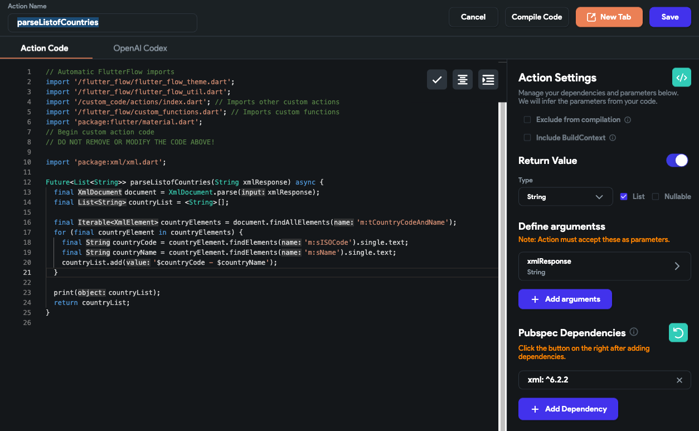
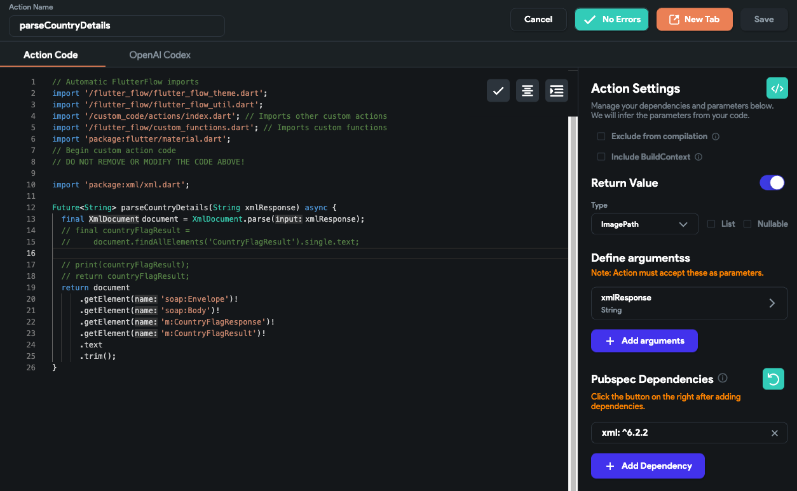
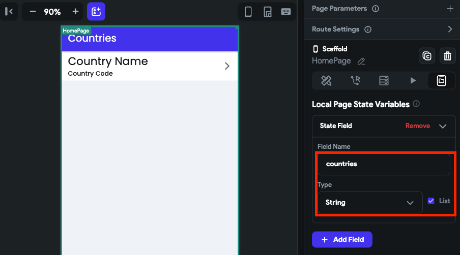
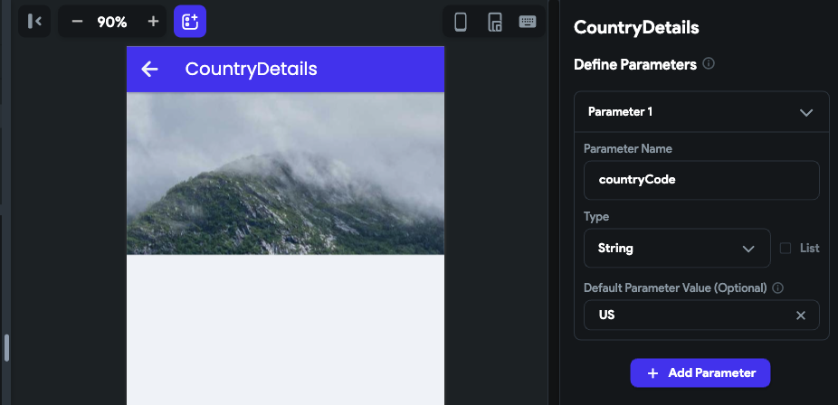
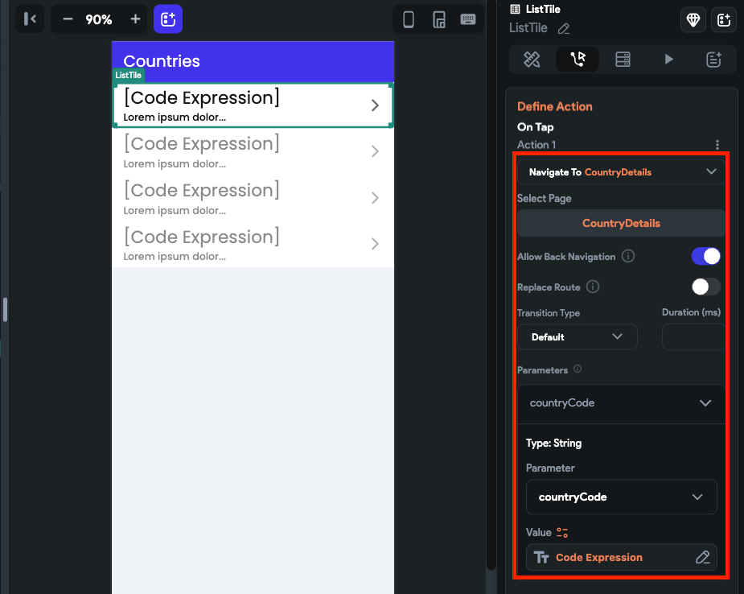
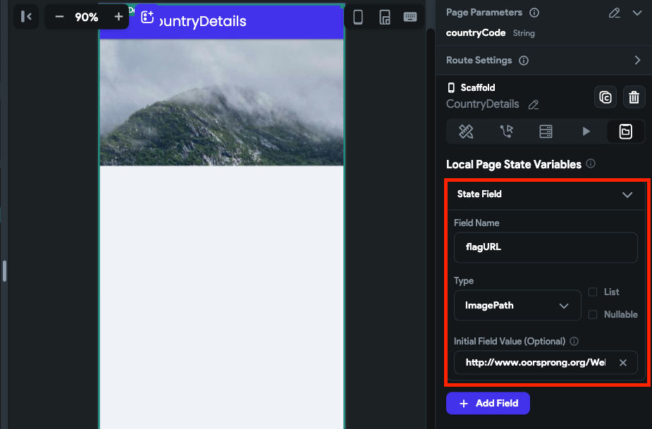
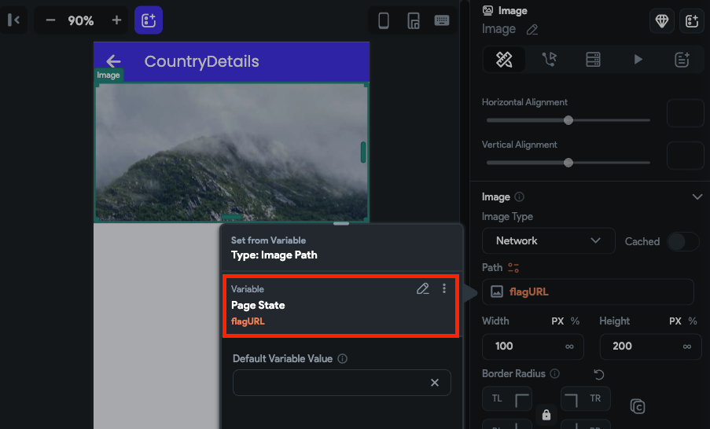

import Tabs from '@theme/Tabs';
import TabItem from '@theme/TabItem';

# SOAP APIs

SOAP APIs (Simple Object Access Protocol) provide a standardized way to communicate between systems, typically using XML as the message format and operating over protocols such as HTTP, SMTP, and more.

Unlike REST APIs, which use a flexible request/response model and typically exchange data in JSON, SOAP APIs are built around a formal contract defined by WSDL. This contract ensures strict adherence to communication standards, making SOAP APIs more rigid but also more reliable and secure—ideal for enterprise applications requiring transactional integrity and guaranteed message delivery.

SOAP APIs are particularly well-suited for scenarios where robust security and detailed error handling are required, such as in financial services or telecommunications.

### Difference between SOAP APIs and REST APIs:

**Protocol and Message Format**: SOAP is protocol-based with XML messaging, while REST is more flexible, using HTTP methods and supporting multiple data formats like JSON and XML.

**Connection Lifecycle**: SOAP operates with independent requests and responses, while REST is stateless, where each request is independent, making REST more scalable and easier to manage.

**Use Case**: SOAP is preferred in scenarios where formal contracts and high security are required, while REST is more suitable for lightweight, scalable web services.

<Tabs>
<TabItem value="1" label="SOAP Example response" default>
```xml
<soap:Envelope xmlns:soap="http://www.w3.org/2003/05/soap-envelope">
  <soap:Body>
    <GetMatchScoreResponse xmlns="http://example.com/scores">
      <MatchScore>
        <Team1>Red Dragons</Team1>
        <Team2>Silver Sharks</Team2>
        <Score>2-1</Score>
      </MatchScore>
    </GetMatchScoreResponse>
  </soap:Body>
</soap:Envelope>
```
</TabItem>
<TabItem value="2" label="REST Example response">
```json
{
  "event": "match_score",
  "data": {
    "team1": "Red Dragons",
    "team2": "Silver Sharks",
    "score": "2-1"
  }
}
```
</TabItem>
</Tabs>

## Building an App

This guide provides a step-by-step instructions on how to add and use SOAP APIs to build an example app that displays a list of countries. Upon tapping on a country name, the user is taken to a details page where the country flag is displayed. By following these instructions, you can learn how to add SOAP APIs into your app and create a basic navigation flow.

The final app looks like this:

<div style={{
    position: 'relative',
    paddingBottom: 'calc(56.67989417989418% + 41px)', // Keeps the aspect ratio and additional padding
    height: 0,
    width: '100%'}}>
    <iframe 
        src="https://demo.arcade.software/tbf3GWI6ElhejYAuJXBv?embed&show_copy_link=true"
        title=""
        style={{
            position: 'absolute',
            top: 0,
            left: 0,
            width: '100%',
            height: '100%',
            colorScheme: 'light'
        }}
        frameborder="0"
        loading="lazy"
        webkitAllowFullScreen
        mozAllowFullScreen
        allowFullScreen
        allow="clipboard-write">
    </iframe>
</div>
<p></p>


:::info[What you'll learn]

- How to create SOAP APIs.
- Creating API with dynamic data in the request body.
- Parsing XML response.
- How to navigate and pass data to a new page.
:::

To build such an app, you will need the following pages.

1. **HomePage**: It shows a list of all countries.
2. **CountryDetails**: Shows the country flag.

Here's how you'll navigate between these pages:


The steps to build the app are as follows:


### 1. Build UI

Let's start with building the UI for both pages.

#### 1.1 Home page

On this page you display the list of all countries using [**ListView**](../../../ui/widgets/composing-widgets/list-grid.md#listview-widget) and [**ListTile**](../../../ui/widgets/composing-widgets/list-grid.md#listview-widget) widgets.


#### 1.2 Country details page

This page shows the country flag using the [**Image**](../../../ui/widgets/basic-widgets/image.md) widget.


### 2. Create APIs

For building this example, we will use two APIs from Postman's [**Public SOAP APIs**](https://www.postman.com/cs-demo/workspace/public-soap-apis). Here are they:

1. [**getCountries**](https://www.postman.com/cs-demo/workspace/public-soap-apis/request/8854915-96a53688-6305-45be-ab8b-ca1d1c88f830)
2. [**getCountryFlag**](https://www.postman.com/cs-demo/workspace/public-soap-apis/request/8854915-4f5fae60-9ae1-4b77-8518-59e9143b8fb4)

Before you build anything related to APIs in your app, you must create and test the APIs to make sure all the APIs are working correctly. So let's [create and test](create-test-api-calls.md) these APIs in our project.

#### 2.1 getCountries

This API retrieves a list of all countries' names and codes. You can add this API by following the instructions [here](create-test-api-calls.md).

:::info
It's **important** to note that you need to include the proper *Header* in your requests, such as "**Content-Type: text/xml; charset=utf-8**", and set the request *Body* type to "**Text**".
:::

Here's how you do it:

<div style={{
    position: 'relative',
    paddingBottom: 'calc(56.67989417989418% + 41px)', // Keeps the aspect ratio and additional padding
    height: 0,
    width: '100%'}}>
    <iframe 
        src="https://www.loom.com/embed/0c0ebd8acb9f40a8b739f3940e772c24?sid=f88b7899-df56-47b3-b29a-e582cdfad2e9"
        title=""
        style={{
            position: 'absolute',
            top: 0,
            left: 0,
            width: '100%',
            height: '100%',
            colorScheme: 'light'
        }}
        frameborder="0"
        loading="lazy"
        webkitAllowFullScreen
        mozAllowFullScreen
        allowFullScreen
        allow="clipboard-write">
    </iframe>
</div>
<p></p>

#### 2.2 getCountryFlag

This API gets you the country's flag based on its code. You can pass the country code dynamically into the request body by creating a variable. See how to do it [here](rest-api.md#creating-variables).


<Tabs>
<TabItem value="1" label="Request body" default>

</TabItem>
<TabItem value="2" label="Header">

</TabItem>
</Tabs>

### 3. Create custom actions

The APIs you added in the previous step return the result in [XML](https://www.w3schools.com/xml/xml_whatis.asp) format, which needs to be parsed to extract relevant data or information. This can be accomplished using a [custom action](../../../../ff-concepts/adding-customization/custom-actions.md). The custom action can utilize the '[xml](https://pub.dev/packages/xml)' package to parse the XML response and retrieve data in a format that can be easily displayed on UI widgets.

For this example, you need to create two custom actions that parse the result for two APIs. Here are they:

#### 3.1 parseListofCountries

This custom action parses the result of [getCountries](#21-getcountries) API and gives the list of countries in a *List* variable with a *Type* *String*.

Here's the code with an explanation in the comments:

```dart
// Automatic FlutterFlow imports
import '/flutter_flow/flutter_flow_theme.dart';
import '/flutter_flow/flutter_flow_util.dart';
import '/custom_code/actions/index.dart'; // Imports other custom actions
import '/flutter_flow/custom_functions.dart'; // Imports custom functions
import 'package:flutter/material.dart';
// Begin custom action code
// DO NOT REMOVE OR MODIFY THE CODE ABOVE!

import 'package:xml/xml.dart';

Future<List<String>> parseListofCountries(String xmlResponse) async {
  final document = XmlDocument.parse(xmlResponse);
  final countryList = <String>[]; // Create an empty list to hold the countries

  // Find all elements with tag 'm:tCountryCodeAndName'
  final countryElements = document.findAllElements('m:tCountryCodeAndName');
  // Loop through all the 'm:tCountryCodeAndName' elements found above
  for (final countryElement in countryElements) {
    // Extract the country code from the element
    final countryCode = countryElement.findElements('m:sISOCode').single.text;
    // Extract the country name from the element
    final countryName = countryElement.findElements('m:sName').single.text;
    // Add the country code and name to the country list as a single string
    countryList.add('$countryCode - $countryName');
  }

  print(countryList);
  return countryList;
}
```

Here's how it looks after adding:



#### 3.2 parseCountryDetails

This custom action parses the result of [**getCountryFlag**](#22-getcountryflag) API. It uses method chaining to navigate to the desired element and retrieve the flag URL.

Here's the code with an explanation in the comments:


```dart
// Automatic FlutterFlow imports
import '/flutter_flow/flutter_flow_theme.dart';
import '/flutter_flow/flutter_flow_util.dart';
import '/custom_code/actions/index.dart'; // Imports other custom actions
import '/flutter_flow/custom_functions.dart'; // Imports custom functions
import 'package:flutter/material.dart';
// Begin custom action code
// DO NOT REMOVE OR MODIFY THE CODE ABOVE!

import 'package:xml/xml.dart';

Future<String> parseCountryDetails(String xmlResponse) async {
  final document = XmlDocument.parse(xmlResponse);

  return document
      .getElement('soap:Envelope')! // Access the soap:Envelope element
      .getElement('soap:Body')! // Access the soap:Body element
      .getElement('m:CountryFlagResponse')! // Access the m:CountryFlagResponse element
      .getElement('m:CountryFlagResult')! // Access the m:CountryFlagResult element
      .text // Retrieve the text value of the element
      .trim(); // Trim any leading or trailing whitespaces
}
```

Here's how it looks after adding:



### 4. Showing a list of countries

You can now proceed to display the country list in *HomePage*. Here are the steps you should follow:

1. Open the HomePage.
2. Create a [page state](../../../ui/pages/page-lifecycle.md#creating-a-page-state) variable (i.e., *countries*) to hold the list of countries. This will be used to bind data in a ListView.

    

3. Select the page and add the following action chain.
    1. The API call to [getCountries](#21-getcountries).
    2. On success, [add a custom action](../../../../ff-concepts/adding-customization/custom-actions.md) to [parseListOfCountries](#31-parselistofcountries). It's **important** to note that you must pass the result of a previous API call as a function argument and set the **API Response Options** to **Raw Body Text**. Also, add the *Action Output Variable Name*.
    3. Add the [update page state](../../../ui/pages/page-lifecycle.md#update-page-state-action) action and set the variable (i.e., *countries*) value with the output of the custom action (previously added). Ensure you keep the **Update Type** to **Rebuild Current Page**.

    <div style={{
        position: 'relative',
        paddingBottom: 'calc(56.67989417989418% + 41px)', // Keeps the aspect ratio and additional padding
        height: 0,
        width: '100%'}}>
        <iframe 
            src="https://www.loom.com/embed/f009aef15a2046e2ab7dd68143937cbf?sid=31fb7af7-f347-4902-8de9-ee2b74be1426"
            title=""
            style={{
                position: 'absolute',
                top: 0,
                left: 0,
                width: '100%',
                height: '100%',
                colorScheme: 'light'
            }}
            frameborder="0"
            loading="lazy"
            webkitAllowFullScreen
            mozAllowFullScreen
            allowFullScreen
            allow="clipboard-write">
        </iframe>
    </div>
    <p></p>

4. On ListView, [generate dynamic children](../../../ui/widgets/composing-widgets/generate-dynamic-children.md) using the page state variable.
5. The page state variable stores the country name and code as a single string (e.g., Australia - AT). To display the name and code separately in a *ListTile*, we can use a [code expression](../../../control-flow/functions/utility-functions.md#code-expressions). To display the country name, we can use `var1.split("-")[1].trim()`, where `var1` is the current item in the list. To display the country code, we can use the same expression and replace `[1]` with `[0]`.

    <div style={{
        position: 'relative',
        paddingBottom: 'calc(56.67989417989418% + 41px)', // Keeps the aspect ratio and additional padding
        height: 0,
        width: '100%'}}>
        <iframe 
            src="https://www.loom.com/embed/933dbf3f9f394d929174e09efb97410d?sid=4d010707-fa5a-4648-b8a4-49d93d95c9ce"
            title=""
            style={{
                position: 'absolute',
                top: 0,
                left: 0,
                width: '100%',
                height: '100%',
                colorScheme: 'light'
            }}
            frameborder="0"
            loading="lazy"
            webkitAllowFullScreen
            mozAllowFullScreen
            allowFullScreen
            allow="clipboard-write">
        </iframe>
    </div>
    <p></p>

### 5. Navigate to the country details page

On tapping the country name (ListView > ListTile widget), you will navigate to the *CountryDetails* page and pass the country code. This will be used to retrieve the flag of the country in the next step.

To do so:

1. Select the **ListTile** widget and add an [action to navigate](../../../../ff-concepts/navigation-routing/page-navigation.md#navigate-to-action) to the *CountryDetails* page.
2. Inside this action, click on the **Define** button. This will open the *CountryDetails* page, where you can define a parameter that will accept the country code.
3. After defining the parameter, open this action again and pass the country code using the code expression we used in the previous step (e.g., `var1.split("-")[0].trim()`).

<Tabs>
<TabItem value="1" label="Parameter on CountryDetails page" default>

</TabItem>
<TabItem value="2" label="Passing country code while navigating to CountryDetails page">

</TabItem>
</Tabs>

### 6. Show country flag

Whenever this page opens, it will have the country code (as a page parameter). You can use it to make an API call and get the respective country flag.

Here are the step-by-step instructions:

1. Open the *CountryPage*.
2. Create a [page state](../../../ui/pages/page-lifecycle.md#creating-a-page-state) variable with **Type** as **ImagePath** (i.e., *flagURL*) to hold the URL of the flag image. This will be used to display in the *Image* widget.

    

3. Select the page and add the following action chain.
    1. The API call to [getCountryFlag](#22-getcountryflag).
    2. On success, [add a custom action](../../../../ff-concepts/adding-customization/custom-actions.md) to [parseCountryDetails](#32-parsecountrydetails). It's **important** to note that you must pass the result of a previous API call as a function argument and set the **API Response Options** to **Raw Body Text**. Also, add the *Action Output Variable Name*.
    3. Add the [update page state](../../../ui/pages/page-lifecycle.md#update-page-state-action) action and set the variable (i.e., *flagURL*) value with the output previously added custom action. Ensure you keep the **Update Type** to **Rebuild Current Page**.

    <div style={{
        position: 'relative',
        paddingBottom: 'calc(56.67989417989418% + 41px)', // Keeps the aspect ratio and additional padding
        height: 0,
        width: '100%'}}>
        <iframe 
            src="https://www.loom.com/embed/634936ad3557402a8ee60c5ece8fe0a4?sid=6e2ab70b-2432-4f79-a43d-73b1de5bc2a5"
            title=""
            style={{
                position: 'absolute',
                top: 0,
                left: 0,
                width: '100%',
                height: '100%',
                colorScheme: 'light'
            }}
            frameborder="0"
            loading="lazy"
            webkitAllowFullScreen
            mozAllowFullScreen
            allowFullScreen
            allow="clipboard-write">
        </iframe>
    </div>
    <p></p>

4. Now simply use the page state variable to display the flag URL in the *Image* widget.

    

## Get the example app

Get the clonable version of this app [here](https://app.flutterflow.io/project/soap-countries-4tbmom).