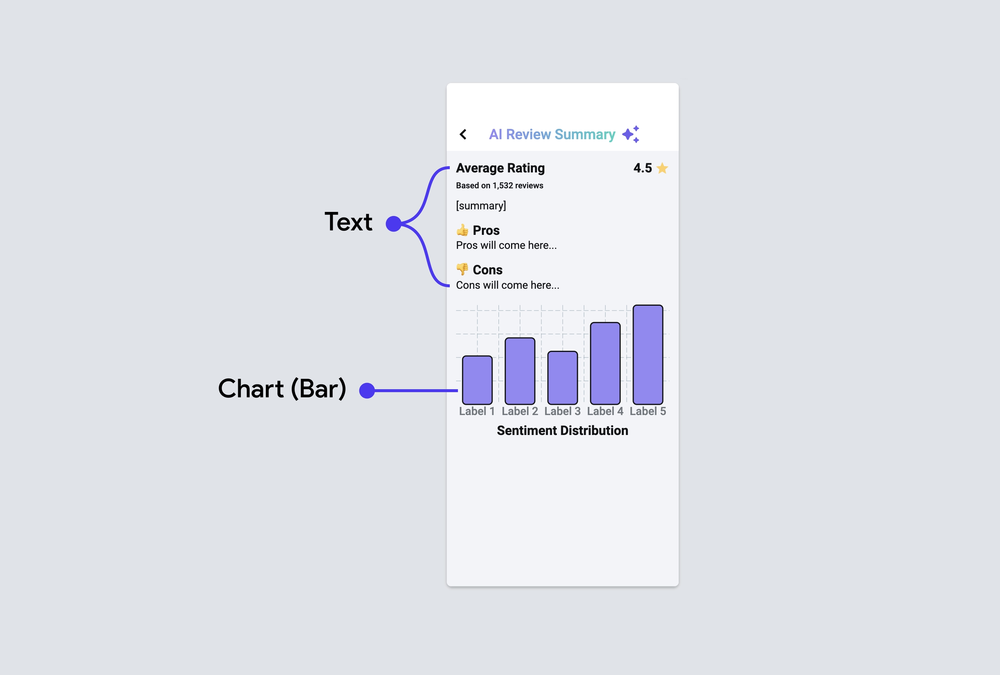
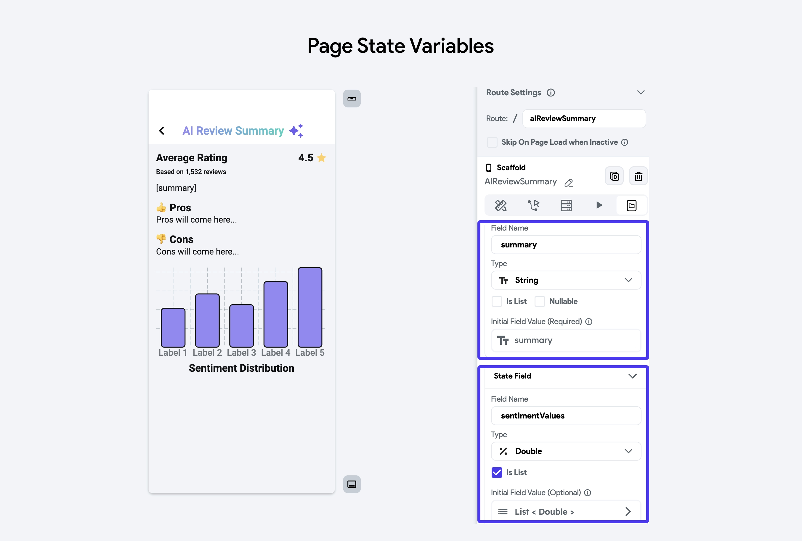

# Streaming APIs

Streaming APIs provide a continuous flow of data over a long-lived HTTP connection, enabling real-time updates for your application.

Unlike REST APIs, which deliver data in response to specific requests, streaming APIs are designed to maintain an open connection between the client and the server, continuously sending data as it becomes available. This is particularly useful for applications that require live updates, such as live sports scores, stock market tickers, chat applications, and real-time notifications.

This reduces latency and improves the user experience by providing immediate feedback. The most common protocol used for streaming APIs is Server Sent Events (SSE), but others like WebSockets can also be used depending on the application's requirements.

### Difference between REST APIs and Streaming APIs

The primary difference between REST APIs and Streaming APIs lies in their data delivery methods:

* **REST APIs**:
	+ **Request/Response Model**: The client sends a request, and the server responds with the data.
	+ **Connection Lifecycle**: Each request/response pair is independent, and the server closes the connection after sending the response.
	+ **Use Case**: Suitable for applications where data doesn't change frequently and real-time updates aren't critical.
	+ **Example response**:

	```
	{  
	  "event": "match_score",
	  "data": {
	    "team1": "Red Dragons",
	    "team2": "Silver Sharks",
	    "score": "2-1"
	  }
	}
	```
* **Streaming APIs (Server Sent Events)**:
	+ **Continuous Data Stream**: The server maintains an open connection and continuously sends data to the client as it becomes available.
	+ **Connection Lifecycle**: The connection remains open, allowing the server to push new data to the client without the client having to request it.
	+ **Use Case**: Ideal for applications requiring real-time updates, such as live sports scores, real-time notifications, and live chat applications.
	+ **Example response**:

	```
	event: match_score
	data: {"team1": "Red Dragons", "team2": "Silver Sharks", "score": "2-1"}
	
	event: match_score
	data: {"team1": "Red Dragons", "team2": "Silver Sharks", "score": "3-1"}
	
	event: match_score
	data: {"team1": "Red Dragons", "team2": "Silver Sharks", "score": "3-2"}
	```

## Example: AI Review Summary 

Let's see how you can use streaming APIs in FlutterFlow by building an example that allows users to see an AI summary of product reviews. On page load, the app displays the AI summary in real-time, letting users watch the analysis unfold as it's being generated.

The final app looks like this:

<div style={{
    position: 'relative',
    paddingBottom: 'calc(56.67989417989418% + 41px)', // Keeps the aspect ratio and additional padding
    height: 0,
    width: '100%'
}}>
    <iframe 
        src="https://demo.arcade.software/EPHAltGtmoefX2QTXb0H?embed&show_copy_link=true"
        title=""
        style={{
            position: 'absolute',
            top: 0,
            left: 0,
            width: '100%',
            height: '100%',
            colorScheme: 'light'
        }}
        frameborder="0"
        loading="lazy"
        webkitAllowFullScreen
        mozAllowFullScreen
        allowFullScreen
        allow="clipboard-write">
    </iframe>
</div>

<p></p>

The steps to build the app are as follows:

1. [Build UI](#1-build-ui)
2. [Create API](#2-create-api)
3. [Create page state variable](#3-create-page-state-variables)
4. [Trigger and Parse API response](#4-trigger-and-extract-data-from-api-response)
5. [Extract chart data](#5-extract-chart-data)

### 1. Build UI

The user interface includes a section for the average rating, and number of reviews, followed by a detailed summary of the reviews including pros, cons, and sentiment distribution visualization. Here are key widgets to build the page:

* [**Text Widget**](../../../ui/widgets/basic-widgets/text.md): 
  Displays 
  the AI-generated summary of the reviews and a list of the positive and negative points mentioned in the reviews.
* [**Chart (Bar chart) Widget**](../../../ui/widgets/built-in-widgets/chart/bar-chart.md): Visual representation of the sentiment distribution (positive, neutral, negative) in a bar chart.

<p></p>


### 2. Create API

For building this app, we will use [OpenAI's Chat Completion API](https://platform.openai.com/docs/guides/text-generation/chat-completions-api) to generate a summary based on given reviews. Before you build anything related to APIs in your app, it's essential to create and test the APIs to ensure they work correctly. So let's [create and test](../api/create-test-api-calls.md) the Chat Completion API in our project.

Once created, open the **Advanced Settings** and **enable** the **Process Streaming Response** toggle.

Here's how you do it:

<p></p>

<div style={{
    position: 'relative',
    paddingBottom: 'calc(56.67989417989418% + 41px)', // Keeps the aspect ratio and additional padding
    height: 0,
    width: '100%'
}}>
    <iframe 
        src="https://demo.arcade.software/erzDAcLQ1mR7coF28oFi?embed&show_copy_link=true"
        title=""
        style={{
            position: 'absolute',
            top: 0,
            left: 0,
            width: '100%',
            height: '100%',
            colorScheme: 'light'
        }}
        frameborder="0"
        loading="lazy"
        webkitAllowFullScreen
        mozAllowFullScreen
        allowFullScreen
        allow="clipboard-write">
    </iframe>
</div>


### 3. Create page state variables

In this example, to hold and display the result of the generated AI summary, you'll need two variables.

1. `summary`: This variable will hold the full text of the summary that includes the overall sentiment of the reviews, key points mentioned by customers, and lists of pros and cons. It is initialized as an empty string and will later be updated with the AI-generated text.
2. `sentimentValues`: This variable will store the sentiment distribution values. It is a list of *double* representing the number of positive, neutral, and negative reviews. **Note that**, these values will be used to provide the *Bar Values* in a bar chart. It is initialized with three zeros and will later be updated with the actual counts of positive, neutral, and negative reviews.


### 4. Trigger and extract data from API response

You can trigger the streaming API just like any other regular API. However, the method of extracting and parsing data differs from that of a standard API. Unlike non-streaming APIs, where you receive a response in an action output variable, the streaming API provides data through the following response actions:

* **onMessage:** This action is triggered every time a new piece of data is received from the streaming API. You can use this action to update your UI or perform any logic with the incoming data in real-time.
* **onError:** This action is triggered when there is an error in the streaming connection. You can use this action to handle errors gracefully, such as displaying an error message to the user or attempting to reconnect.
* **onClose:** This action is triggered when the streaming connection is closed. You can use this action to perform cleanup tasks or to notify the user that the stream has ended.

Whenever the data is received, you can access the response body via the **OnMessage > Set Variable menu > Action Parameters > OnMessageInput**. and then use the [**Response Stream Message Options**](#response-stream-message-options) to extract the data.

For this specific example, we use the *Server Sent Event Stream Data JSON* option and then use this JSON path `$['choices'][0]['delta']['content']` to retrieve the story data.

Here's how exactly you do it:

<div style={{
    position: 'relative',
    paddingBottom: 'calc(56.67989417989418% + 41px)', // Keeps the aspect ratio and additional padding
    height: 0,
    width: '100%'
}}>
    <iframe 
        src="https://demo.arcade.software/hWI8Kin5EcytoC3Pk4Vj?embed&show_copy_link=true"
        title=""
        style={{
            position: 'absolute',
            top: 0,
            left: 0,
            width: '100%',
            height: '100%',
            colorScheme: 'light'
        }}
        frameborder="0"
        loading="lazy"
        webkitAllowFullScreen
        mozAllowFullScreen
        allowFullScreen
        allow="clipboard-write">
    </iframe>
</div>

### 5. Extract chart data

The API returns a detailed summary as text, but to display counts of positive, neutral, and negative reviews on chart, you need to extract these data from the text. To achieve this, you can write a simple [custom function](../../../../ff-concepts/adding-customization/custom-functions.md). Once the stream ends, pass the full text to the custom function to extract the relevant data and save the output in the `sentimentValues` page state variable we created earlier.

Here's how you do it:

<div style={{
    position: 'relative',
    paddingBottom: 'calc(56.67989417989418% + 41px)', // Keeps the aspect ratio and additional padding
    height: 0,
    width: '100%'
}}>
    <iframe 
        src="https://demo.arcade.software/U0TB9ENX5xSdfAVCB2BW?embed&show_copy_link=true"
        title=""
        style={{
            position: 'absolute',
            top: 0,
            left: 0,
            width: '100%',
            height: '100%',
            colorScheme: 'light'
        }}
        frameborder="0"
        loading="lazy"
        webkitAllowFullScreen
        mozAllowFullScreen
        allowFullScreen
        allow="clipboard-write">
    </iframe>
</div>

<p></p>

:::tip
* After saving the`sentimentValues`, it’s a good idea to remove the same data points from the generated review text to avoid redundancy.
* Similarly, you can extract other data like 'pros' and 'cons' and display them the way you like.
:::

## Response Stream Message Options

When working with Server Sent Events (SSE) in FlutterFlow, it's essential to understand how to process and handle the various components of the event messages. FlutterFlow provides several options that capture different parts of the SSE. Here are they:

### Server Sent Event Data JSON (Type: JSON)

This field captures the result of JSON parsing. For example:

```
event: chat

data: {"response": "hello", "version": 7}

id: 2
```
The Server Sent Event Data JSON would be:

```
{
  "response": "hello",
  "version": 7
}
```
**Note that** If the data is not in JSON format, it will be null:

```
event: ping

data: Server time is 2024-06-28T11:52:56+00:00

id: 2
```
The Server Sent Event Data JSON would be `null`.

### Server Sent Event Data Text (Type: String)

This field contains just the text of the "data" field from the SSE. If there are multiple "data" entries, they are concatenated with a new line. For example, from the event:

```
event: ping

data: Server time is 2024-06-28T11:52:56+00:00

id: 2
```
The Server Sent Event Data Text would be: `Server time is 2024-06-28T11:52:56+00:00`

And from the event:

```
event: journalEntry

data: Today I went to the park.

data: For Lunch I had a sandwich.

id: 3
```
The Server Sent Event Data Text would be:

```
Today I went to the park.

For Lunch I had a sandwich.
```
### Server Sent Event Name (Type: String)

This field contains the text of the "event" field from the SSE. For example:

```
event: ping

data: Server time is 2024-06-28T11:52:56+00:00

id: 2
```
The Server Sent Event Name would be `ping`.

### Server Sent Event ID (Type: Integer)

This field contains the text of the "id" field from the SSE, typically used to keep track of the last sent item from the server. For example:

```
event: ping

data: Server time is 2024-06-28T11:52:56+00:00

id: 2
```
The Server Sent Event ID would be `2`.

### Server Sent Event Retry (Type: String?)

This field contains the "retry" field from the SSE, typically used to communicate to the client when to try reconnecting to the server.

### Message Text (Type: String)

This includes the entire Server Sent Event (SSE) message, including new lines and fields ('data', 'event', 'id', 'retry'). For example:

```
event: ping

data: Server time is 2024-06-28T11:52:56+00:00

id: 2
```
## FAQs

<details>
<summary>Why does it show 'null'?</summary>
<p>

The "null" value appears in the Server Sent Event Data JSON field when the data is not in JSON format.

For instance, the following event data is not in JSON format:


```
event: ping
data: Server time is 2024-06-28T11:52:56+00:00
id: 2
```
The Server Sent Event Data JSON will be `null` because the data cannot be parsed as JSON.

You can fix this by using the following expression inside the [Code Expression](../../../control-flow/functions/utility-functions.md#code-expressions) to handle the `null` case:

```
responseData ?? ''
```
This expression ensures that if `responseData` is `null`, it will return an empty string instead.
</p>

</details>


