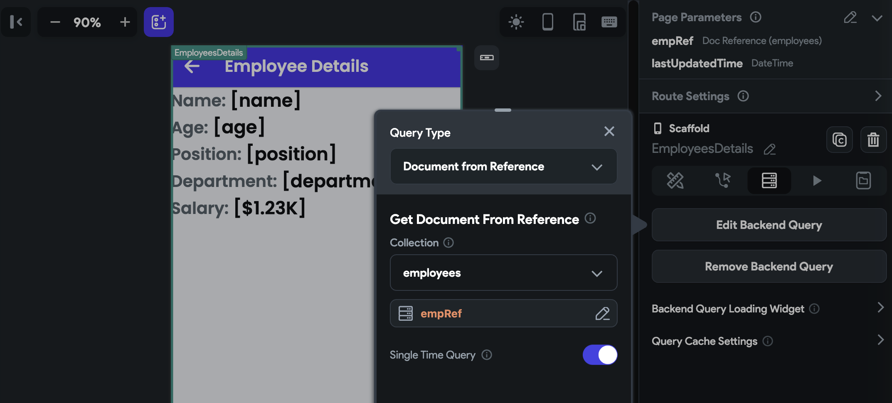
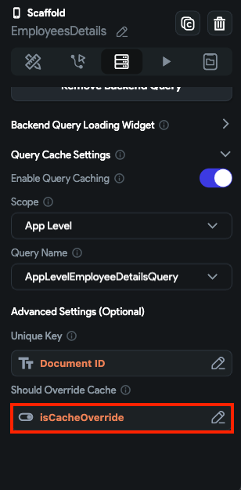
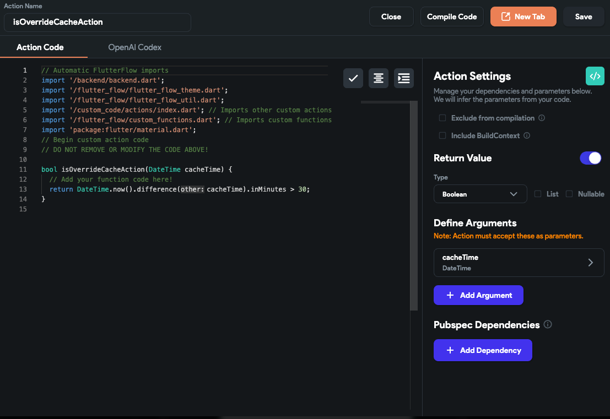

import Tabs from '@theme/Tabs';
import TabItem from '@theme/TabItem';

# Backend Query

**Backend Query** helps you to trigger a query automatically whenever a user navigates to the page containing the query. You can set a Backend Query on a particular widget or an entire page. The information retrieved using the Backend Query can be used in any widget present inside.

## Types of Query

We offer you the following types of Backend Queries that you can specify on any widget or page.

* [**Query Collection or Table**](query-collection.md)**:** This query type is used to fetch a single record or a list of records from a Firestore Collection or Supabase Table.
* [**Document from Reference**](document-from-reference.md)**:** Used to retrieve the details from a document reference.
* [**API Call Query**](api-call-query.md)**:** Used to initiate an API 
  call.
* [**SQLite Query**](sqlite-query.md): Used to execute the SQL statements.
* [**Algolia Search**](algolia-search-query.md)**:** Used to trigger an Algolia search on a Firestore Collection.

## Difference between Actions & Backend Query

| **Aspect**                   | **Actions**                                                                                                                                     | **Backend Queries**                                                                                                                         |
|------------------------------|-------------------------------------------------------------------------------------------------------------------------------------------------|---------------------------------------------------------------------------------------------------------------------------------------------|
| **Trigger**                  | Triggered by user interactions such as taps, double taps, or long presses on widgets, or they can be executed automatically on page load.       | Automatically triggered when the user navigates to a page or widget containing the query.                                                   |
| **Usage**                    | Can be used to navigate between pages, show messages, update variables, make API calls, and more.                                               | For apps needing instant updates like chat or live scores, Backend Queries can auto-refresh the UI with the latest database changes.         |
| **Multiplicity**             | You can specify multiple actions on the same widget.                                                                                            | Only one Backend Query can be specified on a particular widget or page.                                                                      |
| **Conditional Execution**    | Can be conditional, meaning they can execute different actions on certain conditions.                                                           | -                                                                                                                                           |
| **Caching**                  | -                                                                                                                                               | Can include caching mechanisms to improve app performance by reducing the number of server calls and providing offline access to data.      |
| **Handling States**          | -                                                                                                                                               | Often involve handling loading states and empty states, as the data fetching process can take time and might not always return results.     |
| **Data Fetching**            | -                                                                                                                                               | Only used to fetch data from a backend.                                                                                                      |


## Change loading indicator

While the backend query is busy retrieving results, it shows the default *Project Theme Loading 
Indicator* (which you can change from 
[**Navigation menu**](../../../../../docs/intro/ff-ui/builder.md#navigation-menu) *> Theme 
Settings > Design System > Loading Indicator*.) However, if you want to replace this with a custom loading indicator in a specific backend query, follow the instructions below:

<div style={{
    position: 'relative',
    paddingBottom: 'calc(56.67989417989418% + 41px)', // Keeps the aspect ratio and additional padding
    height: 0,
    width: '100%'
}}>
    <iframe 
        src="https://demo.arcade.software/bEmTE6KoPDCIUgbdhRWD?embed&show_copy_link=true"
        title=""
        style={{
            position: 'absolute',
            top: 0,
            left: 0,
            width: '100%',
            height: '100%',
            colorScheme: 'light'
        }}
        frameborder="0"
        loading="lazy"
        webkitAllowFullScreen
        mozAllowFullScreen
        allowFullScreen
        allow="clipboard-write">
    </iframe>
</div>

<p></p>

To change the loading indicator:

1. Ensure you have added a backend query.
2. Open the **Backend Query** section (on the right side) and scroll down to the **Backend Query Loading Widget**. Open it by clicking on the arrow icon.
3. Set the **Loading Widget Type** to **Image**. You can also choose a [**Component**](../../../ui/components/creating-components.md) if you have already designed a loading component.
4. Enable the **View in UI Builder**. This allows you to see your custom loading indicator on canvas (before you actually run the app).
5. Choose the **Image Type**, [add the image](../../../ui/widgets/basic-widgets/image.md#image-type), and adjust its **Padding** and **Width**.
6. To show the indicator in the center, turn on the **Center Image** toggle.
7. Run the app, and your custom loading indicator will appear while the data is being loaded.

<div class="video-container"><iframe src="https://www.loom.
com/embed/342529d978644aabac485e518eff4a76?sid=83c5d7c7-1a94-44c0-aec4-12786f768b2c" frameborder="0" allow="accelerometer; autoplay; clipboard-write; encrypted-media; gyroscope; picture-in-picture; web-share" referrerpolicy="strict-origin-when-cross-origin" allowfullscreen></iframe></div>


## Copy Query

Sometimes, you might want to display the same list of items with a little modification. For example, showing all Todo items and completed Todo items. In such a case, you can copy-paste the entire backend query to speed up the building process. This is helpful, especially when you have a complex backend query.

To copy-paste the query:

1. Select the widget (e.g., ListView, GridView, etc.) where you have already added the backend 
   query.
2. Select the **Backend Query** tab, and click the **Copy** button.
3. Now, select the widget (where you want to add the query), move to the **Backend Query** tab, and click **Paste Backend Query** button.
4. Click **Confirm**.

<div class="video-container"><iframe src="https://www.loom.
com/embed/9f6e9d436e1a4f9db63d05d835a75e51?sid=351e3c1a-71a3-4489-be07-c2850b2475fc" frameborder="0" allow="accelerometer; autoplay; clipboard-write; encrypted-media; gyroscope; picture-in-picture; web-share" referrerpolicy="strict-origin-when-cross-origin" allowfullscreen></iframe></div>


## Move query to parent widget

You might want to utilize the same backend query on multiple widgets on a page. But if you do so, you end up making redundant server calls for the same thing. So, instead of copying it on every widget, you can move the query to any parent widget. The existing widgets will then use a generated variable derived from the parent widget's query.

To move the query up to any parent widget, simply select the up arrow button and select the parent widget you would like the query to move to.

<div class="video-container"><iframe src="https://www.loom.
com/embed/a5bbb2c03c034826b0ebf2537595baee?sid=f81ddbae-a67b-4044-bdaa-9eee1cd17d35" frameborder="0" allow="accelerometer; autoplay; clipboard-write; encrypted-media; gyroscope; picture-in-picture; web-share" referrerpolicy="strict-origin-when-cross-origin" allowfullscreen></iframe></div>


## Displaying empty list widget

The *Empty List* widget is a widget used to display a message when there are no items in a list. This widget helps to provide a better user experience by displaying a message instead of just an empty screen.

To display the empty list widget:

1. Ensure you have added a backend query on any scrollable widget, such as **ListView**, **GridView**, **Column**, **Row**, DataTable, and **StaggeredView**.
2. Select the scrollable widget (on which you have added the backend query), move to the properties panel, and turn on the **Show Empty List Widget**.
3. Set **Widget Type** to **Image** or **Component**. The further options are available based on what you choose.
4. Try toggling the **View in UI Builder**. This allows you to see your empty list widget on canvas (before you actually run the app).
5. You can also control the size and centering of the widget using the available options.

<div class="video-container"><iframe src="https://www.loom.
com/embed/667ed7fd6cdd40b7b602dcae6000f151?sid=8e5a3e88-6b32-4bf9-b156-372b297be16a" frameborder="0" allow="accelerometer; autoplay; clipboard-write; encrypted-media; gyroscope; picture-in-picture; web-share" referrerpolicy="strict-origin-when-cross-origin" allowfullscreen></iframe></div>


## Backend Query Caching

Backend query caching refers to the process of storing the result of a backend query in a cache so that subsequent queries for the same data can be served directly from the cache rather than making a new query to the backend.

Caching a query can bring significant benefits to your app, including improved performance and reduced server load. Additionally, caching can enable your app to function offline by serving cached results when there is no internet connection available.

For example, an e-commerce app can cache product data, such as product descriptions, prices, and images, to avoid making unnecessary API calls for each page load.

:::note
Caching backend queries works for all [types of queries](#types-of-query).
:::

:::tip[Single time Query]
For Firebase queries, enable Single Time Query if you want the query to fetch data only once. Otherwise, the query operates in real-time, updating automatically as soon as the data changes.
:::

### When to cache

In general, any data that is static, slowly changing, or read more often than they are updated can be cached to improve performance and reduce the load on the server. A few examples are

1. Static content such as images and videos.
2. Configuration data such as application settings or system parameters.
3. Data that is expensive to compute, such as complex reports or analytics.

### When NOT to cache

Sometimes, it's not a good idea to cache the backend query. Here are some examples:

1. Large amounts of data can cause performance issues and may not be appropriate.
2. Sensitive or confidential data should not be cached, as it could lead to unauthorized access.
3. Frequently changing data, such as in real-time or near real-time scenarios, caching may not be appropriate as the cached data could quickly become stale or outdated.
4. Critical response time where the data needs to be up-to-date and accurate at all times.

### Example

Let's see how to cache a backend query with an example app that shows a list of employees on the first page and employees' details on the second page. On the employee details page, the data is retrieved from a backend query and read more often than they are updated, so it's a good candidate to cache.

To improve performance, you can cache the data on the details page so that it can be quickly retrieved and displayed to users.

Here is how it looks:

<div class="video-container"><iframe src="https://www.loom.
com/embed/9da2c25012de4710b9fe0a4db35a2b39?sid=ff77956c-48c8-4ac9-a791-b40e31be0175" frameborder="0" allow="accelerometer; autoplay; clipboard-write; encrypted-media; gyroscope; picture-in-picture; web-share" referrerpolicy="strict-origin-when-cross-origin" allowfullscreen></iframe></div>

<p></p>

:::note
In the visual above, see how the loading indicator appears for the first time a query is made on the page. However, subsequent queries will retrieve the result from the cache, and the loading indicator will not be displayed again.
:::

To cache the backend query:

1. Ensure you have added a backend query. For this example, to retrieve data from a Firebase 
document, we add a backend query at the page level as *Single Time Query*. We use a document reference to get the employee details.

  <figure>
      
    <figcaption class="centered-caption">Querying employee details using document reference</figcaption>
  </figure>

2. Open **Query Cache Settings** and **Enable Query Caching**.
3. Determine the **Scope** of the cache. If you set it to **App Level** and the *exact* same query is made on any other page of the app, it will display the result from the cache. However, if you set the **Page Level**, the cached result will be used only on that page if the query is made multiple times on the same page.
4. If the current query is completely new/different, create a **Query Name**. If not, and you want to use the cached result of this query (that might be created somewhere else), select the name from the list.

<div class="video-container"><iframe src="https://www.loom.
com/embed/f2efd72f590e4e83b67fe70da18ee193?sid=618d1d7d-a8de-4a78-b177-1fdab616638e" frameborder="0" allow="accelerometer; autoplay; clipboard-write; encrypted-media; gyroscope; picture-in-picture; web-share" referrerpolicy="strict-origin-when-cross-origin" allowfullscreen></iframe></div>

<p></p>

5. If we leave this example here, we'll have data inaccuracy issues. That means when any employee 
data is cached, the same data will be used for all employees, which is not what we want. We want to cache data for all individual employees. To do so, we can set the **Unique Key**. Here the unique key can be the employee id or the document reference.

<Tabs>
<TabItem value="1" label="Data inaccuracy without Unique Key" default>
<div class="video-container"><iframe src="https://www.loom.
com/embed/b0383a28dd2c4ad4aa761c27be9f7d3d?sid=2d6ec072-976a-4116-b971-78c1c8e79704" frameborder="0" allow="accelerometer; autoplay; clipboard-write; encrypted-media; gyroscope; picture-in-picture; web-share" referrerpolicy="strict-origin-when-cross-origin" allowfullscreen></iframe></div>
</TabItem>
<TabItem value="2" label="Adding Unique Key ">
<div class="video-container"><iframe src="https://www.loom.
com/embed/ed9716ec74e542d8a264e87235ce3aec?sid=7b03c276-a8bb-4dbf-9131-acf0a1fa9e8b" frameborder="0" allow="accelerometer; autoplay; clipboard-write; encrypted-media; gyroscope; picture-in-picture; web-share" referrerpolicy="strict-origin-when-cross-origin" allowfullscreen></iframe></div>
</TabItem>
</Tabs>

<p></p>

6. At this point, we have enabled the caching, but we still have one problem. Once the query is 
cached, it will be used forever, although we update the data in our backend. This is because we are not clearing or invalidating the cache at the appropriate time. To properly invalidate the cache, you can use the **Should Override Cache** property OR **Clear Query Cache** action. This helps you remove the cached data that has become stale or outdated.

    1. The *Should Override Cache* property accepts a boolean (True/False). That means we can 
   provide a variable (e.g., an *App State* variable named *isCacheOverride)* that knows when to override the cache. So create one and set it here.
    2. Create one more *App State* variable, something like *lastCacheTime,* and set the current time as default. This will be used to save the time of results retrieved from the backend. You'll better understand how helpful it is in the logic we add in the next step.

<figure>
    
  <figcaption class="centered-caption">Setting Should Override Cache to App State variable</figcaption>
</figure>

<p></p>

7. Now, we must add a logic that determines whether to override the cache (every time when the 
page is loaded) and set the *isCacheOverride* variable accordingly. Here is how it goes:

    1. First, check if the *lastCacheTime* is set or not. If not, set the current time to it.
    2. Then the idea is to create one custom action that checks if the current time is more than 30 minutes ahead of the *lastCacheTime*. **Note** that 30 minutes is the cache expiration time, and here, it is kept minimum just for simplification purposes; It's important to carefully choose the appropriate expiration time for your cache based on the nature of your data.
    3. if **True** :
        1. [Update](../../../../resources/data-representation/app-state.md#update-app-state-action) the **lastCacheTime** with 
       the current time and **isCacheOverride** to True. Make sure you keep the **Update Type** to **Rebuild Current Page** so that the backend query is made again, which will invalidate the cache and display updated data.
        2. You can also add an action to [Clear Query Cache](#).
        3. Continuing the same action flow, [wait](../../../../resources/control-flow/time-based-logic/wait-action.md) for 1 sec and again update **isCacheOverride** to **False** so that the cached result won't override on page load for the next 30 min.

<div class="video-container"><iframe src="https://www.loom.
com/embed/b5ca17571da943f2811db8b485ed4f02?sid=5e0a2480-727a-4868-8dd1-11f58e60d1f8" frameborder="0" allow="accelerometer; autoplay; clipboard-write; encrypted-media; gyroscope; picture-in-picture; web-share" referrerpolicy="strict-origin-when-cross-origin" allowfullscreen></iframe></div>

<p></p>

:::note[Note]
**Note** that in this example, we use both the *Clear Query Cache* action and the *Should Override Cache* property to clear or invalidate the cache. Although both perform the same task, it's generally considered better practice to explicitly *Clear Query Cache* rather than relying on the *Should Override Cache* bool. However, in certain cases, you may want to override the cache conditionally instead of with an explicit action, so the option is there.
:::

Here is how the custom function looks in case you want to check:

```
bool isOverrideCacheAction(DateTime cacheTime) {
  // Add your function code here!
  return DateTime.now().difference(cacheTime).inMinutes > 30;
}
```


<figure>
    
  <figcaption class="centered-caption">Custom function to know if last cache time is more than 30 minutes</figcaption>
</figure>

:::tip
You can have a separate *lastCacheTime* variable for all the employee records to avoid any 
conflict with others. Failing to do so may keep on updating the common *lastCacheTime* variable, and you might not see updated data. For example, creating a list of JSON that contains the id and *lastCacheTime* of an employee might help. Like this:

`{ "id": 1, "lastCacheTime": '2023-03-22T14:30:00+00:00', }`

:::

### Clear Query Cache [Action]
This action provides a simple way to clear the query cache, which can be helpful in situations where the cached data is no longer accurate or needs to be refreshed. By executing this action, you reset the query cache, allowing the app to fetch and display the most up-to-date data.

:::tip
This can help improve app performance and ensure users see the most recent information available.
:::

Follow the steps below to add this action to any widget.

1. Select the **Widget** (e.g., Container, Button, etc.) on which you want to add the action.
2. Select **Actions** from the [properties panel](../../../../intro/ff-ui/builder.md#properties-panel) (the right menu), If it's the first action, click **+ Add Action** button. Otherwise, click the "**+**" button below the previous action tile (inside *Action Flow Editor*) and select **Add Action**.
3. Search and select the **Clear Query Cache** (under *State Management*) action.
4. Determine the **Scope** of the cache, whether it lives at the **App Level** or **Page Level**.
5. Set the **Query Name** to the one you gave while adding the query cache.
6. If you have set the **Unique Key** while caching a query, you should add the same key here as well. This ensures that the cache will be removed only for specific data.

<div style={{
    position: 'relative',
    paddingBottom: 'calc(56.67989417989418% + 41px)', // Keeps the aspect ratio and additional padding
    height: 0,
    width: '100%'}}>
    <iframe 
        src="https://demo.arcade.software/Dd7WqsRVbJbAL4ml2Gse?embed&show_copy_link=true"
        title=""
        style={{
            position: 'absolute',
            top: 0,
            left: 0,
            width: '100%',
            height: '100%',
            colorScheme: 'light'
        }}
        frameborder="0"
        loading="lazy"
        webkitAllowFullScreen
        mozAllowFullScreen
        allowFullScreen
        allow="clipboard-write">
    </iframe>
</div>
<p></p>