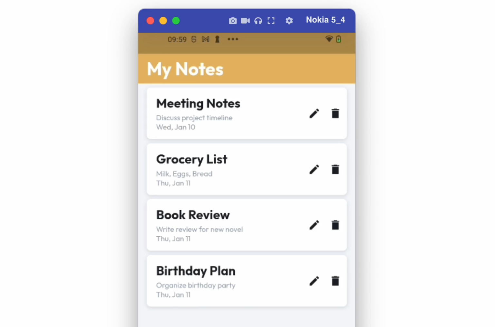

# SQLite Query

SQLite Query can be set up to automatically execute SQL statements as soon as a page or widget loads. This feature is useful for fetching data from the database to display on a page or widget, such as populating a ListView with items or showing user preferences in Text widgets.

:::info[Prerequisites]

Before you add this query, ensure you configure the database and define the query. Check detailed instructions [here](../../../../ff-integrations/database/local-sql/quickstart.md).
:::

## Adding SQLite query

Let's see how to display a list of items from the database using the SQLite query. Here are the steps:

1. [Add query](#1-add-query)
2. [Showing query data in UI element](#2-showing-query-data-in-ui-element)

### 1. Add query

Go to your project page and follow the steps below to define an SQLite query:

1. Select the **widget** (or page) on which to apply the query.
2. Select **Backend Query** from the Properties Panel (the right menu).
3. Click **Add Query** and set the **Query Type** to **SQLite Query**.
4. Select the **Query Name**. (Only *Read Queries* will be displayed here.)
5. Click **Confirm**.

<iframe src="https://www.loom.
com/embed/29001cdee28d4d058dd711b3bbb70b7e?sid=d5be04cc-1ce3-4f16-98e1-5b929c0f6673" frameborder="0" allow="accelerometer; autoplay; clipboard-write; encrypted-media; gyroscope; picture-in-picture; web-share" referrerpolicy="strict-origin-when-cross-origin" allowfullscreen></iframe>

### 2. Showing query data in UI element

Once you have the SQLite query defined, you can use the data retrieved from the query to display on widgets present inside. Follow the steps below:

1. Select the **widget** (e.g., `Text`) on which you want to display the data.
2. From the Properties Panel, open the **Set from Variable** menu **>** select **[your query name] Row** **>** select the column data that you want display here.
3. Click **Confirm**.

<iframe src="https://www.loom.
com/embed/1cf9df4d871948c1b6513587c05d9040?sid=c77df270-a91b-40da-b796-05f243ae9d15" frameborder="0" allow="accelerometer; autoplay; clipboard-write; encrypted-media; gyroscope; picture-in-picture; web-share" referrerpolicy="strict-origin-when-cross-origin" allowfullscreen></iframe>

