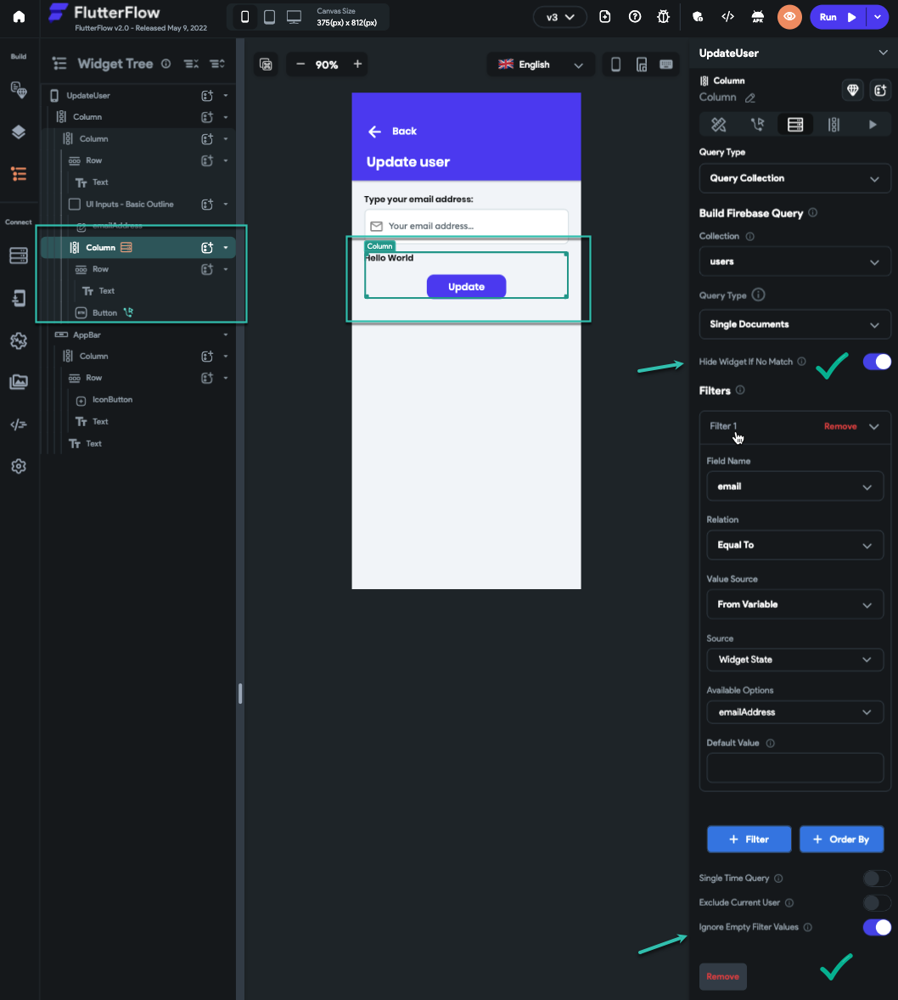
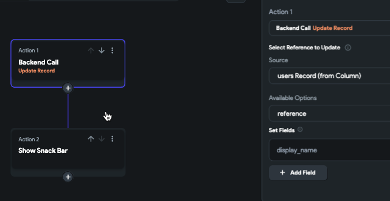

# Update a User Record Using Email Input

This article explains how to update a user document in Firebase based on an email address entered in a `TextField`. This approach is useful when you want to locate a user record dynamically and update it based on real-time user input.

You may need to update or associate a document with a user record based on an email typed by the current user. Since FlutterFlow does not support queries directly as an action, this setup allows you to use widget-level queries and UI logic instead.

Follow the steps below to update User Record using Email input:

    1. **Add the Input Field**

        - Place a `TextField` on the canvas to accept the email input.
        - Enable **Update Page on Change** so the UI updates as the user types.

        

    2. **Add a Query-Linked Widget**

        - Add a container or column widget below the `TextField`.
        - Attach a **Single Document Query** to this widget, filtering by the entered email address.
        - Enable **Hide widget if no match** to conditionally show the result and the action button only when a matching document is found.

        

    3. **Add an Update Action**

        - Inside the visible widget, add a button.
        - Set the **On Tap** action to `Update Document`.
        - Select the user document from the query result as the source.
        - Add a `SnackBar` action to confirm the update.

        

:::tip
Instead of using **Update Page on Change**, you can:
- Store the text field value in a `localState` variable using a button action.
- Filter your query using this `localState` value.
:::

:::info[Example Project]
Explore this setup in the following FlutterFlow project:
**[UpdateUser Page – FlutterFlow Project](https://app.flutterflow.io/project/flutterflow-adcdi2)**
:::
