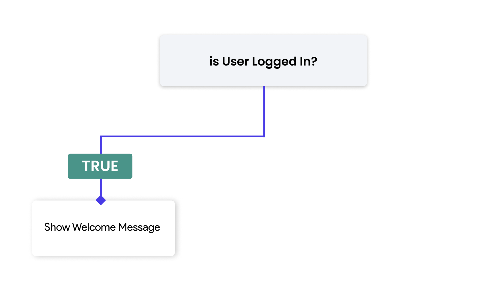
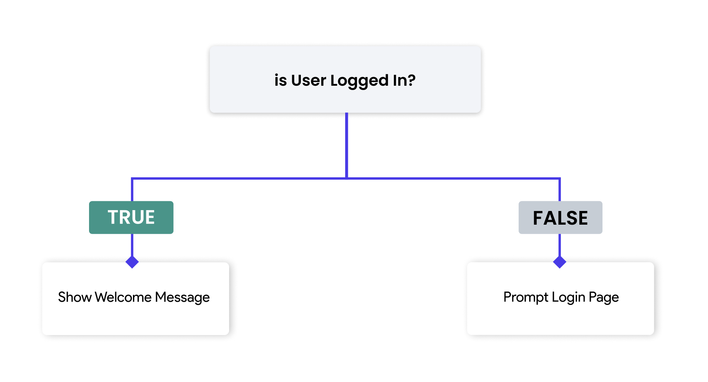
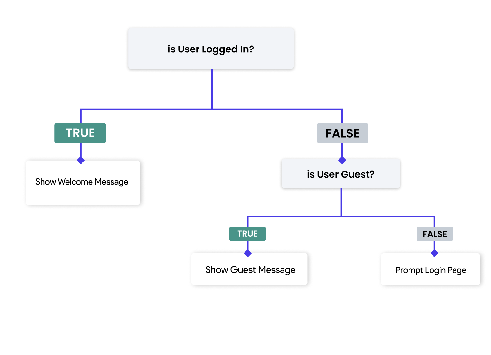
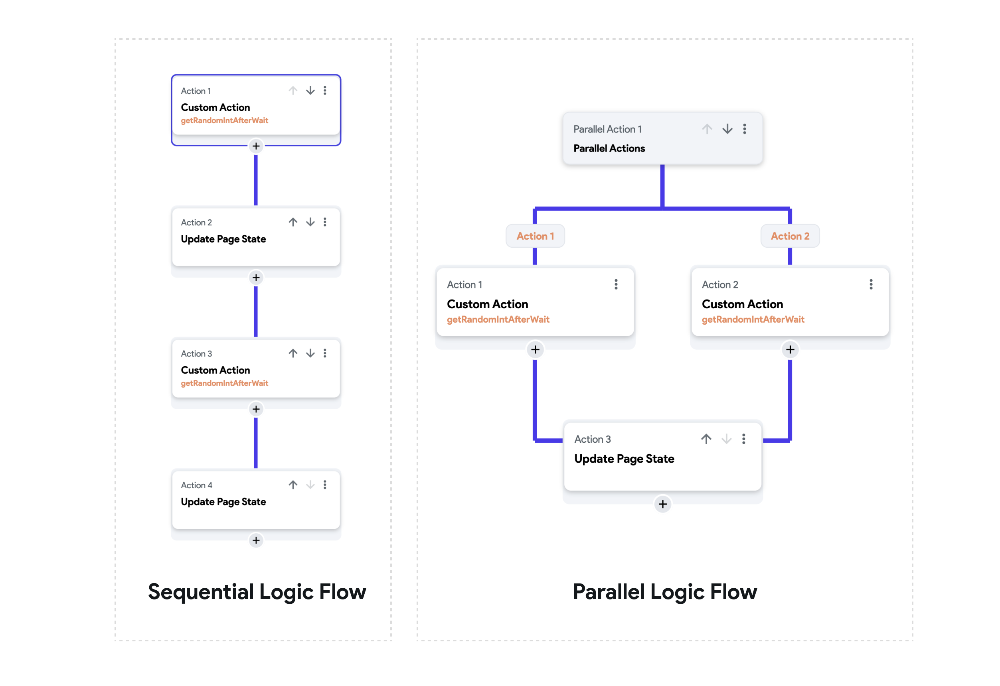

# Control Flow Concepts

In app development, control flow refers to the order in which individual statements,
instructions, or function calls are executed or evaluated. Proper control flow ensures that your
app behaves as expected under various conditions and user interactions. This involves
understanding and implementing **conditionals**, managing **sequential and parallel** logic
flows, handling **blocking and non-blocking** actions, and deciding when and how to execute
specific actions based on certain criteria.

In this section, we will explore various control flow concepts and how they can be effectively
implemented in FlutterFlow to create dynamic, responsive, and efficient applications.

## Conditional

One of the fundamental aspects of control flow is the use of conditionals, which allow your app
to make decisions and execute different blocks of code based on specific criteria. Conditional
statements are expressions that evaluate to either true or false. Depending on the result of
these evaluations, different logic sequences are executed.

The primary conditional statements are `if`, `if-else`, and `else`.

- **`if` Statement:** The if statement evaluates a condition and executes a block of code if the condition is true.

The if statement evaluates a condition and executes a block of code if the condition is true.




- **`if-else` Statement:**

The if-else statement provides an alternative block of code to execute if the condition is false.



Here, if `userIsLoggedIn` is true, the app will show a welcome message. Otherwise, it will prompt the user to log in.

<p></p>

- **`else if` Statement:**

The `else if` statement can be used to check multiple conditions sequentially.



This example demonstrates multiple conditions. If `userIsLoggedIn` is true, it shows a welcome message. If not, it checks if `userIsGuest` is true and shows a guest message. If neither condition is met, it prompts the user to log in.


### Implementing Conditionals
In FlutterFlow, you can implement conditional logic in two primary ways: 

- **[When Setting Properties](functions/conditional-logic.md#setting-widget-properties-with-conditional-logic)**

    In FlutterFlow, you can set properties of widgets conditionally. For example, you might want to change the color of a button based on a variable's value. You can use conditional expressions to dynamically set these properties during runtime.

- **[Conditional Actions](functions/conditional-logic.md#conditional-actions)**

  You can also perform conditional actions in FlutterFlow, where certain actions are executed 
  only if specified conditions are met. This is useful for implementing logic like 
  navigating to different pages based on user input or showing/hiding widgets.

  Example: If the user clicks a button and a form is valid, navigate to the next screen; otherwise, show an error message.

:::info 
Check out the [**complete guide**](functions/conditional-logic.md) here. Are you looking to learn about implementing conditional UI instead? Check out our **[Responsiveness 101](../../ff-concepts/layout/responsive-layout.md)** guide instead. 
:::

## Sequential vs Parallel Logic Flow

- **Sequential Logic Flow**:
  Actions are executed **one after the other**. Each action waits for the 
previous one to complete before starting. This is useful for tasks that depend on the outcome of previous actions. 

  **Example:** Submitting a form, waiting for a server response, and then showing a confirmation message.


- **Parallel Logic Flow**
  Multiple actions are executed at the **same time**, independently of each 
other. This is useful for tasks that can be done simultaneously and do not depend on each other's outcomes.
  
  **Example:** Loading data from multiple sources simultaneously to speed up the data fetching process.

## Asynchronous Functions

Asynchronous functions are operations that do not complete immediately and may finish at a
future time due to network delays or long computation times.

They can be made **blocking** or **non-blocking** depending on the use case. Some examples of asynchronous operations include:

- **Network requests** (e.g., fetching data from an API)
- **Database operations** (e.g., reading or writing data)
- **Long-running computations** (e.g., complex calculations)
- **Animations** (e.g., transitions, widget animations)

### Blocking Actions

Blocking actions are actions that halt the execution of subsequent actions until they are completed. These actions typically involve operations that take time, such as network requests or animations.

:::tip[Generated Code]
In the **generated code**, FlutterFlow uses the `await` keyword to pause the execution of an 
asynchronous function until the operation completes before proceeding to the next 
function. This approach is commonly used to handle asynchronous functions, ensuring that each operation finishes before the subsequent one begins.

In the following example from **generated code**, the code **awaits** on `actions.getRandomIntAfterWait()` because it is an asynchronous function that takes around 2 seconds to complete and provide a result (in this case, a random integer). 
```dart
    _model.result = await actions.getRandomIntAfterWait();
    _model.text1Value = _model.result.toString();
```

The result of the `actions.getRandomIntAfterWait()` is stored in `model.result` variable and 
then the result then set to a Text widget using the Page State variable `text1Value`.
:::


### Non-Blocking Actions
Non-blocking actions, on the other hand, allow the program to continue executing other 
subsequent tasks while waiting for the initial actions to complete in the background. 

:::tip[Generated Code]
In the **generated code**, when an asynchronous function is made **non-blocking**, FlutterFlow removes the `await` keyword. This means the subsequent function will not wait for the asynchronous action to complete and will move to the next action immediately.

The previous example will no longer work because it doesn't await the asynchronous function 
`actions.getRandomIntAfterWait()`. As a result, the variable `model.result` may not be 
ready or available when `_model.text1Value = _model.result.toString();` is executed.

```
_model.result = actions.getRandomIntAfterWait();
_model.text1Value = _model.result.toString(); // will throw errors
```

To ensure proper execution, make only those actions non-blocking whose subsequent actions do not depend on the results from these initial functions.

:::


## Non-Blocking vs Parallel Actions

| Non-Blocking Actions                                                   | Parallel Actions                                                                      |
|------------------------------------------------------------------------|---------------------------------------------------------------------------------------|
| Allows the subsequent action to run **immediately** after the current one without waiting for the current action to complete. | Allows users to run two or more actions at the **same time** independently.               |
| **Only asynchronous** functions can be made non-blocking.                  | **Both asynchronous and synchronous** functions can be included in parallel actions.      |
| Ideal for tasks where the result of the action is not immediately needed by the next action. | Ideal for independent tasks that can be executed simultaneously to improve efficiency. |
| Ensures the app remains responsive by not waiting for long-running tasks. | Helps in reducing overall execution time by performing multiple tasks concurrently.   |
| **Example**: Fetching data in the background while allowing user interaction. | **Example**: Loading data from two APIs simultaneously to save time.                     |

