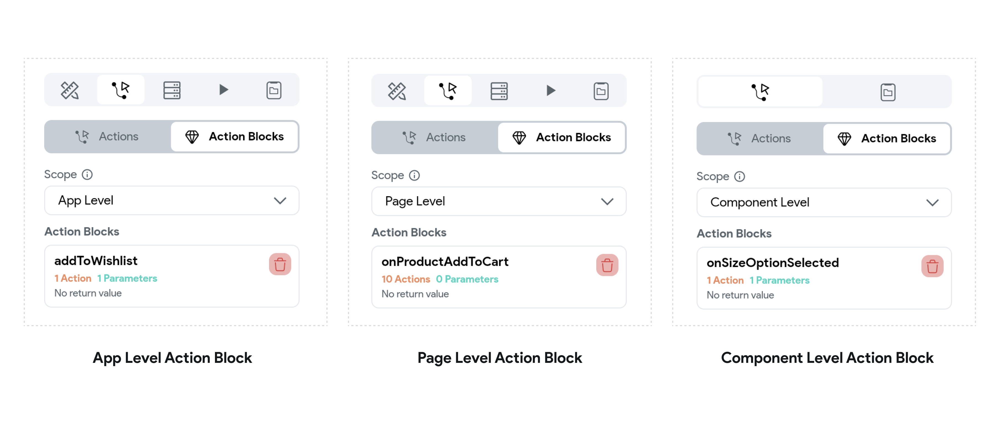

# Action Blocks

An Action Block is a set of actions that perform a specific task and can be reused in different parts of the app. If you find yourself repeatedly performing a particular set of operations in your app, it may be helpful to create an Action Block. This allows you to break down complex actions into smaller, more manageable units, making them easier to understand and modify in the future.

Action Blocks have different scopes, which determine their availability:
| **Action Block Type**            | **Description**                                                                                                                                                          | **Scope**                                                                                                                                                     |
|----------------------------------|--------------------------------------------------------------------------------------------------------------------------------------------------------------------------|---------------------------------------------------------------------------------------------------------------------------------------------------------------|
| **App Level Action Blocks**      | Usable across the entire app. Create one from a page or component, then select **App Level** to view or edit it from other pages and components. | App-scoped values, including [App State](../../../resources/data-representation/app-state.md), plus explicit Action Parameters. |
| **Page Level Action Blocks**     | Restricted to the page where they were created. | That page's state and other page-scoped values, App State, plus explicit Action Parameters. |
| **Component Level Action Blocks**| Restricted to the component where they were created. | That component's state and parameters, App State, plus explicit Action Parameters. Pass caller-page values into the block instead of assuming it can read arbitrary Page State. |

:::note[Unsupported Actions in Action Blocks]
Some actions are not supported in Action Blocks. The editor hides unavailable actions for the selected scope. Availability can change as capabilities are added, so use the action picker as the current source of truth.
:::

## Action Blocks Structure
When creating an Action Block, the process of defining the flow is similar to **[defining
Actions](action-flow-editor.md#adding-an-action-example)**.
The main difference is in choosing the scope and defining the input & output values of the
Action Block.

### Choosing the Scope of Action Block

As discussed, Action Blocks can be **App Level, Page Level**, or **Component Level**. App Level Action Blocks can be created from any widget's action properties throughout the app. However, Page Level or Component Level Action Blocks are only available in the Page or Component where they were created.

Usually, you will see a dropdown to choose between App Level, Page Level, or Component Level. Choose the scope based on your Action Block's use case.

### Action Parameters

Action Blocks have access to the state variables available in the same scope as the Action Block
(for e.g., Page State variables can be accessed from Page Level Action Blocks). However, there
will be times when you may need to input some parameters for the Action Block to perform its logic. These are called **Action Parameters**, and they can be added from the Action Flow Editor when you create a new Action.

For example, here is a small demo where we create an Action Block with an input parameter.

In this example, we add an item to the wishlist of an e-commerce app. Let's say our local wishlist is saved in an App State variable called `localWishlist`, and we have a reusable Action Block called `addToWishlist` that takes an input parameter called productId and performs the actions to add it to the `localWishlist` object.

    <iframe
        src="https://demo.arcade.software/YHRng4VryDSVZdsmYfr5?embed&show_copy_link=true" title="Action Blocks interactive tutorial"
        style={{
            position: 'absolute',
            top: 0,
            left: 0,
            width: '100%',
            height: '100%',
            colorScheme: 'light'
        }}
        frameborder="0"
        loading="lazy"
        webkitAllowFullScreen
        mozAllowFullScreen
        allowFullScreen
        allow="clipboard-write">
    </iframe>

Callers must supply every required Action Parameter with a type-compatible value. Prefer parameters for values that differ between callers; this keeps an App Level block reusable and prevents hidden dependencies on local state.

### Return Values

Often, your Action Block may return a value. For example, in our Product Cart Page, we have a reusable Component Level Action Block called `getTotalCost` that returns the final cost of all the products. You can define such an Action Block that returns a value (e.g., a double for this example) or a value related to your use case. You can define the return value in the Action Flow Editor. Let's see one example.

    <iframe
        src="https://demo.arcade.software/u9jrS3b8eFXyGiZ34dS3?embed&show_copy_link=true" title="Action Blocks interactive tutorial"
        style={{
            position: 'absolute',
            top: 0,
            left: 0,
            width: '100%',
            height: '100%',
            colorScheme: 'light'
        }}
        frameborder="0"
        loading="lazy"
        webkitAllowFullScreen
        mozAllowFullScreen
        allowFullScreen
        allow="clipboard-write">
    </iframe>

Use **Add Return Value** to terminate the block with a value that matches its declared return type. A caller can use that output only after the Action Block completes; keep the call blocking when a later action depends on the result.

## Verify an Action Block

Run the block from at least two intended callers with normal, empty, null, and error inputs. Confirm required parameters are supplied, the block reads only values available in its declared scope, every return path produces a compatible value, and caller actions that use the output wait for completion.
