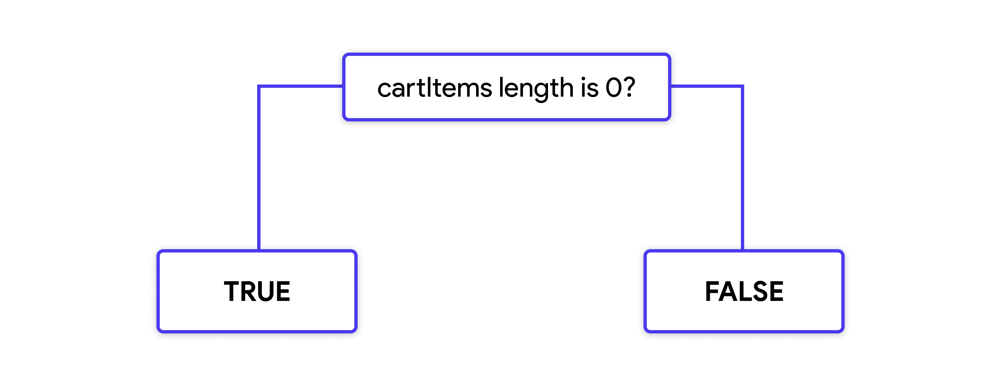
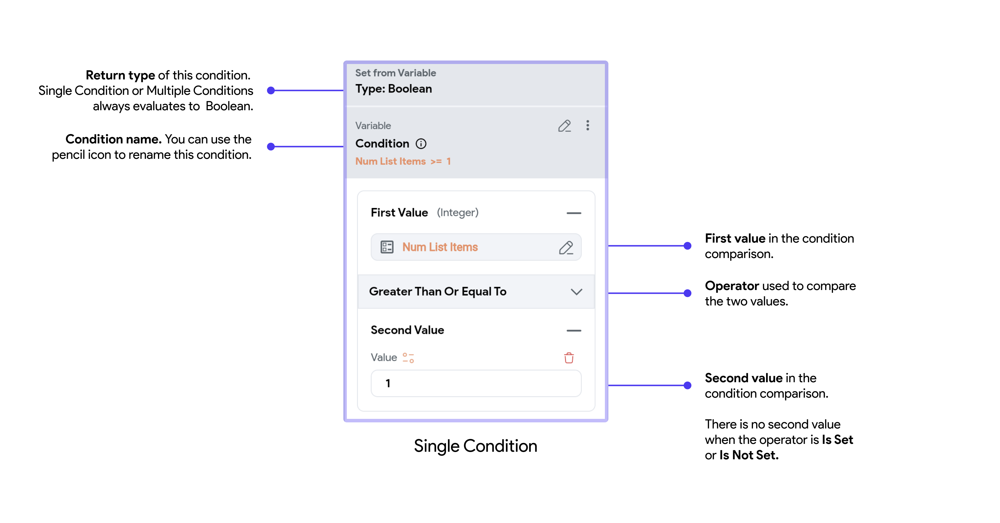
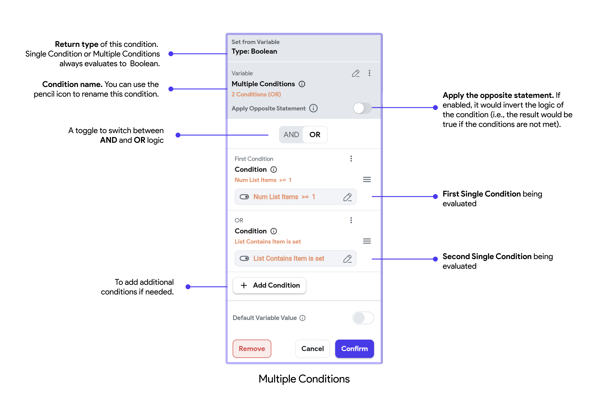

Conditional logic is a fundamental concept in programming and software development. It involves making decisions in code based on certain conditions. This is achieved using conditional statements, which evaluate expressions to determine whether they are true or false. Depending on the result, different actions or outcomes are executed.

#### How Conditional Logic Works
- **Condition:** An expression that evaluates to either true or false.
- **True Path:** The set of actions to execute if the condition is true.
- **False Path:** The set of actions to execute if the condition is false.

## Conditional Flows
Conditional flows enhance basic true-false logic by handling multiple conditions and executing specific actions based on those conditions. This is achieved through more complex flows, such as single conditions, multiple conditions (using AND/OR), and conditional values with If/Then/Else logic.

### Single Condition
This flow allows you to define a condition based on the comparison of two values, which can be set manually or derived from variables. The condition will return **True** or **False**.

**Comparison Operators:**

- Equal To
- Not Equal To
- Less Than
- Greater Than
- Less Than Or Equal To
- Greater Than Or Equal To
- Is Set
- Is Not Set

### Multiple Conditions (AND/OR)
This flow lets you combine multiple single conditions using logical AND or OR operators. It is useful for more complex decision-making processes.

### Conditional Value (If/Then/Else)
Conditional Value allows you to set a dynamic variable based on different conditions. For each condition, you can specify a value that will be assigned if the condition is true. A default value can be provided if none of the conditions are met.

See the example **[below](#setting-widget-properties-with-conditional-logic).**

## Setting Widget Properties with Conditional Logic

FlutterFlow allows you to dynamically set the properties of widgets based on conditional logic. Depending on the expected data type of the property, you can use a combination of conditional flows to achieve your desired logic.

Here's an example where we use Conditional Logic to determine the value of a Text widget:

    <iframe 
        src="https://demo.arcade.software/zTJw7GmAolmmE1S6vTvv?embed&show_copy_link=true"
        title=""
        style={{
            position: 'absolute',
            top: 0,
            left: 0,
            width: '100%',
            height: '100%',
            colorScheme: 'light'
        }}
        frameborder="0"
        loading="lazy"
        webkitAllowFullScreen
        mozAllowFullScreen
        allowFullScreen
        allow="clipboard-write">
    </iframe>

<figure>
  <figcaption class="centered-caption">If the `placePicker` widget state is set, then return the placePicker address string. Else, if the `defaultAddress` component parameter is set and not empty, then return that as a string. Otherwise, return a default address value.</figcaption>
</figure>

## Conditional Actions

When you need to execute actions based on specific conditions, you can do so in the Action Flow Editor. By combining simple single conditions or multiple conditions, you can create complex logical flows. These conditions can be configured as learned in the Setting Properties section, allowing your action flows to follow **True/False** logic or **If-Else, If-Else If-Else** structures.

Here's a quick demo to illustrate a simple Single Condition Action flow:

    <iframe 
        src="https://demo.arcade.software/SPvvln7RqEx25mL9eQ4t?embed&show_copy_link=true"
        title=""
        style={{
            position: 'absolute',
            top: 0,
            left: 0,
            width: '100%',
            height: '100%',
            colorScheme: 'light'
        }}
        frameborder="0"
        loading="lazy"
        webkitAllowFullScreen
        mozAllowFullScreen
        allowFullScreen
        allow="clipboard-write">
    </iframe>

You can easily convert a single condition action flow into a multiple condition action flow by 
enabling the Multiple Conditions toggle. Here's how: 

    <iframe 
        src="https://demo.arcade.software/sSiA90fRKnsZkTLOyPFg?embed&show_copy_link=true"
        title=""
        style={{
            position: 'absolute',
            top: 0,
            left: 0,
            width: '100%',
            height: '100%',
            colorScheme: 'light'
        }}
        frameborder="0"
        loading="lazy"
        webkitAllowFullScreen
        mozAllowFullScreen
        allowFullScreen
        allow="clipboard-write">
    </iframe>

