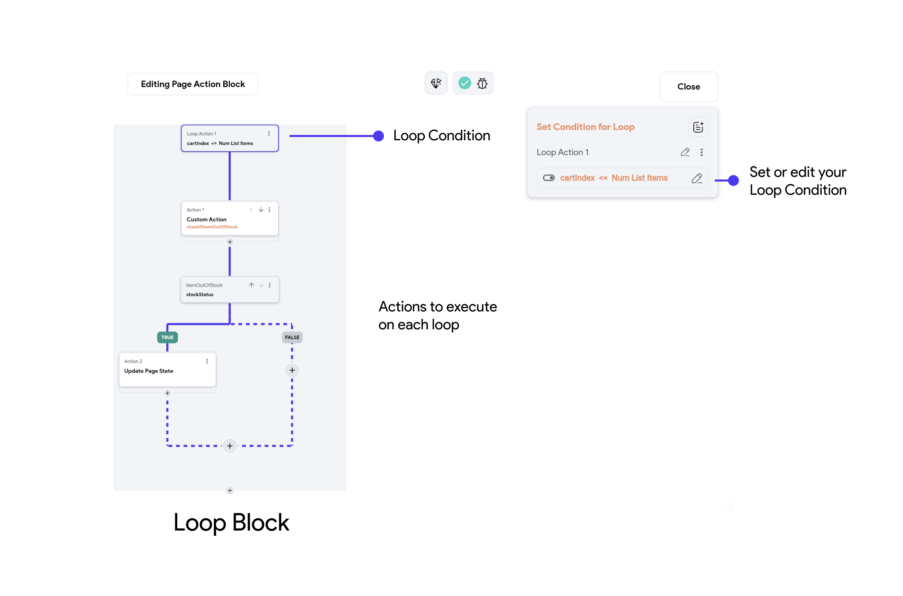
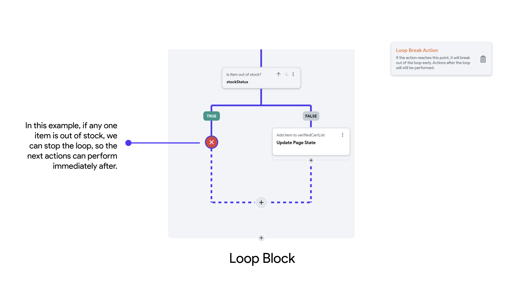

Sometimes, you might want to trigger certain actions multiple times. For example, an app might fetch data from a server, and you want to handle network errors by retrying the request up to a certain number of times.

:::info
Every loop requires a condition, and the actions within the loop will continue to trigger as 
long as the condition holds true. When the condition becomes false, the loop terminates, and the next actions in the workflow will trigger.
:::

## Loop Breaks 

:::danger[AVOID an INFINITE LOOP]
Be careful with loop actions, as they can cause your app to enter an infinite loop if the condition never becomes false. Always ensure that the condition will be met at some point so the loop can exit.
:::

If the intended operation is completed before the condition becomes false, you must add a **Loop Break** action in your workflow to exit the loop.

**Loop Breaks** are statements used to exit a loop prematurely, before the loop's normal termination 
condition is met. They are typically used to stop the loop when a certain condition is satisfied,
preventing unnecessary iterations and allowing the program to proceed to the next section of 
actions.

**Key Points:**

- **Purpose:** Exit the loop immediately when a specific condition is met.
- **Implementation:** Typically implemented with the "Add Break" node in Action Flow Editor.
- **Usage:** Commonly used to avoid infinite loops or to stop looping once a desired result is achieved.

