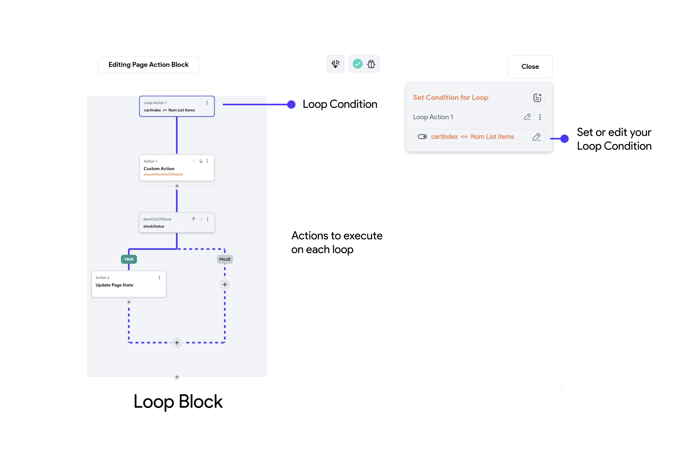
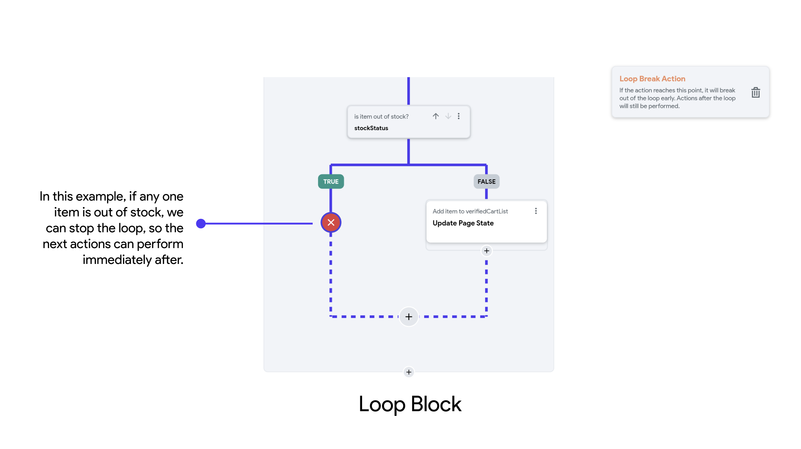

# Loops

**Loops** in FlutterFlow allow you to perform repetitive tasks without writing complex code. This is useful when working with lists of data or when you want to repeat actions a certain number of times.

There are two types of loops supported in FlutterFlow:

## While Condition Loops

A **While Condition** loop requires a condition. The actions within the loop will continue to trigger as long as the condition holds true. When the condition becomes false, the loop terminates, and the next actions in the workflow will trigger.

For example, use a While Condition loop for a bounded retry flow: attempt an operation, increment an attempt counter, optionally add **Wait (Delay)**, and continue only while the operation has not succeeded and the maximum attempt count has not been reached.

## Over List

This loop type lets you iterate over a list of items to perform actions for each item in the list.

For example, if you have a list of items in a shopping cart and want to calculate the total price or apply a discount to each item, you can use Over List to go through each product and perform a calculation for each one.

You can also customize how the loop iterates:

- **Start Index**: Where the loop starts (default is `0`).
- **End Index**: The last index to include. Leave it empty to continue through the end of the list.
- **Step Size**: Positive interval between iterations; the default is `1`. Set it to `2` to process every second item.
- **Reverse Order**: Enables the loop to iterate from the end of the list to the beginning (e.g., showing the latest messages first).

Inside a loop, you can access the current item and its index. This gives you the ability to work with each item individually, such as displaying item-specific data and making calculations.

The loop processes its body sequentially. If the body contains an asynchronous action, the next iteration waits unless that action is explicitly non-blocking. Do not make an action non-blocking when a later step or iteration depends on its result.

:::tip[Nested Loops]

You can also add a loop inside another loop to handle related data structures. For example, looping through orders and then looping through each order’s line items.

:::

## Loop Breaks

:::danger[AVOID an INFINITE LOOP]
Be careful with loop actions, as they can cause your app to enter an infinite loop if the condition never becomes false. Update a value used by the condition, enforce a maximum attempt or elapsed-time bound, and add a delay when repeatedly polling an external condition.
:::

If the intended operation is completed before the condition becomes false, you must add a **Loop Break** action in your workflow to exit the loop.

**Loop Breaks** are statements used to exit a loop prematurely, before the loop's normal termination
condition is met. They are typically used to stop the loop when a certain condition is satisfied,
preventing unnecessary iterations and allowing the program to proceed to the next section of
actions.

**Key Points:**

- **Purpose:** Exit the loop immediately when a specific condition is met.
- **Implementation:** Typically implemented with the "Add Break" node in Action Flow Editor.
- **Usage:** Commonly used to avoid infinite loops or to stop looping once a desired result is achieved.

## Related documentation

See [Action Blocks](/resources/functions/action-blocks) for a related FlutterFlow workflow.

## Verify a loop

Test an empty list, a one-item list, the chosen start and inclusive end indices, step sizes, reverse order, and the break condition. For a While Condition loop, force both success and maximum-attempt exits. Confirm each item is processed once in the intended order and that failures cannot leave the UI in an endless loop.
