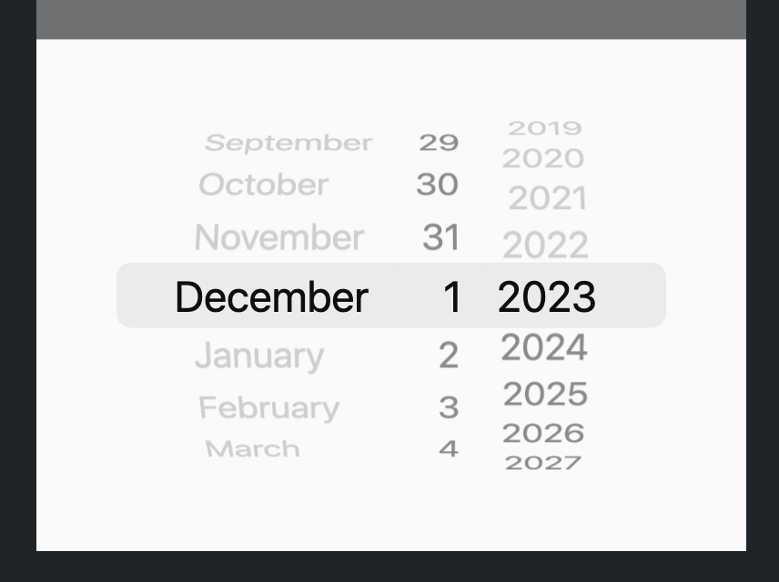
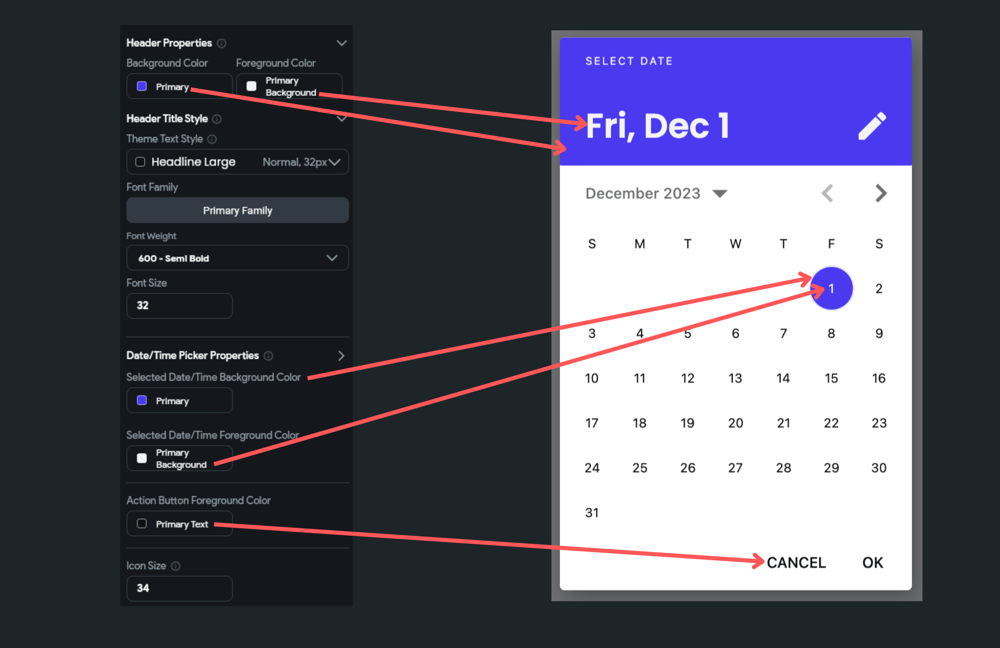

import Tabs from '@theme/Tabs';
import TabItem from '@theme/TabItem';

# Utility Actions

Utility Actions provide essential functionalities that enhance your app's capabilities, such as data manipulation and system interactions. These actions streamline processes and improve the overall user experience. Examples include copying text to the clipboard and selecting colors or dates.

## Color Picker

Using this action, you can allow users to pick their favorite color from the palette or by entering a HEX/RGB color value. You might, for instance, utilize this to give customers the option of choosing the color of a product you offer.

When this action is triggered, it opens the color picker, where users can customize the color. The color picker will close once the desired color has been selected, and the selected color will then be accessible via *Widget State > Color Picked*.

    <iframe 
        src="https://demo.arcade.software/5lUa4lK1SgPUQvkM6Kqj?embed&show_copy_link=true"
        title=""
        style={{
            position: 'absolute',
            top: 0,
            left: 0,
            width: '100%',
            height: '100%',
            colorScheme: 'light'
        }}
        frameborder="0"
        loading="lazy"
        webkitAllowFullScreen
        mozAllowFullScreen
        allowFullScreen
        allow="clipboard-write">
    </iframe>

### Adding Color Picker [Action]

Follow the steps below to add this action to any widget.

1. Select the **Widget** (e.g., Container, Button, etc.) on which you want to add the action.
2. Select **Actions** from the properties panel (the right menu), If it's the first action, click **+ Add Action** button. Otherwise, click the "**+**" button below the previous action tile (inside *Action Flow Editor*) and select **Add Action**.
3. Search and select the **Color Picker** (under *Widget/UI Interactions*) action.
4. When the color picker is opened, by default, the primary color is selected. To change this, set the **Initially Selected Color**.
5. You can also customize the look and feel of the color picker by changing the color of the **Text**, **Background**, and **Button**.
6. By default, the color picker allows users to add opacity to the color. To allow users only select the opaque colors, disable the **Allow Opacity** toggle.
7. Recent colors help users choose any previous color they have used. Disable the **Show Recent Color** toggle if you don't want to show them.
8. The selected color is now available at **Widget State > Color Picked**. You can access it from any widget's color property or click the "**+**" button and add the following action to update the selected color in your backend or app state.

:::info
After the user has selected the desired color, the picker will close automatically, and the selected color can then be accessed via the **Widget State > Color Picked**.
:::

Here's an example of adding the color picker action and updating the selected color in an app state variable.

<Tabs>
<TabItem value="1" label="Adding color picker action" default>

    <iframe 
        src="https://demo.arcade.software/BHfN2umFDQgL0upiZUaz?embed&show_copy_link=true"
        title=""
        style={{
            position: 'absolute',
            top: 0,
            left: 0,
            width: '100%',
            height: '100%',
            colorScheme: 'light'
        }}
        frameborder="0"
        loading="lazy"
        webkitAllowFullScreen
        mozAllowFullScreen
        allowFullScreen
        allow="clipboard-write">
    </iframe>

</TabItem>
<TabItem value="2" label="Customize color picker">

</TabItem>
</Tabs>

## DateTime Picker
This action allows the user to select a date and time. You could use it to schedule appointments, set a reminder for a specific date, choose travel dates and times, etc.

When this action is triggered, it opens the graphical calendar and clock interface that the user can interact with to select a specific date and time.

    <iframe 
        src="https://demo.arcade.software/HyKZpuo986EOfdG7IrQC?embed&show_copy_link=true"
        title=""
        style={{
            position: 'absolute',
            top: 0,
            left: 0,
            width: '100%',
            height: '100%',
            colorScheme: 'light'
        }}
        frameborder="0"
        loading="lazy"
        webkitAllowFullScreen
        mozAllowFullScreen
        allowFullScreen
        allow="clipboard-write">
    </iframe>

### Types Date/Time Picker

You can choose to open the following types of *Date/Time* picker dialog:

- **Date**: Allows you to only select a date.
- **Date+Time**: Allows you to select the date followed by the time.
- **Time**: Allows you to only select a time.

### Adding Date/Time Picker [Action]

Follow the steps below to add this action to any widget.

1. Select the **Widget** (e.g., Container, Button, etc.) on which you want to add the action.
2. Select **Actions** from the properties panel (the right menu), If it's the first action, click **+ Add Action** button. Otherwise, click the "**+**" button below the previous action tile (inside *Action Flow Editor*) and select **Add Action**.
3. Search and select the **Date/Time Picker** (under *Widget/UI Interactions*) action.
4. Set the [Date/Time picker type](#types-datetime-picker).
5. By default, the picker shows the current date/time. You can change this by adjusting the **Default Date/Time**.
6. To define the range of selectable dates, use the **Minimum Date/Time** and **Maximum Date/Time** properties. Click on **Unset** to specify your dates.
7. Control whether the past and future dates/times are selectable with **Allow Past Date/Time** and **Allow Future Date/Time**. **Tip**: If you explicitly set the min or max date, this option will be disabled.
8. For an iOS-style display, activate the **Use Cupertino-style** toggle.
   
9. For more personalized styling, turn off **Use Default Theme** and tweak the settings in the **Appearance Properties** section.
   

:::info
After the user has selected the desired date and time, the picker will close automatically, and the selected date/time can then be accessed via the ***Widget State > Date Picked**.*
:::

Here's an example of adding the date time picker action and displaying the value in a Text widget.

    <iframe 
        src="https://www.loom.com/embed/ffcbf0422511433b93bef7b08f7501a5?sid=cebeb57a-5bbc-41c4-9604-c9ba2b1aad32"
        title=""
        style={{
            position: 'absolute',
            top: 0,
            left: 0,
            width: '100%',
            height: '100%',
            colorScheme: 'light'
        }}
        frameborder="0"
        loading="lazy"
        webkitAllowFullScreen
        mozAllowFullScreen
        allowFullScreen
        allow="clipboard-write">
    </iframe>

## Biometric Verification

Most modern devices come with biometric sensors to strengthen the device's security. Using this action, you can leverage on-device authentication such as fingerprint or face recognition to protect your app's privacy.

When this action triggers, it checks for the enrolled biometric. If it finds any, it asks users to verify their identity. If the biometric authentication fails, it opens up the screen lock option (e.g., Pattern, PIN, Password, Swipe, etc.) as a fallback method to authenticate users.

A common use case of this action is to allow only the intended user to open an app that involves financial or confidential information, such as an online payment app, stock trading app, or online storage app.

    <iframe 
        src="https://demo.arcade.software/nzMmo0lGgvZ4LybXBSy2?embed&show_copy_link=true"
        title=""
        style={{
            position: 'absolute',
            top: 0,
            left: 0,
            width: '100%',
            height: '100%',
            colorScheme: 'light'
        }}
        frameborder="0"
        loading="lazy"
        webkitAllowFullScreen
        mozAllowFullScreen
        allowFullScreen
        allow="clipboard-write">
    </iframe>

### Adding Biometric Verification [Action]

Go to your project page on FlutterFlow and follow the steps below to define the Action to any widget.

1. Select the **Widget** (e.g., Button) on which you want to define the action.
2. Select **Actions** from the Properties panel (the right menu), and click **Open**. This will open an **Action Flow Editor** in a new popup window.
3. Click on the **+ Add Action**.
4. On the right side, search and select the **Biometric Verification** (under *Utilities*) action.
    1. By default, if the biometric verification fails, it opens the on-device credentials such as Pattern and PIN. This helps in a case where the biometric sensor can't recognize a valid fingerprint or face. However, you can disable this behavior and only allow biometric verification. To do so, turn on the **Allow biometric only** toggle.
    2. Enter the **Biometric Reason text**. This message is displayed inside the biometric recognition UI.
    3. Provide the **Action Output Variable Name**. The status of biometric verification, True (pass) or False(fail), is stored in this variable. You can use this variable to decide the following action. For example, showing a success or failure message.
    4. To show a success or failure message, **Add Conditional** action by clicking on the + button inside the already added action.
        1. Click on the **UNSET**, select **Action Output**, and select the action output variable name.
        2. Under the **TRUE** section, add an action to [show the snackbar](../../../resources/ui/pages/page-elements.md#snackbar) with a success message.
        3. Similarly, add the failure message under the **FALSE** section.

    <iframe 
        src="https://demo.arcade.software/87E8n4OAqZWl6pVqMeyp?embed&show_copy_link=true"
        title=""
        style={{
            position: 'absolute',
            top: 0,
            left: 0,
            width: '100%',
            height: '100%',
            colorScheme: 'light'
        }}
        frameborder="0"
        loading="lazy"
        webkitAllowFullScreen
        mozAllowFullScreen
        allowFullScreen
        allow="clipboard-write">
    </iframe>

