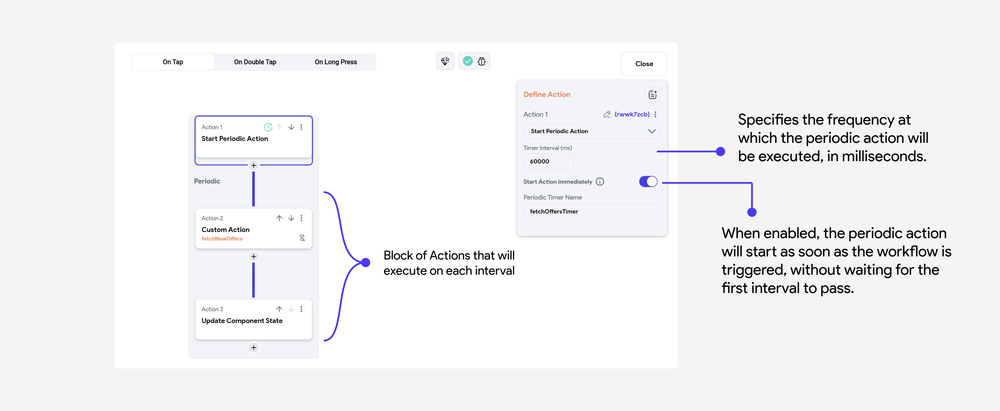

# Periodic Action

Periodic execution of logic refers to running a specific block of code or a set of actions at
regular, defined intervals. This is useful for tasks that need to be repeated continuously or at
specific time intervals.

## Use-cases

- For tasks that need regular updates, such as fetching data from a server, monitoring system
  health, or updating a user interface.
- In scenarios where periodic checks or maintenance tasks are required (e.g., cleaning up
  temporary files, sending periodic notifications).
- Implementing polling mechanisms for checking changes in state or data.

## Start Periodic Action

To create a periodic action workflow, add the **Start Periodic Action** action either on the **On
Page Load** action trigger of your page or on any widget that should start the periodic action.

The properties of the Periodic Action look like this:

## Stop Periodic Action

You can call the **Stop Periodic Action** action from anywhere on the page or component to stop
one or multiple
periodic actions.

:::danger[Dont forget to stop the Periodic Actions]
Stopping a periodic action is crucial to prevent unnecessary resource consumption and potential
performance issues. It ensures that tasks do not continue running in the background when they are no
longer needed, which can help maintain the efficiency and responsiveness of your application.
:::

### Periodic Action vs Timer

| Feature     | Timer Widget                                                                                                    | Periodic Action                                                         |
|-------------|-----------------------------------------------------------------------------------------------------------------|-------------------------------------------------------------------------|
| **Purpose** | Used for single or non-repetitive timing events, often within user interfaces.                                  | Used for repetitive tasks that need to run at regular intervals.        |
| **Usage**   | To set a countdown timer, start/stop actions based on user input, or trigger actions after a specific duration. | For background tasks, monitoring, regular updates, and periodic checks. |
| **Example** | Countdown timer in a quiz application.                                                                          | Fetching new messages from a server every 5 minutes.                    |

### Periodic Actions vs Loops

| Feature                   | Periodic Actions                                                           | Loops                                                                  |
|---------------------------|-----------------------------------------------------------------------------|------------------------------------------------------------------------|
| **Purpose**               | To execute a task at regular, defined intervals.                            | To execute a task repeatedly until a condition is met.                 |
| **Execution Frequency**   | Executes at specified time intervals (e.g., every 60 seconds).              | Executes continuously until the loop condition is false.               |
| **Use Case**              | Suitable for tasks needing regular updates, such as fetching new data.      | Suitable for tasks requiring iteration over collections or repeated checks. |
| **Control**               | Can be started and stopped easily, allowing for controlled execution.       | Runs until a break condition is met or the loop is explicitly stopped. |
| **Resource Management**   | Efficient, as it allows idle time between executions.                       | Can be resource-intensive if not managed properly, as it runs continuously. |
| **Examples**              | Fetching new offers from a server every 5 minutes.                          | Iterating over a list of items to process them one by one.             |
