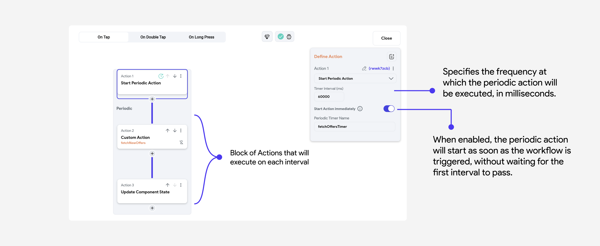

# Periodic Action

Periodic execution of logic refers to running a specific block of code or a set of actions at
regular, defined intervals. This is useful for tasks that need to be repeated continuously or at
specific time intervals.

## Use-cases

- For tasks that need regular updates, such as fetching data from a server, monitoring system
  health, or updating a user interface.
- For in-app periodic checks while the page or component is active.
- Implementing polling mechanisms for checking changes in state or data.

## Start Periodic Action

To create a periodic action workflow, add the **Start Periodic Action** action either on the **On
Page Load** action trigger of your page or on any widget that should start the periodic action.

Configure:

- **Timer Interval (ms):** Time between executions.
- **Start Action immediately:** Run once when started instead of waiting for the first interval.
- **Periodic Timer Name:** A unique name used to identify this periodic action.

Add the actions that should repeat after the **Start Periodic Action** tile. Those attached actions become the periodic body; they are not also executed as the ordinary next step in the original flow.

The properties of the Periodic Action look like this:

## Stop Periodic Action

You can call the **Stop Periodic Action** action from anywhere on the page or component to stop
one or multiple
periodic actions.

:::warning[Stop periodic work when it is no longer needed]
Use **Stop Periodic Action** and **Choose Timer to Cancel** when the work should end before its owning page or component is disposed. FlutterFlow cancels the periodic timer when that owner is disposed, but leaving unnecessary polling active while the user remains on the page wastes network and processing resources.
:::

A Periodic Action is in-app timer logic, not an operating-system background task. Mobile platforms can pause or terminate the app, so do not use it for guaranteed background jobs, scheduled notifications, or server maintenance.

### Periodic Action vs Timer

| Feature     | Timer Widget                                                                                                    | Periodic Action                                                         |
|-------------|-----------------------------------------------------------------------------------------------------------------|-------------------------------------------------------------------------|
| **Purpose** | Used for single or non-repetitive timing events, often within user interfaces.                                  | Used for repetitive tasks that need to run at regular intervals.        |
| **Usage**   | To set a countdown timer, start/stop actions based on user input, or trigger actions after a specific duration. | For repeated in-app actions, polling, or UI refreshes while the owner is active. |
| **Example** | Countdown timer in a quiz application.                                                                          | Fetching new messages from a server every 5 minutes.                    |

### Periodic Actions vs Loops

| Feature                   | Periodic Actions                                                           | Loops                                                                  |
|---------------------------|-----------------------------------------------------------------------------|------------------------------------------------------------------------|
| **Purpose**               | To execute a task at regular, defined intervals.                            | To execute a task repeatedly until a condition is met.                 |
| **Execution Frequency**   | Executes at specified time intervals (e.g., every 60 seconds).              | Executes continuously until the loop condition is false.               |
| **Use Case**              | Suitable for tasks needing regular updates, such as fetching new data.      | Suitable for tasks requiring iteration over collections or repeated checks. |
| **Control**               | Can be started and stopped easily, allowing for controlled execution.       | Runs until a break condition is met or the loop is explicitly stopped. |
| **Resource Management**   | Efficient, as it allows idle time between executions.                       | Can be resource-intensive if not managed properly, as it runs continuously. |
| **Examples**              | Fetching new offers from a server every 5 minutes.                          | Iterating over a list of items to process them one by one.             |

## Related documentation

See [Timer Widget](/resources/time-based-logic/timer-widget) for a related FlutterFlow workflow.

## Verify a periodic action

Use a short interval in **Test Mode** and display the periodic action's tick count or another visible result. Confirm the immediate-run setting, interval, stop target, navigation/disposal behavior, overlapping-request behavior, and recovery from a failed request before increasing the production interval.
