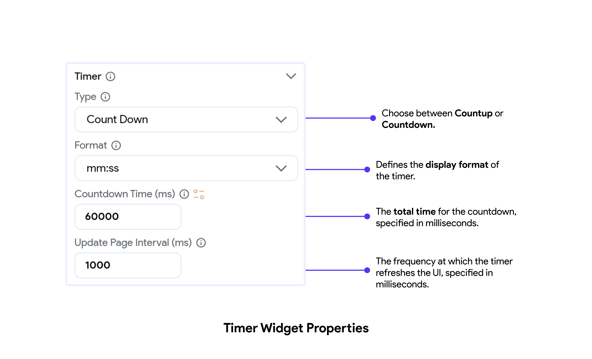
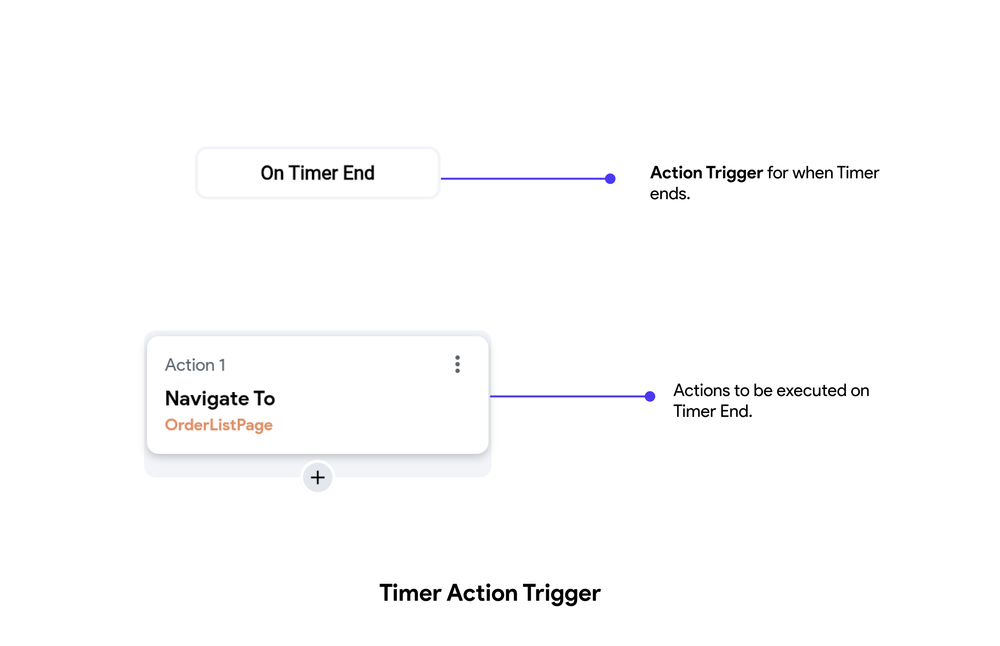
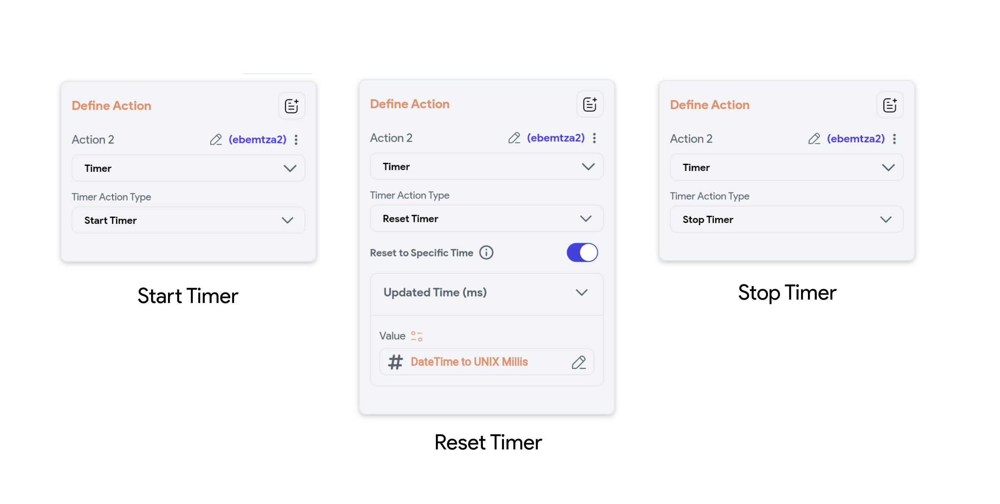

**Timer [Widget]** allows developers to create countdown or count-up timers within your page. It is
particularly useful in scenarios where timing is crucial, such as quizzes, auctions, workout apps,
and various time-sensitive activities.

## Use Cases

- **Quizzes and Exams:** Enforcing time limits for answering questions.
- **Auctions:** Displaying the remaining time for bids.
- **Workouts:** Timing exercises and rest periods.
- **Events:** Counting down to the start or end of an event.
- **Productivity:** Using Pomodoro timers to manage work sessions and breaks.

## Timer Types

- **Countdown Timer:** Counts down from a specified time to zero, often used in scenarios where a
  task or event needs to be completed within a set period.

- **Count-up Timer:** Counts up from zero to a specified time or indefinitely, useful for tracking
  the duration of an event or activity.

On adding the Timer widget to your page, you can specify the type of timer and other properties
as mentioned here:

## On Timer End [Action Trigger]

You can also specify a flow of actions when the timer ends. You can find this Action Trigger on
clicking the Action Flow Editor on the Timer widget.

## Controlling the Timer

You can control the timer from anywhere on the page. Using any widget's Action Flow Editor, you can perform the following actions:

- **Start Timer:** This starts the timer. If the timer is already started, triggering this type
  won't
  have any effect.

- **Stop Timer:** This stops the timer. This will have effect only if the timer is started.

- **Reset Timer:** This resets the timer and brings it to the initial state.

## Periodic Action vs Timer

| Feature            | Timer Widget                                                                                       | Periodic Action                                                   |
|--------------------|----------------------------------------------------------------------------------------------------|-------------------------------------------------------------------|
| **Purpose**        | Used for single or non-repetitive timing events, often within user interfaces.                      | Used for repetitive tasks that need to run at regular intervals.  |
| **Usage**          | To set a countdown timer, start/stop actions based on user input, or trigger actions after a specific duration. | For background tasks, monitoring, regular updates, and periodic checks. |
| **Example**        | Countdown timer in a quiz application.                                                             | Fetching new messages from a server every 5 minutes.              |