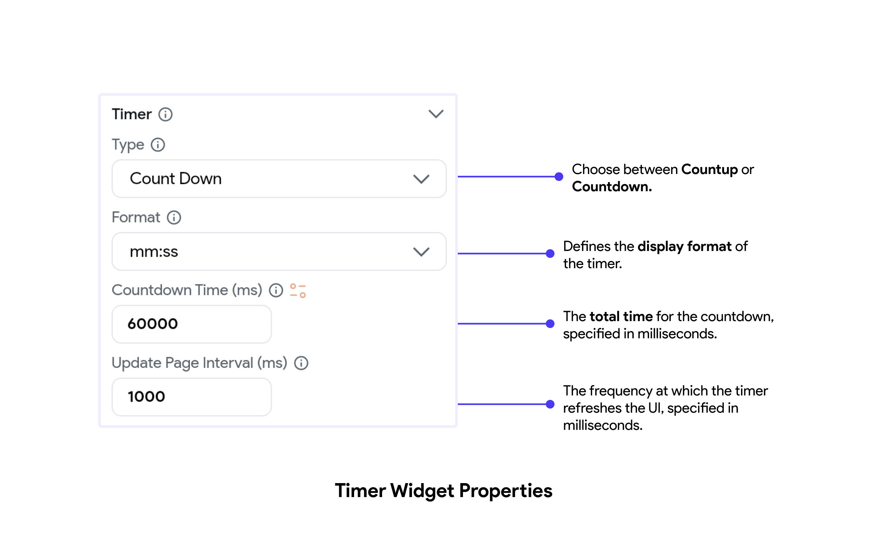
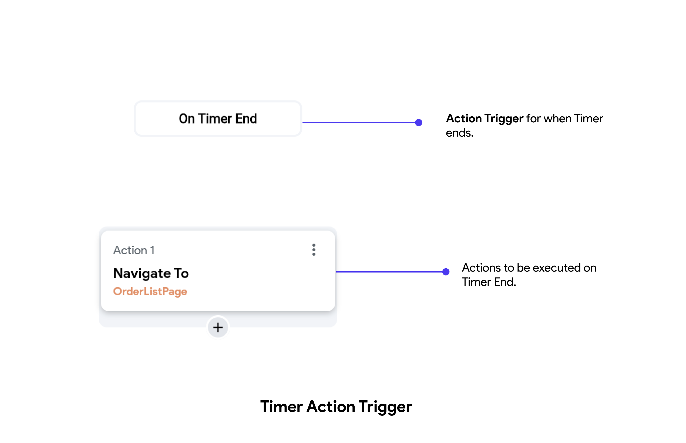
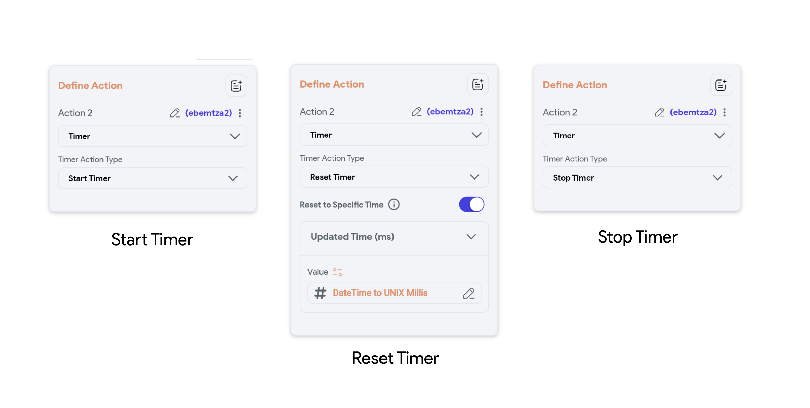

# Timer [Widget]

**Timer [Widget]** allows developers to create countdown or count-up timers within your page. It is
particularly useful in scenarios where timing is crucial, such as quizzes, auctions, workout apps,
and various time-sensitive activities.

## Use Cases

- **Quizzes and Exams:** Enforcing time limits for answering questions.
- **Auctions:** Displaying the remaining time for bids.
- **Workouts:** Timing exercises and rest periods.
- **Events:** Counting down to the start or end of an event.
- **Productivity:** Using Pomodoro timers to manage work sessions and breaks.

## Timer Types

- **Countdown Timer:** Counts down from a specified time to zero, often used in scenarios where a
  task or event needs to be completed within a set period.

- **Count-up Timer:** Counts up from zero until it is stopped, reset, or disposed, which is useful for tracking elapsed time.

On adding the Timer widget to your page, you can specify the type of timer and other properties
as mentioned here:

- **Format:** Choose which hour, minute, second, and millisecond units to display.
- **Countdown Time (ms):** Starting value for a countdown.
- **Update Page Interval (ms):** How often the surrounding UI rebuilds so other widgets can reflect the current timer state. A larger interval reduces rebuild work.

## On Timer End [Action Trigger]

For a countdown, you can specify a flow of actions when the timer reaches zero. Open the Timer widget's **Actions** tab and select **On Timer End**.

## Controlling the Timer

You can control the timer from anywhere on the page. Using any widget's Action Flow Editor, you can perform the following actions:

- **Start Timer:** This starts the timer. If the timer is already started, triggering this type
  won't
  have any effect.

- **Stop Timer:** This stops the timer. This will have effect only if the timer is started.

- **Reset Timer:** This resets the timer and brings it to the initial state.

When configuring **Reset Timer**, enable **Reset to Specific Time** to provide a new value in milliseconds instead of the original value. If a page or component contains multiple Timer widgets, select the **Timer to Control**.

## Periodic Action vs Timer

| Feature            | Timer Widget                                                                                       | Periodic Action                                                   |
|--------------------|----------------------------------------------------------------------------------------------------|-------------------------------------------------------------------|
| **Purpose**        | Used for single or non-repetitive timing events, often within user interfaces.                      | Used for repetitive tasks that need to run at regular intervals.  |
| **Usage**          | To display elapsed or remaining time and start, stop, or reset it from an action. | To run repeated in-app actions while a page or component is active. |
| **Example**        | Countdown timer in a quiz application.                                                             | Fetching new messages from a server every 5 minutes.              |

## Related documentation

See [Periodic Action](/resources/time-based-logic/periodic-action) for a related FlutterFlow workflow.

:::note
Timer control actions do not execute in Preview Mode. Use **Test Mode**, **Run Mode**, or a deployed build.
:::

## Verify a timer

Test start, repeated start, stop, reset, and reset-to-specific-time behavior. For a countdown, confirm **On Timer End** runs once at zero. Navigate away and back to verify the timer lifecycle, and confirm widgets bound to Timer **Widget State** update at the frequency set by **Update Page Interval (ms)**.
