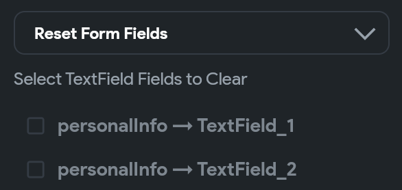

# Reset Form Field [Action]

This action allows you to reset a value for the Form widgets. This is helpful in clearing out any previously entered data and allows users to start fresh.

For example, If a form has been successfully submitted, it may make sense to clear out the form fields so that the user can enter new data if they want to submit the form again.

    <iframe 
        src="https://demo.arcade.software/8j2HzV0zEQu2JN23K0NG?embed&show_copy_link=true"
        title=""
        style={{
            position: 'absolute',
            top: 0,
            left: 0,
            width: '100%',
            height: '100%',
            colorScheme: 'light'
        }}
        frameborder="0"
        loading="lazy"
        webkitAllowFullScreen
        mozAllowFullScreen
        allowFullScreen
        allow="clipboard-write">
    </iframe>

## Adding Reset Form Field action

Follow the steps below to add this action to any widget.

1. Select the **Widget** (e.g., Button, etc.) on which you want to add the action.
2. Select **Actions** from the properties panel, If it's the first action, click **+ Add Action** button. Otherwise, click the "**+**" button below the previous action tile (inside *Action Flow Editor*) and select **Add Action**.
3. Search the **Reset Form Field** (under *State Management*) action and select the widget you would like to reset.

You can reset the same types of widgets in a single action only. e.g., multiple *TextField* widgets.

    <iframe 
        src="https://demo.arcade.software/ceKpYitIZcLrq8UKZBdp?embed&show_copy_link=true"
        title=""
        style={{
            position: 'absolute',
            top: 0,
            left: 0,
            width: '100%',
            height: '100%',
            colorScheme: 'light'
        }}
        frameborder="0"
        loading="lazy"
        webkitAllowFullScreen
        mozAllowFullScreen
        allowFullScreen
        allow="clipboard-write">
    </iframe>

:::info
You can also reset form fields that are inside the components.

:::