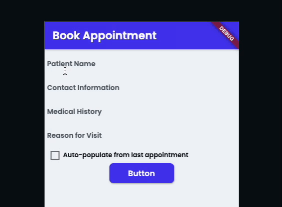
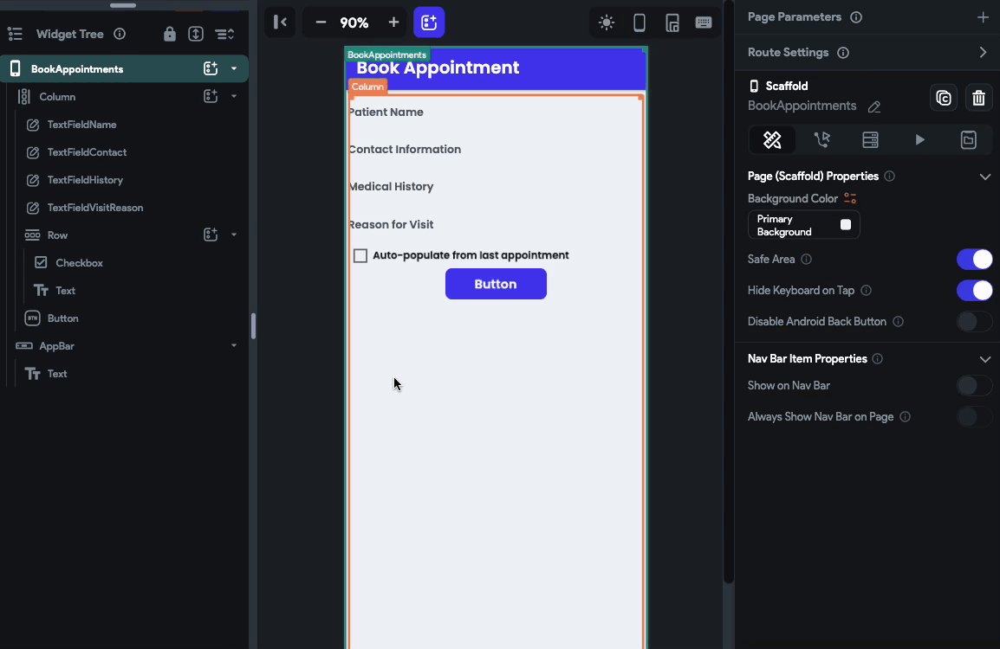

# Set Form Field [Action]

This action allows you to set a value for the Form widgets. For example, you could use this action to auto-populate a form based on a user's previous submission.

You could also dynamically update a dropdown menu based on a user's previous selection, such as showing relevant cities based on a selected country.

## Adding Set Form Field action

Follow the steps below to add this action to any widget.

1. Select the **Widget** (e.g., Button, etc.) on which you want to add the action.
2. Select **Actions** from the properties panel. If it's the first action, click the **+ Add Action** button. Otherwise, click the "**+**" button below the previous action tile (inside *Action Flow Editor*) and select **Add Action**.
3. Search the **Set Form Field** (under *State Management*) action and select the widget you would like to set.
4. Now, you can set its value directly or from a variable.

:::info
You can also set form fields that are inside the components.

:::