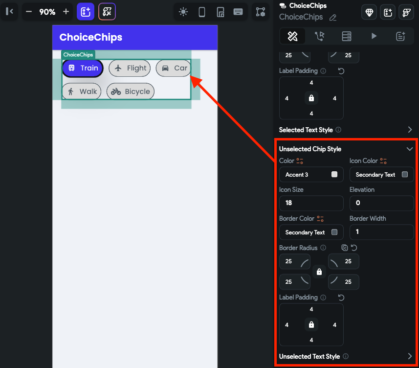

# ChoiceChips
The ChoiceChips widget allows users to select a single option from a group of chips. Each chip is presented with an icon and accompanying text, making it easy to represent various choices.

You could use this widget to implement a filter feature in an e-commerce app to let users select different product attributes like size, color, or price range.

:::tip[Widget State]
Before diving into form widgets, check out our guide on [**Widget States**](../../../../../ff-concepts/state-management/widget-state.md) to efficiently manage the state and behavior of your form elements.
:::

## Adding ChoiceChips widget

To add the ChoiceChips widget to your app:

1. Add the **ChoiceChips** widget from the **Form Elements** tab.
2. By default, this widget adds a single option named **Option 1**. To change the name, move to the Properties Panel, and scroll down to the **Define Options** section. Find the **Option 1** property and change the **name** and **icon**.
3. To add more options, click on the **Add Option** text and set the name and icon for new options.
4. To set any chip as selected by default, find the **Initial Option** property and enter the chip name.
    1. To set this value dynamically, open the **Set from Variable** menu and set the variable.
    2. When [multiselect](#allow-multiselect) is enabled, you can also set the list of options to pre-select.

    <iframe 
        src="https://www.loom.com/embed/16bb138384864990ae6991f477589d13?sid=1b31ba9a-2d8b-4b74-9640-746f1d93960d"
        title=""
        style={{
            position: 'absolute',
            top: 0,
            left: 0,
            width: '100%',
            height: '100%',
            colorScheme: 'light'
        }}
        frameborder="0"
        loading="lazy"
        webkitAllowFullScreen
        mozAllowFullScreen
        allowFullScreen
        allow="clipboard-write">
    </iframe>

## Trigger action on change

See how to [trigger an action when a selection changes](../../../../../resources/ui/widgets/widget-commonalities.md#trigger-action-on-selection-change) on this widget.

## Select or clear all choices [Action]

Users may need to swiftly deselect all chips or choose all available choice chips at once. You can do so by adding the **Clear All/Select All** action.

:::info
Before you add this action, ensure you [**allow multiselect**](#allow-multiselect) on this widget.
:::

## Customizing

You can customize the appearance and behavior of this widget using the various properties available under the properties panel.

### Allow multiselect

You might want to allow users to select multiple choices to filter the result.

To allow multiselect, select the **ChoiceChips** widget, move to the properties panel, find the **Allow Multiselect** property and enable it.

    <iframe 
        src="https://demo.arcade.software/VqGnacSdCkjlgUEKxxpy?embed&show_copy_link=true"
        title=""
        style={{
            position: 'absolute',
            top: 0,
            left: 0,
            width: '100%',
            height: '100%',
            colorScheme: 'light'
        }}
        frameborder="0"
        loading="lazy"
        webkitAllowFullScreen
        mozAllowFullScreen
        allowFullScreen
        allow="clipboard-write">
    </iframe>

### Disable ChoiceChips

Sometimes, you may want to present the choices in a read-only mode, preventing users from making any changes.

To do so, move to the **Properties Panel** **>** turn on **Disable >** click **Unset,** and set the [**Conditions**](../../../../../resources/functions/conditional-logic). This can be the [**Single Condition**](../../../../../resources/functions/conditional-logic#single-condition) or [**Combine Conditions**](../../../../../resources/functions/conditional-logic#multiple-conditions-andor) based on your requirement. **Note:** The ChoiceChips widget will be disabled only when condition(s) is true.

    <iframe 
        src="https://www.loom.com/embed/6521e458211b4250b1376f8462a9cce2?sid=23586025-bed2-4cf2-869f-1c54eea5d59b"
        title=""
        style={{
            position: 'absolute',
            top: 0,
            left: 0,
            width: '100%',
            height: '100%',
            colorScheme: 'light'
        }}
        frameborder="0"
        loading="lazy"
        webkitAllowFullScreen
        mozAllowFullScreen
        allowFullScreen
        allow="clipboard-write">
    </iframe>

### Adding Space between Chips

To add a space between the chips, you can use the **Chip Spacing** ad **Row Spacing** property.

- **Chip Spacing**: This adds horizontal gaps between individual chips.
- **Row Spacing**: This adds vertical gaps between the chips in a row.

    <iframe 
        src="https://demo.arcade.software/AfcL6FJqajdK1lTNm1me?embed&show_copy_link=true"
        title=""
        style={{
            position: 'absolute',
            top: 0,
            left: 0,
            width: '100%',
            height: '100%',
            colorScheme: 'light'
        }}
        frameborder="0"
        loading="lazy"
        webkitAllowFullScreen
        mozAllowFullScreen
        allowFullScreen
        allow="clipboard-write">
    </iframe>

### Align chips

When you have chips in multiple rows, you can align them using the **Alignment** property. This is similar to setting main axis alignment for the Row widget.

    <iframe 
        src="https://demo.arcade.software/DgiJyfeuWqactFYVKd1v?embed&show_copy_link=true"
        title=""
        style={{
            position: 'absolute',
            top: 0,
            left: 0,
            width: '100%',
            height: '100%',
            colorScheme: 'light'
        }}
        frameborder="0"
        loading="lazy"
        webkitAllowFullScreen
        mozAllowFullScreen
        allowFullScreen
        allow="clipboard-write">
    </iframe>

### Customizing selected and unselected chip style

Various properties under the **Selected Chip Style** and **Unselected Chip Style** section allow you to customize chips to match your design. Here's how you do it:

1. To change the background color, use the **Color** property.
2. To change the icon's color and size, use the **Icon Color** and **Icon Size** property.
3. To add a shadow or to create a sense of depth for the chip, you can use the **Elevation** property.
4. To customize the border, use the **Border Color**, **Border Width** (thickness), and **Border Radius** (rounded corner) properties.
5. To create some space around the label, use the **Label Padding** property.
6. To change the label text styling, use the **Selected Text Style** property.

    <iframe 
        src="https://www.loom.com/embed/75141dcf90cd4d1a8e22dd288a7e9dee?sid=2e289300-60a6-4d99-ab66-1e38baf5265f"
        title=""
        style={{
            position: 'absolute',
            top: 0,
            left: 0,
            width: '100%',
            height: '100%',
            colorScheme: 'light'
        }}
        frameborder="0"
        loading="lazy"
        webkitAllowFullScreen
        mozAllowFullScreen
        allowFullScreen
        allow="clipboard-write">
    </iframe>

7. Similarly, you can customize the properties under the **Unselected Chip Style**.

