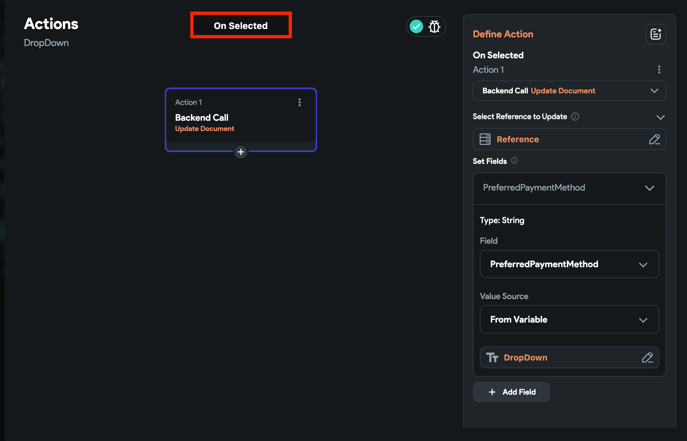
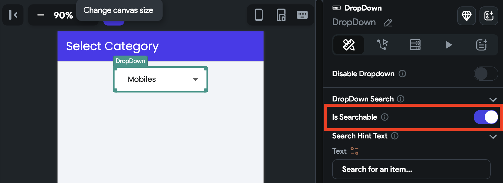
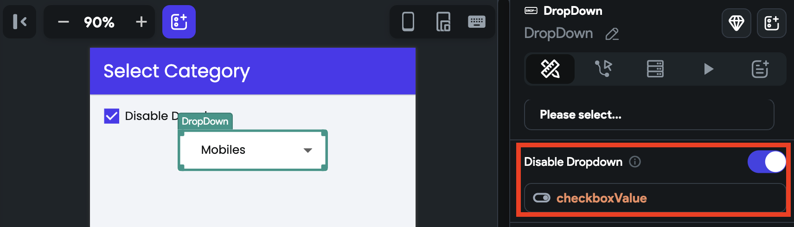
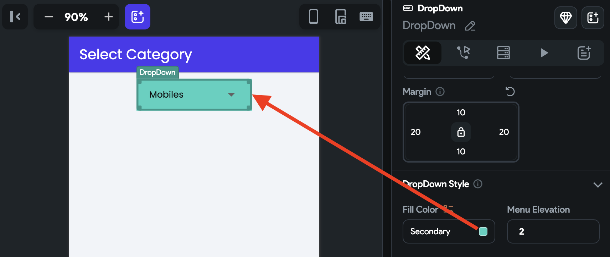
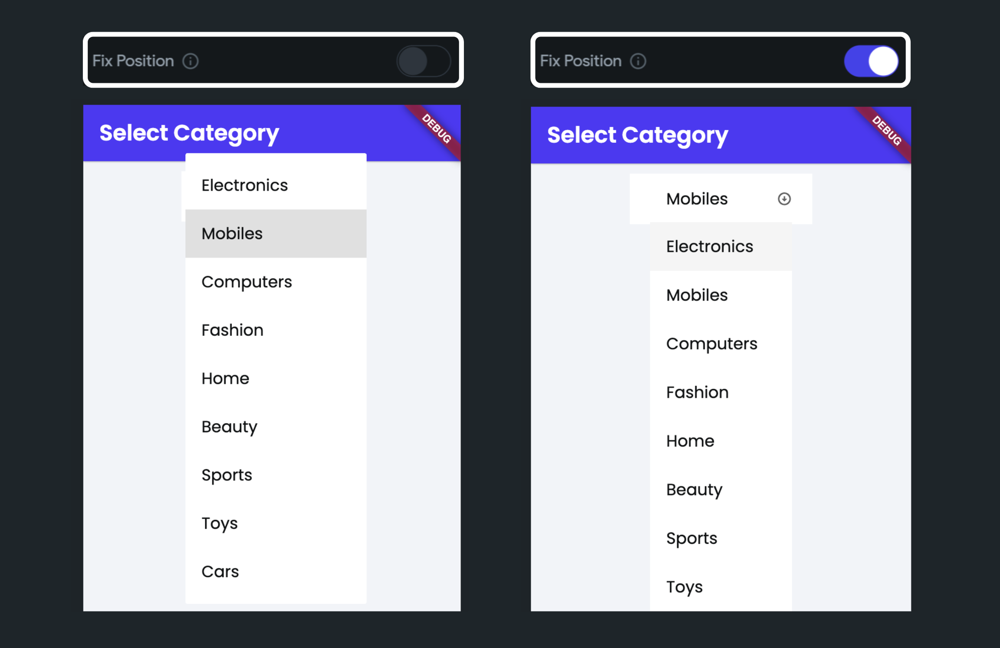

# Dropdown

The DropDown widget enables users to choose from a list of options. It requires a set of items to display and an initial value to indicate the current selection. When a user selects an item from the dropdown list, the value is updated to reflect the selected item.

You can use this widget in any situation where you want users to select from a set of options, such as selecting a country, choosing a language, or picking a color.

:::tip[Widget State]
Before diving into form widgets, check out our guide on [**Widget States**](../../../../../ff-concepts/state-management/widget-state.md) to efficiently manage the state and behavior of your form elements.
:::

## Adding DropDown widget

Let's see how to add a *DropDown* widget and build an example that shows the selected value on a Text widget. Here's how it looks:

    <iframe 
        src="https://demo.arcade.software/W83rbxwxh8Bru695kqOs?embed&show_copy_link=true"
        title=""
        style={{
            position: 'absolute',
            top: 0,
            left: 0,
            width: '100%',
            height: '100%',
            colorScheme: 'light'
        }}
        frameborder="0"
        loading="lazy"
        webkitAllowFullScreen
        mozAllowFullScreen
        allowFullScreen
        allow="clipboard-write">
    </iframe>

1. Add the **DropDown** widget, move to the **Properties Panel > Define Options >** click **Add Options** to add items.
2. To display the default value, move to the **Initial Configuration** section and enter the value. Ensure it matches one of the options added in the previous step.
3. The selected dropdown value can be accessed via *Widget State > DropDown*. To display it on the *Text* widget, add a [**Text**](../../../../ui/widgets/basic-widgets/text.md) widget, move to the properties panel, click on **Set from Variable** and choose the **Widget State > DropDown** (i.e., name of your dropdown).

    <iframe 
        src="https://www.loom.com/embed/5317999e08a54ce0ae91d98228e88be0?sid=baf7b3d9-67b1-4a02-83cd-32b7f78d6e53"
        title=""
        style={{
            position: 'absolute',
            top: 0,
            left: 0,
            width: '100%',
            height: '100%',
            colorScheme: 'light'
        }}
        frameborder="0"
        loading="lazy"
        webkitAllowFullScreen
        mozAllowFullScreen
        allowFullScreen
        allow="clipboard-write">
    </iframe>

### Setting initial value

Setting a default or initial value for the DropDown is a common requirement for many apps. It can provide a better user experience by pre-selecting the most likely option.

To set an initial value:

1. Select the **DropDown** widget > move to the **Properties Panel** > **Initial Configuration**.
2. In **Initial Option Value**, enter the option name that you want to set as default.
3. To set this value dynamically, open the **Set from Variable** menu and select the variable.
    1. For example, to set this value from Firebase, ensure you have access to Firebase document that contains the field you want to set.
    2. Open the **Set from Variable** menu > select **[collection_name] Document** > select the **field**.
4. If you don't set the initial value, the **Hint Text** will be displayed.

    <iframe 
        src="https://www.loom.com/embed/ff9b49636f634064b22a4b7e66c3de23?sid=d2282e8e-2f2f-4bd2-8fb6-44c33bced294"
        title=""
        style={{
            position: 'absolute',
            top: 0,
            left: 0,
            width: '100%',
            height: '100%',
            colorScheme: 'light'
        }}
        frameborder="0"
        loading="lazy"
        webkitAllowFullScreen
        mozAllowFullScreen
        allowFullScreen
        allow="clipboard-write">
    </iframe>

### Saving DropDown value on selection change

You might want to save the dropdown value as soon as the selection changes. This approach is useful when you want to ensure that the user's selection is immediately saved without having to wait for them to submit the form. By doing so, you can provide a better user experience and reduce the risk of data loss in case of any interruption.

You can do so by adding an action such as [update app state](../../../../../resources/data-representation/app-state.md#update-app-state-action), [update Firestore record](../../../../../integrations/database/cloud-firestore/firestore-actions#update-document-action) that [triggers when a selection changes](../../../../ui/widgets/widget-commonalities.md#trigger-action-on-selection-change) on this widget.

## Customizing

You can customize the appearance and behavior of this widget using the various properties available under the properties panel.

### Showing option label

The dropdown widget allows you to show a label than the actual option value. By adding the option label, you can have a simple/short name or abbreviation (which is quite easy to compare and process in the backend) instead of a tricky name (e.g., Falkland Islands (the) [Malvinas]).

For example, In a Country dropdown, you could have different *Option* *Values* to store in the backend and *Option Labels* to show in the dropdown list. Just like below:

| Option Values | Option Labels |
| --- | --- |
| US | United States |
| IN | India |
| FK | Falkland Islands (the) [Malvinas] |

To show option label:

1. Select the **DropDown** widget, move to the properties panel, and turn on the **Add Option Labels** toggle.
2. Enter the value in the **Define Option Values** and **Define Options Labels**. Click **Add Option** (below the *Define Option Values*) to add more values and labels.
3. You must also set the **Data Type** for the values. For example, if the values you are going to store are in numbers like 1,2,3, set it to *Integer*.

    <iframe 
        src="https://www.loom.com/embed/317159e4b34041a49498af7fccdd1256?sid=b7144c2d-e4a6-42e8-9b2e-13a0ebf45180"
        title=""
        style={{
            position: 'absolute',
            top: 0,
            left: 0,
            width: '100%',
            height: '100%',
            colorScheme: 'light'
        }}
        frameborder="0"
        loading="lazy"
        webkitAllowFullScreen
        mozAllowFullScreen
        allowFullScreen
        allow="clipboard-write">
    </iframe>

### Searchable dropdown

The *DropDown* widget is a good choice when you have a small number of options, up to around 10-20; however, If you have more options than that, consider using a searchable dropdown.

A searchable dropdown allows users to search and filter options by typing in a search bar. As the user types, the dropdown list is dynamically filtered to only show matching options. This is especially useful when dealing with long lists of options and can improve the user experience by reducing the time it takes to find and select an option.

    <iframe 
        src="https://www.loom.com/embed/43fc4e965b18469399a2cfa90a1226e6?sid=977c9928-283f-4793-b497-c3a8a299eb72"
        title=""
        style={{
            position: 'absolute',
            top: 0,
            left: 0,
            width: '100%',
            height: '100%',
            colorScheme: 'light'
        }}
        frameborder="0"
        loading="lazy"
        webkitAllowFullScreen
        mozAllowFullScreen
        allowFullScreen
        allow="clipboard-write">
    </iframe>

To make the dropdown widget a searchable one:

1. Select the **DropDown** widget, move to the **Properties Panel > DropDown Search >** enable **Is Searchable** option.
2. You can also customize the **Search Hint Text** property.

### Disable dropdown

You might need to disable a dropdown when certain conditions are not yet met or need to be fulfilled. For example, when the dropdown options are dependent on other fields, and those fields are not filled yet.

    <iframe 
        src="https://demo.arcade.software/42Bn1gyDN1eCHCk4kXZ8?embed&show_copy_link=true"
        title=""
        style={{
            position: 'absolute',
            top: 0,
            left: 0,
            width: '100%',
            height: '100%',
            colorScheme: 'light'
        }}
        frameborder="0"
        loading="lazy"
        webkitAllowFullScreen
        mozAllowFullScreen
        allowFullScreen
        allow="clipboard-write">
    </iframe>

To disable the dropdown:

1. Select the **DropDown** widget, move to the **Properties Panel > DropDown Search >** enable **Disable Dropdown** option.
2. Click on **Unset** and select the source that returns the boolean value (i.e., True or False), such as boolean variable, [Conditions](../../../../../resources/functions/conditional-logic), [Code Expression](../../../../../resources/functions/utility#code-expressions).

### Allow multi select

You might want to allow users to select multiple options from the dropdown list. For example, on an e-commerce app, users might want to filter products based on multiple attributes, such as t-shirts in both 'blue' and 'red' colors.

To allow multi-select, select the **Dropdown** widget, move to the properties panel, find the **Allow Multi Select** property, and enable it.

:::info
To clear the selection, you can use the [Reset Form Fields](../form-actions/reset-form-field.md) action and choose the **Reset Dropdown Fields** option. Then, simply select the name of the dropdown widget you wish to reset.
:::

    <iframe 
        src="https://www.loom.com/embed/da8f8e2b0ceb4509a2d69dd25e2d94e2?sid=2df82d07-a178-495c-ba7c-ec2ed059c649"
        title=""
        style={{
            position: 'absolute',
            top: 0,
            left: 0,
            width: '100%',
            height: '100%',
            colorScheme: 'light'
        }}
        frameborder="0"
        loading="lazy"
        webkitAllowFullScreen
        mozAllowFullScreen
        allowFullScreen
        allow="clipboard-write">
    </iframe>

### Changing dropdown size

To change the height and width of the dropdown, select the **DropDown** widget, move to the **Properties Panel > DropDown Properties > enter the Width and Height value**.

### Set max height

If needed, you can also control the dropdown height using the **Max Height** property.

    <iframe 
        src="https://www.loom.com/embed/06fb6dfef8304bb5b3a2d1be4e8fe6b0?sid=80820c77-9ea4-4024-8af2-df09ce978f5c"
        title=""
        style={{
            position: 'absolute',
            top: 0,
            left: 0,
            width: '100%',
            height: '100%',
            colorScheme: 'light'
        }}
        frameborder="0"
        loading="lazy"
        webkitAllowFullScreen
        mozAllowFullScreen
        allowFullScreen
        allow="clipboard-write">
    </iframe>

### Adding margin

Margin adds a space between the DropDown's text and its border. To change the margin, select the **DropDown** widget, move to the **Properties Panel > DropDown Properties >** find the **Margin** property, and change the values.

    <iframe 
        src="https://demo.arcade.software/3U91Y8JXTXXvKUyxlCoC?embed&show_copy_link=true"
        title=""
        style={{
            position: 'absolute',
            top: 0,
            left: 0,
            width: '100%',
            height: '100%',
            colorScheme: 'light'
        }}
        frameborder="0"
        loading="lazy"
        webkitAllowFullScreen
        mozAllowFullScreen
        allowFullScreen
        allow="clipboard-write">
    </iframe>

### Changing background color

To change the background color, move to the **Properties Panel > DropDown Style > set the Fill Color**.

### Changing menu elevation

Menu elevation adds a shadow to the dropdown, giving it a sense of depth and making it appear above the surface it is placed on.

To change the menu elevation (depth or Z-axis), move the **Properties Panel >** enter the **Menu** **Elevation** value.

:::info
The higher value draws the bigger size of the shadow.
:::

### Adding border

See how to [add a border](../../../../ui/widgets/widget-commonalities.md#adding-border).

### Show/hide underline

To show or hide the dropdown underline, move the **Properties Panel >** **DropDown Style** > use the **Hides Underline** toggle.

    <iframe 
        src="https://demo.arcade.software/SireMWgr1E8ADdHlz5cu?embed&show_copy_link=true"
        title=""
        style={{
            position: 'absolute',
            top: 0,
            left: 0,
            width: '100%',
            height: '100%',
            colorScheme: 'light'
        }}
        frameborder="0"
        loading="lazy"
        webkitAllowFullScreen
        mozAllowFullScreen
        allowFullScreen
        allow="clipboard-write">
    </iframe>

### Fix position

By default, the dropdown options are displayed over/above the dropdown button. To display beneath/below the button, move the **Properties Panel >** **DropDown Style** > switch on the **Fix Position** toggle.

:::info[Trigger action on change]
See how to [**trigger an action when a selection changes**](../../../../ui/widgets/widget-commonalities.md#trigger-action-on-selection-change) on this widget.
:::