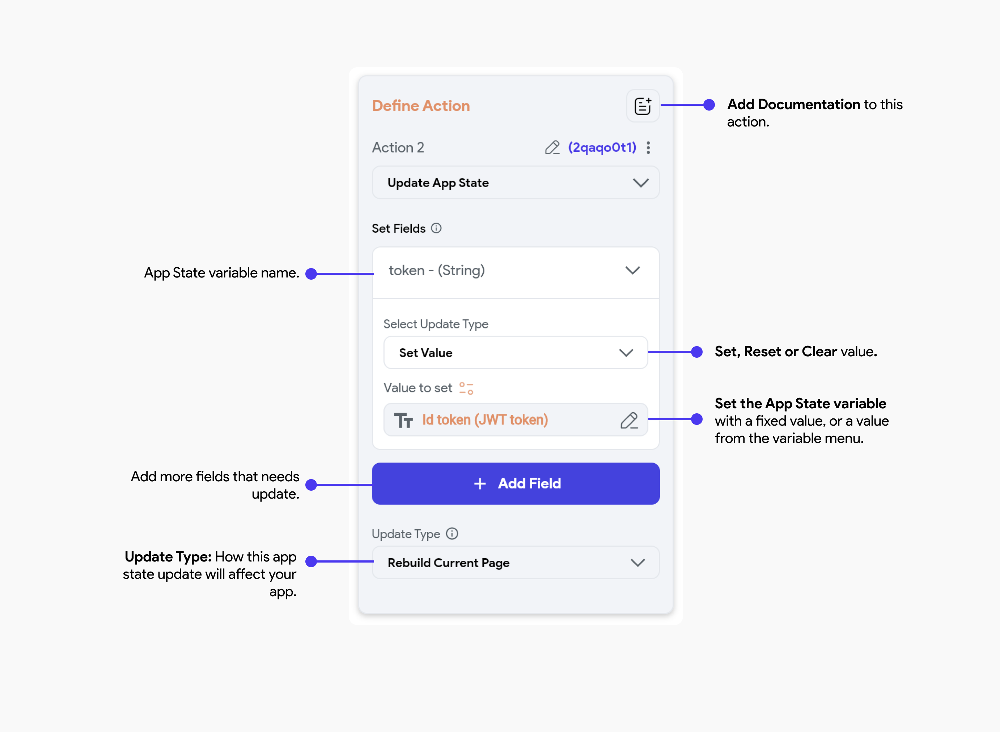

# App State

App state variables are specific variables that hold the current state of an application. They can be accessed and modified throughout the entire application across all pages and components. This type of variable can be useful for storing data that needs to be shared between different parts of the app, such as user preferences and authentication tokens.

App state variables should be used in scenarios where the same data needs to be accessed and modified from multiple locations within the app. For instance, in a shopping cart app, items in a user's cart are usually accessible across different pages.

App state variables should not be used for temporary data that doesn't impact the overall state of the application. For instance, a user's temporary input in a form should not be stored in an app state variable. It would be more appropriate to use a [page state](../../resources/ui/pages/page-lifecycle.md#page-state) or [component state](../../generated-code/state-mgmt-gen-code.md#component-state) variable instead.

## App State Variables

Let’s see how you can manage the app state variable using an example of adding items to a cart in a shopping app. 

### Create App State variable

Head over to the left-side navigation menu and follow the steps below to create a variable.

    <iframe 
        src="https://demo.arcade.software/QjdQ0cTmGDqUeG6F1JMh?embed&show_copy_link=true"
        title="Sharing a Project with a User"
        style={{
            position: 'absolute',
            top: 0,
            left: 0,
            width: '100%',
            height: '100%',
            colorScheme: 'light'
        }}
        frameborder="0"
        loading="lazy"
        webkitAllowFullScreen
        mozAllowFullScreen
        allowFullScreen
        allow="clipboard-write">
    </iframe>

#### App State Properties

- **isList:** Whether this field is a list type (e.g List of String or List of Custom Data Type)
- **Persisted:** Whether this app state is saved to disk so that it can be loaded when the app is restarted. Otherwise the field will be reset on restart.
 
:::tip[Generated Code]
  Curious about what happens when the **Persisted** toggle is on? Check out the [**Generated Code**](../../generated-code/state-mgmt-gen-code.md#persisting-app-state) guide.
 :::

### Use App State

The variable can now be accessed via set from variable menu. For example, on the cart page, you can loop through the app state variable to display each item.

### Update App State [Action]

You can update an app state from the Actions Panel anywhere in the app, whether it's on tap of a widget in a component or page, or via custom code in FlutterFlow.

When you update the app state via the Action Flow Editor, you will find the following options in the Action Settings.

#### Update Type
How this app state update will affect your app.

- **Rebuild All Pages:** Rebuilds all pages in the app when this app state is updated. 
- **Rebuild Current Page:** Rebuilds only the current page when this app state is updated. 
- **No Rebuild:** No rebuild is required. 

:::tip[Generated Code]
Curious about how state changes are handled internally when you choose different **Update Type** options? Explore the detailed [**FFAppState**](../../generated-code/ff-app-state.md) guide.
:::

Here's a quick guide to updating the app state variable. We need to add an action to the 'Add to Bag' button. Within this action, we'll provide the product details and configure it to add to the current cart list.

    <iframe 
        src="https://demo.arcade.software/FKv2dXq4jTjjJVLy6nxu?embed&show_copy_link=true"
        title="Sharing a Project with a User"
        style={{
            position: 'absolute',
            top: 0,
            left: 0,
            width: '100%',
            height: '100%',
            colorScheme: 'light'
        }}
        frameborder="0"
        loading="lazy"
        webkitAllowFullScreen
        mozAllowFullScreen
        allowFullScreen
        allow="clipboard-write">
    </iframe>

