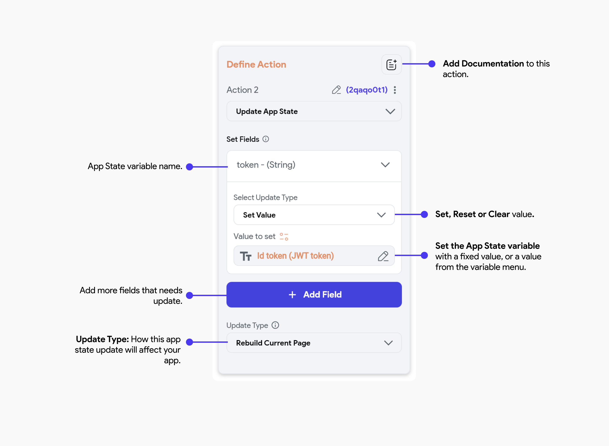

# App State

App State variables hold values that need to be read or changed across pages and components. Good examples include a shopping cart, an onboarding-complete flag, or a user-selected display preference.

Do not put API keys, passwords, access tokens, or other secrets in App State. Persisted values are stored on the user's device, and values can still be exposed while the app is running or making network requests. Use a backend or another purpose-built secret-management mechanism for secrets.

App state variables should be used in scenarios where the same data needs to be accessed and modified from multiple locations within the app. For instance, in a shopping cart app, items in a user's cart are usually accessible across different pages.

App state variables should not be used for temporary data that doesn't impact the overall state of the application. For instance, a user's temporary input in a form should not be stored in an app state variable. It would be more appropriate to use a [page state](../../resources/ui/pages/page-lifecycle.md#page-state) or [component state](../../generated-code/state-mgmt-gen-code.md#component-state) variable instead.

## App State Variables

Let’s see how you can manage the app state variable using an example of adding items to a cart in a shopping app.

### Create App State variable

Open **App Values > App State** from the left-side navigation menu, then select **Add App State Variable**.

    <iframe
        src="https://demo.arcade.software/QjdQ0cTmGDqUeG6F1JMh?embed&show_copy_link=true" title="App State interactive tutorial"
        style={{
            position: 'absolute',
            top: 0,
            left: 0,
            width: '100%',
            height: '100%',
            colorScheme: 'light'
        }}
        frameborder="0"
        loading="lazy"
        webkitAllowFullScreen
        mozAllowFullScreen
        allowFullScreen
        allow="clipboard-write">
    </iframe>

#### App State Properties

- **Field Type:** The kind of value the variable stores. The available types are intentionally narrower than Page or Component State types.
- **Is List:** Whether the variable stores one value or a list of values, such as a list of strings or custom data type objects.
- **Persisted:** Whether the value is saved on the device and restored after the app restarts. If this is off, the variable resets when the app restarts.
- **Initial Value:** The value used before any action updates the variable or, for a persisted variable, when no stored value exists.

When at least one field is persisted, **Secure persisted fields** can store persisted App State in encrypted local storage. This protects data at rest only; it does not make secrets safe to embed in a client app or send over the network. Custom Class and Custom Enum App State fields cannot be persisted.

:::tip[Generated Code]
  Curious about what happens when the **Persisted** toggle is on? Check out the [**Generated Code**](../../generated-code/state-mgmt-gen-code.md#persisting-app-state) guide.
 :::

### Use App State

The variable can now be accessed through **Set from Variable > App State**. For example, on the cart page, you can generate children from a cart list and display each item.

### Update App State [Action]

You can update an app state from the Actions Panel anywhere in the app, whether it's on tap of a widget in a component or page, or via custom code in FlutterFlow.

When you update the app state via the Action Flow Editor, you will find the following options in the Action Settings.

#### Update Type
How this app state update will affect your app.

- **Rebuild All Pages:** Rebuilds the active pages that listen to App State.
- **Rebuild Current Page** or **Rebuild Current Component:** Rebuilds the page or component containing the action, depending on where the action runs.
- **No Rebuild:** Updates the field without rebuilding a page or component. Use this only when the UI does not need to react immediately or another event will trigger the required rebuild.

:::tip[Generated Code]
Curious about how state changes are handled internally when you choose different **Update Type** options? Explore the detailed [**FFAppState**](../../generated-code/ff-app-state.md) guide.
:::

Here's a quick guide to updating the app state variable. We need to add an action to the 'Add to Bag' button. Within this action, we'll provide the product details and configure it to add to the current cart list.

    <iframe
        src="https://demo.arcade.software/FKv2dXq4jTjjJVLy6nxu?embed&show_copy_link=true" title="App State interactive tutorial"
        style={{
            position: 'absolute',
            top: 0,
            left: 0,
            width: '100%',
            height: '100%',
            colorScheme: 'light'
        }}
        frameborder="0"
        loading="lazy"
        webkitAllowFullScreen
        mozAllowFullScreen
        allowFullScreen
        allow="clipboard-write">
    </iframe>

:::tip
If you want to rebuild a page or component without updating any state variables, use the [**Rebuild**](../../ff-concepts/state-management/state-variables.md#rebuild-action) state action.
:::

## FAQs

Why are some variable types not available in App State?

Certain variable types, such as **Firestore Document**, **Supabase Row**, and **SQLite Row**, can be used in Page State or Component State but not in App State. App State is global and remains in memory while the app runs; persisted fields are also serialized to device storage.

Storing large or complex data types like documents in App State could lead to **performance or size issues**, especially on lower-end devices. For this reason, FlutterFlow limits App State to lightweight types, while Page/Component State allows for more flexibility since their scope is smaller and temporary.

If you need to work with such data types, it's recommended to store them in Page or Component state instead.

