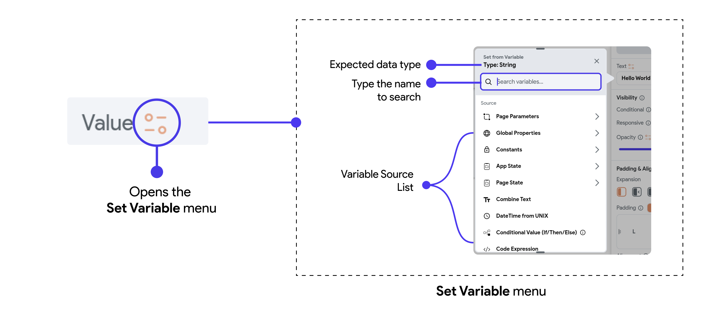

# Variable

Variables in FlutterFlow let you store and manage dynamic data, which is essential for creating interactive and responsive applications. By using variables, you can capture user inputs, track states, and manipulate data across different parts of your app.

In this section, we'll dive into the different types of variables available in FlutterFlow, including:

- **Local Variables:** Variables that are confined to a specific widget or page, used for handling data within a localized context. For example, Page State variables or Component State variables are scoped to the entity they were created in.
- **Global Variables:** Variables that can be accessed and modified throughout the entire app, allowing for consistent data management across pages. For example, App State variables can be accessed from anywhere in the app.

:::info[What are scopes?]
The scope of a variable is determined by where it is created. For instance, if it's created at the app level, it can be accessed throughout the app. However, a variable created at the page level can only be accessed on that page.
:::

<!--
### Where are they used?

Variables are used in practically all areas of the app, from the user interface to the functionality of the app. They can store user inputs, hold temporary values for calculations, or store data fetched from a server. They are integral to managing the state of the app and controlling the flow of data.
-->

## Creating Variables

When creating variables in FlutterFlow, there are a few important considerations regarding their name, data type, nullability, and initial values. The specific _process_ for creating variables differs depending on whether you are working with App State, Page State, or Component State variables, and you can find detailed instructions linked below.

### Naming Variable
Start by giving your variable a meaningful and descriptive name that reflects its purpose. This name will be used throughout your app to reference the variable, so it's important to keep it clear and consistent with your naming conventions. 

:::tip[Recommended naming convention]
We recommend the `lowerCamelCase` naming convention for variables. Learn more about the **[recommended naming conventions](../style-guide.md)** used in FlutterFlow and Flutter projects. 
:::

### Assigning a Data Type to a Variable
Next, you need to select the appropriate data type for your variable. FlutterFlow offers several data types, such as **Text, Integer, Boolean,** or **String**. Refer to the **[Data Types guide](data-types.md)** to learn more about the available data types.

Choosing the correct data type is crucial, as it determines how the variable can be used and what kind of data it can store.

### Is List Property
Enable the **Is List** toggle to indicate that this field should be of the **list** type.

:::info[Example]

If the data type selected is `String` and the `Is List` toggle is enabled, FlutterFlow will create a **list of String variables**. This list can hold multiple string values, such as a list of city names.
:::

### Nullable & Initial Value
When creating variables in FlutterFlow, you have the option to make them **nullable** or **non-nullable**. This setting is crucial because it determines whether the variable can hold a null value (i.e., no value). Alongside this, you can also define an initial value for your variable, which ensures that it starts with a specific value as soon as it’s created.

- **Nullable:** This option determines if a variable can hold a null value, meaning it can exist without any data. If the Nullable option is enabled, the variable can start as null and only receive a value when needed. If disabled, the variable must always have a value, which means you’ll need to provide an initial value when it’s created.

- **Initial Value:** If a variable is non-nullable (i.e., cannot be null), you are required to provide an initial value to ensure it always contains data. For nullable variables, setting an initial value is optional, allowing them to remain empty until a value is assigned.

:::tip[What is a null value?]
A null value represents the **absence of a value**. In FlutterFlow, allowing a variable to be null can be beneficial in scenarios such as:

- **User Input:** Before a user enters data, a variable can start as null and only hold a value once the user provides input.
- **Conditional Logic:** In cases where certain data might not always be applicable (e.g., an optional user setting), a null value allows you to handle the absence of data more flexibly.
- **Loading States:** When fetching data from an API, variables can be null until the data is loaded, allowing you to differentiate between "loading" and "loaded" states easily.
:::

### How to create variables?
For step-by-step guides on how to create App State, Page State, and Component State variables, please refer to the following links:
- [Creating App State Variables](../data-representation/app-state.md)
- [Creating Page State Variables](../../resources/ui/pages/page-lifecycle.md#page-state)
- [Creating Component State Variables](../ui/components/component-lifecycle.md#component-state)

## Set Variable

The **Set from Variable** or **Set Variable** menu in FlutterFlow is a powerful feature that allows you to dynamically control the content or behavior of your widgets using **data** stored in variables. When you select a variable from this menu, you're instructing FlutterFlow to use the value of that variable to populate or modify the widget's properties, such as text, visibility, or styling.

This menu provides a variety of variable **sources**, including data that's specific to the page or component, global properties that apply across the entire app, constants, and more. By choosing the appropriate variable, you can make your app more interactive and responsive to user input, data changes, or other conditions.

## Manipulating Variables

When setting variables via the **Set Variable** menu, you have the ability to manipulate or transform the data before applying it to a widget or another variable. This manipulation allows you to tailor the data to fit specific needs or contexts, enhancing the flexibility and functionality of your app.

For instance, you can:

- **[Concatenate or Combine Strings:](../control-flow/functions/utility-functions.md#combine-text)** Combine multiple text values into a single string. To learn how to manipulate strings before setting variables, see the [Utility Functions](../control-flow/functions/utility-functions.md#combine-text) guide. 
- **[Filter or Sort Lists](#list-options):** Organize or refine data in lists to display only what’s relevant or in a specific order.
- [**Convert DateTime to UNIX:**](global-properties.md#current-time) Change a DateTime object into a UNIX timestamp for compatibility or calculation purposes.
- [**Apply Conditional Logic:**](../control-flow/functions/conditional-logic.md) Use If/Then/Else statements to set different values based on specific conditions.

These manipulations enable you to create more dynamic and responsive user interfaces by ensuring that the data presented or used in your app is always in the most appropriate form.

### List Options

While working with a list, you may need to extract specific data based on specific criteria. The List options provide a range of functionalities for efficient data extraction from these lists. Here's what it includes:

#### Map List Items

The option **Map List Items** allows you to prepare a list of specific fields from data types such as Documents, [Custom Data Types](custom-data-types.md), and JSON. For instance, if you have a list of Firebase Documents containing fields like name, age, and position, you can specifically generate a list consisting only of names. This option allows you to create tailored lists from complex data structures.

Here's an example of preparing a list of only cat names from Firebase documents (that contain other fields like name, age, and breed) and displaying them on dropdown.

<iframe src="https://www.loom.
com/embed/744716b1b4d640bc8a18c2fc4c7a2a25?sid=2f642f76-4a6b-4f39-a62f-3cec58953a07" frameborder="0" allow="accelerometer; autoplay; clipboard-write; encrypted-media; gyroscope; picture-in-picture; web-share" referrerpolicy="strict-origin-when-cross-origin" allowfullscreen></iframe>

#### Filter List Items

The **Filter List Items** option allows you to create a list of items based on specific criteria, generating a sublist of items that match. For example, you might want to create a list of users over a certain age from a larger user database or perhaps compile a list of products within a specific price range from an extensive inventory.

<iframe src="https://www.loom.
com/embed/2a68084cc58c4c5c9bf636b3b31ad1f8?sid=d7fe9782-86f9-4d88-82e7-0db46b402c4a" frameborder="0" allow="accelerometer; autoplay; clipboard-write; encrypted-media; gyroscope; picture-in-picture; web-share" referrerpolicy="strict-origin-when-cross-origin" allowfullscreen></iframe>

#### First Few Items

The **First Few Items** option extracts the initial elements of the list up to a specified number.

#### Sort List Items

If your list contains "native data types" (like numbers or strings), we can automatically sort these elements. Native data types have a "natural ordering." For example, numbers can be sorted numerically (1, 2, 3, ...), and strings can be sorted alphabetically ("apple", "banana", "cherry", ...). For such a list, set the **Sort Key** to the item in the element.

Here's an example of displaying random names in alphabetical order:

<iframe src="https://www.loom.
com/embed/bcc3f1e72e8247a48826a2dc891153b1?sid=1a4bf7d3-4e39-4e5a-81bd-9d4ade00155d" frameborder="0" allow="accelerometer; autoplay; clipboard-write; encrypted-media; gyroscope; picture-in-picture; web-share" referrerpolicy="strict-origin-when-cross-origin" allowfullscreen></iframe>

:::info[Reversing a list]
To reverse sort a list, first sort it using the sort option, then apply the listView's [reverse option](../ui/widgets/composing-widgets/list-grid.md#advanced-functionalities) for descending order.
:::

For lists with [Custom Data Types](custom-data-types.md), you need to tell which field to use for sorting by specifying it in the **Sort Key**, and this field should be a standard data type that has a clear, natural way to be ordered.

Here's how you can display a list of items (of the custom data type 'Product') in order, sorted by their price.

<iframe src="https://www.loom.
com/embed/4d505788441745c490a69687628f4126?sid=cdca45e3-bd8f-40fc-bd1f-c9e6a7f6a57a" frameborder="0" allow="accelerometer; autoplay; clipboard-write; encrypted-media; gyroscope; picture-in-picture; web-share" referrerpolicy="strict-origin-when-cross-origin" allowfullscreen></iframe>

#### Unique List Items

This option helps you create a list with unique items, such as extracting distinct product categories or unique customer names from a larger dataset.

Here's an example of displaying a list of unique cat breeds:

<iframe src="https://www.loom.
com/embed/02bab8cf7a4c48228700b2493c155f7d?sid=a7fb6c23-31c4-4bed-a590-011aaca6d71f" frameborder="0" allow="accelerometer; autoplay; clipboard-write; encrypted-media; gyroscope; picture-in-picture; web-share" referrerpolicy="strict-origin-when-cross-origin" allowfullscreen></iframe>

To get a list of unique items from a list of custom data type, first map the list of items to the field from which you want to extract unique items. For example, if you have a list of a custom data type named 'Products,' map this list to a list containing all product names. Then, derive the unique list items from this mapped list.

<iframe src="https://www.loom.
com/embed/92db0dff32734c44b6f2b31e2538ec99?sid=7c632af2-c196-43c3-8ad0-9d61570a0be6" frameborder="0" allow="accelerometer; autoplay; clipboard-write; encrypted-media; gyroscope; picture-in-picture; web-share" referrerpolicy="strict-origin-when-cross-origin" allowfullscreen></iframe>

#### Number of Items

Choose the **Number of Items** option if you want to get the count of the total elements in the list.

<iframe src="https://www.loom.
com/embed/08db976f668e4e4b9195c7f75b702858?sid=da81e4d3-b841-4611-932f-352bfe3ad7f3" frameborder="0" allow="accelerometer; autoplay; clipboard-write; encrypted-media; gyroscope; picture-in-picture; web-share" referrerpolicy="strict-origin-when-cross-origin" allowfullscreen></iframe>

#### Item at Index

The **Item at Index** option allows you to access a specific item by its position in the list. For instance, you could retrieve the third item from a list of customer names, or select the fifth product in a catalog list. This is especially useful in scenarios where the order of items carries significance, such as fetching the latest entry in a time-ordered log, or simply when you need to pinpoint a specific item without filtering through the entire list.

<iframe src="https://www.loom.
com/embed/d34a200a3fc04563838482d1898d2ceb?sid=106b3d89-751b-45dc-9277-d800391ffb89" frameborder="0" allow="accelerometer; autoplay; clipboard-write; encrypted-media; gyroscope; picture-in-picture; web-share" referrerpolicy="strict-origin-when-cross-origin" allowfullscreen></iframe>

#### Is Set and Not Empty

To determine, if any value is present in the list or if the list is not empty, choose the **Is Set And Not Empty** option. For example, it can be used to check if a search query returned any results or to verify that a data collection process has successfully captured entries.

<iframe src="https://www.loom.
com/embed/472d32c902a94b338aee5d7cca905517?sid=0745b640-715d-49d5-86eb-9250decb4aea" frameborder="0" allow="accelerometer; autoplay; clipboard-write; encrypted-media; gyroscope; picture-in-picture; web-share" referrerpolicy="strict-origin-when-cross-origin" allowfullscreen></iframe>

## Updating Variable Values

In FlutterFlow, you can update the values of variables through **[actions](../../resources/control-flow/functions/action-flow-editor.md)**. For example, when a button is clicked or when a form field is modified, you can trigger an action that updates a variable with a new value.

Refer to the following guides for detailed instructions on updating and using these variables:

- [App State Variables](app-state.md#update-app-state-action)
- [Page State Variables](../ui/pages/page-lifecycle.md#update-page-state-action)
- [Component State Variables](../ui/components/component-lifecycle.md#update-component-state-action)
