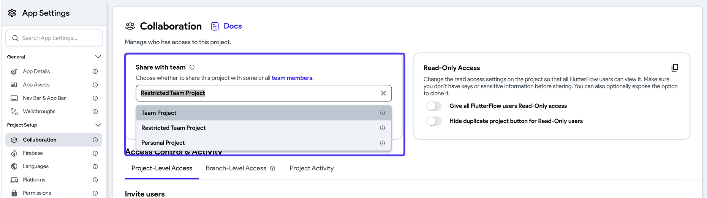

In FlutterFlow you can share projects with your entire organization (team), with individual users within your organization, or external users. 

## Sharing a Project with Team

To share a project with team members, use the **Share with team** dropdown in the **Collaboration** page of your project's settings, and select how you want the project to be shared:

- **Team project:** A project associated with your team and automatically visible to all team members. When a project is a Team Project, team members are automatically added as Editors. You can specifically designate team members as Viewers, but you cannot remove them. 
- **Restricted team project:** A project associated with your team but only visible to specific team members who are added directly. After selecting this option, you’ll need to manually choose the team members you want to share the project with. 
- **Personal project:** A project not associated with any team, where editing capabilities depend on the type of personal plan you have.

:::info
- The Team owner always has edit access to the project, regardless of who created or shared it, and retains full team plan capabilities.
- The Team owner can also selectively share the project with any number of team members.
- A [**Library**](../../resources/projects/libraries.md) project will not have the *Restricted Team Project* option.
- Sharing a project with team members is only available on the **Growth** plan and **higher**. Check out our [**pricing**](https://www.flutterflow.io/pricing) section.
:::

## Sharing a Project with External Collaborators

You can invite users to your project who are not part of your organization.
For instance, you might want to share your work with clients, stakeholders, or
team members of the client.

You can add users as Read Only users to any project regardless of your pricing plan in the **Collaborators** page of your project's settings.

:::info
- Users with read-only access will only be able to access that specific project
  and won't be able to access any shared *Teams* libraries (e.g., custom code,
  design system).
- You must verify your email before inviting users.
- If a user isn't already a FlutterFlow user, we will send them an invite email. Their status will be shown as Pending until they create an account.
:::

To add an external user as a collaborator as an Editor to a project, you first need to purchase a collaborator pass. 

To purchase a collaborator pass, go to the [My Teams](https://app.flutterflow.io/team) page and, under the **Collaborator Passes** section, click **Add Pass** and complete the checkout process. Once the pass is created, enter the user email and select the project (Team Project or Restricted Team Project) you’d like to grant them access to.

:::info
- You must be a Team Owner to purchase and assign a Collaboration Pass.
- Collaborator Passes can only be assigned to users who have a paid plan (Basic, Growth, or Business).
:::

    <iframe 
        src="https://demo.arcade.software/s5nU2VYbrMppj4CRxiGZ?embed&show_copy_link=true"
        title=""
        style={{
            position: 'absolute',
            top: 0,
            left: 0,
            width: '100%',
            height: '100%',
            colorScheme: 'light'
        }}
        frameborder="0"
        loading="lazy"
        webkitAllowFullScreen
        mozAllowFullScreen
        allowFullScreen
        allow="clipboard-write">
    </iframe>

## Transferring Project

:::danger
This step can not be undone. If you want to regain project ownership, the new
project owner will need to transfer ownership back to you.
:::

To transfer ownership to another user, navigate to **Settings & Integrations > Project Setup > Collaboration > Project-Level Access**, click on the current role and select **Owner**.

Note that users must be a part of your Team or be added through a Collaborator pass to be transferred ownership.

## Real-Time Collaboration

Real-Time Collaboration is a powerful feature that allows multiple builders to
work together on the same project or, rather same page and design system
simultaneously. With this, all builders can see the changes being made to the
page as they happen and can also make their own changes to the page without
interfering with the work of others.

This increases efficiency and productivity, as multiple builders can work on
various aspects of the project or together on the same page at the same time.

When multiple builders are on the same page, it looks like this:

:::info
Real-Time collaboration is only available on the **Growth** plan and **higher**. Check out our [**pricing**](https://www.flutterflow.io/pricing) section.
:::

## Transferring Project

:::danger
This step can not be undone. If you want to regain project ownership, the new
project owner will need to transfer ownership back to you.
:::

To transfer ownership to another user, navigate to **Settings & Integrations > Project Setup > Collaboration > Project-Level Access**, click on the current role and select **Owner**.

## Project Activity

You can see a running history of changes made while building that helps you
track progress and stay up to date on project changes.

:::info
Project Activity is only available to **Enterprise** users. Check out our [**pricing**](https://www.flutterflow.io/pricing) section.
:::

