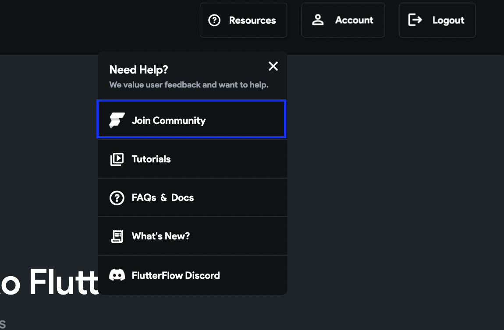

# Join the FlutterFlow Community

The FlutterFlow Community lives on a separate platform from your FlutterFlow editor account and requires a separate login. If you’re seeing errors like _"account not created"_ or _"password is wrong,"_ it’s likely because the community account hasn’t been set up yet.

:::info[Prerequisites]
You must be a registered FlutterFlow user to join the community.
:::

**Steps to Join the Community:**

  1. From your **FlutterFlow Dashboard**, click on **Resources** in the left-hand menu.

  2. Click **Join Community**.

  3. Check your inbox for an email from `no-reply@circle.so`.

  4. Open the email and click **Accept the Invitation**.

  5. Complete the signup process by setting a password.

  

  **Use the same email** associated with your FlutterFlow account to receive the invitation.  
  You can verify your email on your FlutterFlow Account Settings.

**Common Issues:**

  - **Didn’t receive the invite?**  
    Check your spam or promotions folder for an email from `no-reply@circle.so`.

  - **Email mismatch?**  
    If you used a different email to sign up for FlutterFlow, the invitation may not arrive. Confirm your registered email in your FlutterFlow account.

