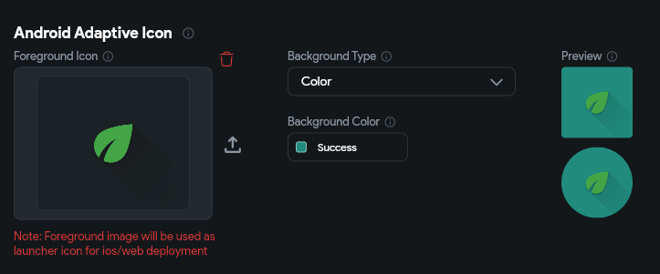

# General Settings
This section serves as the control center for configuring essential aspects of your app.

## App Details
This section allows you to customize a wide range of settings that are crucial for the overall functionality and appearance of your application. From basic configurations like project and package (bundle) name to more advanced settings like theme customization and navigation control.

### Change Project, Package, and Display Name

Modify the app or package name of your project from this settings. You can also define different package names based on the development environment selected. 

You can set a different name for the *App Store* and *Play Store* using the **Display Name**.

:::tip
After changing the package name, errors may appear on the toolbar due to invalidated Firebase config files. To resolve this, generate new config files by going to **Settings & Integrations > Project Setup > Firebase > Regenerate Config Files**.
:::

### Initial Page

You can specify your app's **Entry Page** and **Logged In** **Page** from this section.

- **Entry Page**: This serves as the home page for your app. When authentication is disabled, all users are directed to this page by default. If authentication is enabled, this page becomes the login, signup, or onboarding page for users who are not authenticated.
- **Logged In Page** (*available only if auth is enabled*): This page is displayed when the app starts for authenticated users. If a user successfully signs in, they are automatically redirected to the page specified here. If the user is already authenticated, this page bypasses the Entry Page.

To set the page, simply choose the page that you want to use from the dropdown menu.

    <iframe 
        src="https://demo.arcade.software/EgYmUSzJ4IkHhG6fgpQ0?embed&show_copy_link=true"
        title=""
        style={{
            position: 'absolute',
            top: 0,
            left: 0,
            width: '100%',
            height: '100%',
            colorScheme: 'light'
        }}
        frameborder="0"
        loading="lazy"
        webkitAllowFullScreen
        mozAllowFullScreen
        allowFullScreen
        allow="clipboard-write">
    </iframe>

### Folder Organization

If you want the improved folder organization for your project, **Enable Updated Folder Organization**.  This is especially helpful for older projects; for new projects, this is enabled by default.

### Download Settings

- **Run "dart fix"**: Enabling this will run the `dart fix` command when downloading the code. This makes the generated code cleaner and potentially more performant.
- **Download Unused Project Assets**: Enable this option to download all assets, including those that are not currently used in the project. This is useful when you need to access and use the assets in custom code or other parts of your project.

### Routing & Deep Linking

Configure the global settings for navigation and deep link in your app. To learn, how to set up deeplinks, check out the **[Deep & Dynamic Linking](../../../ff-concepts/navigation-routing/deep-dynamic-linking.md)** guide.

## App Assets

This allows you to upload the images to be used by the app. From here, you can upload the Initial splash image and the image for the app launcher icon.

### Splash

Splash screens are the first thing users see when your app starts up. They give the app time to get ready while showing you something fun or informative. This screen typically contains the image or logo of the app.

The steps to configure the splash screen are as follows:

1. Navigate to the **Setting and Integrations** from the Navigation Menu > **General** section > **App Assets**.

2. Under the **Splash** section, click on the **Upload Image** button and upload the image you would like to display on the splash screen.
3. You can try any of the **Image Fit** options to determine how the uploaded image should display on the splash screen.
4. To control the image dimension by yourself, you can set the **width** and **height** properties.
    - To set an **exact size,** select **PX** and enter the desired values.
    - To set the dimensions as a **% of the screen size**, select **%** and enter the desired value.
5. The **Min Duration** property helps you set the time for which the splash screen will be visible, where (1000ms = 1 second).
6. You can also set a **Background Color** to match the background of the image.
7. In mobile apps, you might occasionally notice a blank white screen briefly appearing (as the Flutter engine loads) before the splash screen is displayed. To change the color of this screen, use the **Pre-loading** Color property.
8. Typically, web apps don't use a splash screen, so If you prefer a more traditional web experience, you can choose to **Disable for Web**.

### Launcher Icon

The launcher icon (also known as the app icon) represents your application. When you open the launcher app, it shows the app icons for all the installed apps. It acts as an entry point for your app. The image asset that you will upload here will be used as the app launcher icon.

To add the app launcher icon:

1. Click on the **Setting and Integrations** from the Navigation Menu (left side of your screen).
2. Under the **General** section, select **App Assets**.
3. Under the **Launcher Icon** section, click on the **Upload Image** button.
4. By clicking on the **Unset** dropdown menu, you can also select from the already uploaded images to the Project Media/Assets.
5. [Download the project](../../../testing-deployment-publishing/exporting-code/ff-cli.md) and run the following command in your terminal to generate the launcher icon:
    
    `flutter pub run flutter_launcher_icons:main`
    
6. [Run your app](../../../testing-deployment-publishing/running-your-app/run-your-app.md) on a real device or emulator to see the app launcher icon.

### Android Adaptive Icon

[Adaptive icons](https://developer.android.com/develop/ui/views/launch/icon_design_adaptive) are a design specification that allows app icons to adapt to different device environments without losing consistency in appearance. Unlike traditional launcher icons, which are static and can appear out of place or poorly scaled on different devices, adaptive icons consist of two layers:

1. **Foreground layer**: This layer usually contains the logo or main visual element of the icon.
2. **Background layer**: This provides a fill (color or background image) behind the foreground, which can be manipulated by the device’s software.

Here are the steps to add adaptive icons:

1. [Create an adaptive icon](https://developer.android.com/develop/ui/views/launch/icon_design_adaptive#design-adaptive-icons). You can either use this [online tool](https://icon.kitchen/) or use these [resources](#create-adaptive-icon) to create one.
2. Return to FlutterFlow and navigate to **Setting and Integrations > General** > **App Assets > Android Adaptive Icon.**
    1. Upload the **Foreground Icon**. If you use the online tool, you'll find it inside the `IconKitchen-Output > android > res > mipmap-xxxhdpi > ic_launcher_foreground.png`.
    2. For **Background Type**, you can either set the **Color** or **Image**. It's recommended to use a color that aligns with your app's branding for a cohesive look.
3. [Download the project](../../../testing-deployment-publishing/exporting-code/ff-cli.md) and run the following command in your terminal to generate the launcher icon:
    
    `flutter pub run flutter_launcher_icons:main`
    
4. [Run your app](../../../testing-deployment-publishing/running-your-app/run-your-app.md) on a real device or emulator to see the app launcher icon.

#### Useful resources

See the following resources for more information on Android adaptive icons.

#### Create Adaptive Icon

- [Create app icons in Android Studio](https://developer.android.com/studio/write/create-app-icons#create-adaptive)
- [Figma template](https://material.uplabs.com/posts/adaptive-icon-sticker-sheet) (requires login)
- [Affinity Designer template](https://cyrilmottier.com/2017/07/06/adaptive-icon-template/)
- [Bjango templates](https://github.com/bjango/Bjango-Templates) include adaptive icons
- [Adobe XD template](https://github.com/faizmalkani/adaptive-icon-template-xd)

#### Adaptive Icon Fundamentals

- [Understanding Android Adaptive Icons](https://medium.com/google-design/understanding-android-adaptive-icons-cee8a9de93e2)
- [Designing Adaptive Icons](https://medium.com/google-design/designing-adaptive-icons-515af294c783)
- [Implementing Adaptive Icons](https://medium.com/google-developers/implementing-adaptive-icons-1e4d1795470e)

## Nav Bar & App Bar
See how to configure the [Nav Bar](../../ui/pages/page-elements.md#enable-nav-bar-in-settings) and the [App Bar](../../ui/pages/page-elements.md#appbar).
