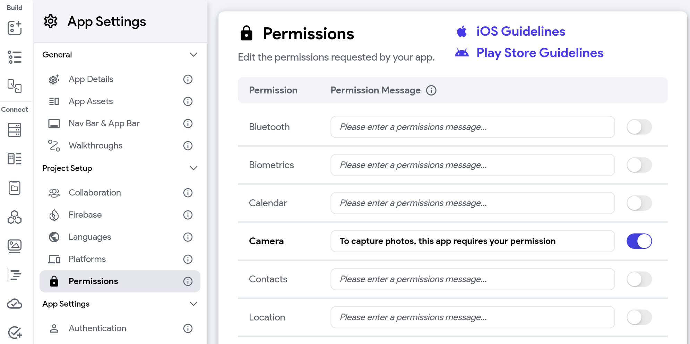
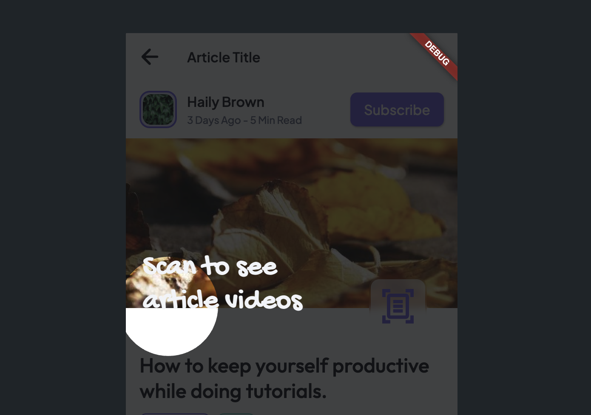

import Tabs from '@theme/Tabs';
import TabItem from '@theme/TabItem';

# Project Setup

Setting up a project in FlutterFlow ensures that your app is prepared to provide a robust and user-friendly experience across different platforms and regions. By adding necessary permissions, enabling multiple platforms, and supporting multiple languages, you can expand your app's reach and functionality while maintaining high standards of performance and user satisfaction.

## Permissions

In your app, you must be transparent and get upfront consent before using the user's private information, such as location, health data, photos, or any information that reveals their identity via the camera and/or microphone. This is done by adding a permission flow just before accessing the data.

We automatically add permissions whenever you add features that access the user's private data. You still need to add permission messages. These messages help users clearly understand how your app will use the data it is requesting.

:::info
- You cannot show custom permission messages on Android, so the messages added here are displayed only on iOS devices. To write a clear permission message, see [**Apple's Human Interface Guidelines**](https://developer.apple.com/design/human-interface-guidelines/patterns/accessing-private-data/#requesting-permission).
- You cannot turn off permissions (with messages) added by FlutterFlow. This helps prevent issues during app review.
- See how to [**request permission**](#request-permission-action).
:::

<figure>
    
  <figcaption class="centered-caption">Asking for camera permission before capturing a photo</figcaption>
</figure>

### Adding a permission message

Although we add some default permission messages, you must update them to clearly explain the reason for requesting each permission.

To add a permission message:

1. Select **Settings & Integrations** from the left navigation menu.
2. Under **Project Setup**, select **Permissions**.
3. Customize the permission message for each permission. For permissions that are not yet added or enabled, turn on the toggle and enter the message. When the app runs, this message appears inside the standard alert dialog, between your app name and the action buttons.

For permissions that are already added and cannot be turned off, leaving the message empty will use the hint text shown in the permission dialog.

### Adding a custom permission

Sometimes you might add a feature, such as a custom widget or custom action, that requires a permission that is not listed here. For example, you may add a speech recognition feature to your project. In that case, you can add the required permission and message for Android and/or iOS from here.

To add a custom permission:

1. Select **Settings & Integrations** from the left navigation menu.
2. Under **Project Setup**, select **Permissions**.
3. Click **+ Add Permission**.
4. Enter the **iOS Permission key** value, such as *NSSpeechRecognitionUsageDescription* or *NSMicrophoneUsageDescription*.
5. Enter the **Android Permission name** value, such as *RECORD_AUDIO* or *CAMERA*.
6. Enter the **Permission Message** that describes exactly how the data is used.
7. Click the Done icon on the right.
    

    <iframe 
        src="https://demo.arcade.software/AuxM1ChTm1v5mh59LfYK?embed&show_copy_link=true"
        title=""
        style={{
            position: 'absolute',
            top: 0,
            left: 0,
            width: '100%',
            height: '100%',
            colorScheme: 'light'
        }}
        frameborder="0"
        loading="lazy"
        webkitAllowFullScreen
        mozAllowFullScreen
        allowFullScreen
        allow="clipboard-write">
    </iframe>

:::info[Adding translations for permission messages]
You can also add multilingual permission messages by following the instructions [**here**](../../../ff-concepts/localization-accessibility/localization.md).
:::

### Request Permission [Action]

Using this action, you can request permission before accessing the user's private information, such as location, voice, contacts, and photos.

This action is helpful when you add a custom widget or action that accesses the user's personal information and does not have a built-in permission mechanism.

:::info
- Request permission only works on mobile platforms.
- No dialog is shown for the *Bluetooth* permission.
:::

<Tabs>
<TabItem value="1" label="Allow permission" default>

    <iframe 
        src="https://demo.arcade.software/EbHqL6taiZfjFhxrQsJK?embed&show_copy_link=true"
        title=""
        style={{
            position: 'absolute',
            top: 0,
            left: 0,
            width: '100%',
            height: '100%',
            colorScheme: 'light'
        }}
        frameborder="0"
        loading="lazy"
        webkitAllowFullScreen
        mozAllowFullScreen
        allowFullScreen
        allow="clipboard-write">
    </iframe>

</TabItem>
<TabItem value="2" label="Reject permission">

    <iframe 
        src="https://demo.arcade.software/6L0VxKxig1wu3uBLoGZq?embed&show_copy_link=true"
        title=""
        style={{
            position: 'absolute',
            top: 0,
            left: 0,
            width: '100%',
            height: '100%',
            colorScheme: 'light'
        }}
        frameborder="0"
        loading="lazy"
        webkitAllowFullScreen
        mozAllowFullScreen
        allowFullScreen
        allow="clipboard-write">
    </iframe>

</TabItem>
</Tabs>

#### Adding Request Permission action

To add this action:

1. Add a new action and select **Request Permissions** under **Alerts/Notifications**.
2. Set the **Permission Type**. Only permissions with a configured permission message appear here.
3. Add a [conditional action](../../control-flow/functions/conditional-logic.md#conditional-actions) to check the result. Set the condition variable to **Permission > Permission name** for the permission you requested.
4. Add the next actions under **TRUE** if permission is granted, or under **FALSE** if permission is denied. Then click **Close**.

    <iframe 
        src="https://demo.arcade.software/ou5BU61S0RQE3pRFkWNw?embed&show_copy_link=true"
        title=""
        style={{
            position: 'absolute',
            top: 0,
            left: 0,
            width: '100%',
            height: '100%',
            colorScheme: 'light'
        }}
        frameborder="0"
        loading="lazy"
        webkitAllowFullScreen
        mozAllowFullScreen
        allowFullScreen
        allow="clipboard-write">
    </iframe>

## Platforms
By default, the generated project can run on Android, iOS, and the Web without any additional effort. However, to run your app on desktop, you need to enable a platform (e.g., macOS, Windows, Linux) from this page.

### Advanced Android Settings

- **Kotlin Version**: There are various situations where you may need to modify or configure the Kotlin version in your Android project. This could include updating to the latest version, adapting the version to accommodate a specific library or tool, or other specific requirements. To change the default version, enter the value here.
- **Minimum SDK Version**: This defines the lowest version of Android that your app can run on. Setting a higher minimum SDK version ensures your app can use newer APIs and features but may limit the devices that can install it.
- **Compile SDK Version**: This refers to the version of Android that your code is compiled against. It determines the APIs your app can use. To change it, enter the desired SDK version here.
- **Target SDK Version**: This is the version of Android that your app is intended to run on. It helps Android ensure forward compatibility by applying certain behavior changes only if the target SDK is high enough. To adjust this, enter the desired version here.

### Advanced iOS Settings

- **Disable iPad Support:** If the app is specifically designed for an iPhone and doesn't provide a good user experience on an iPad, you might want to turn on this setting.
- **Minimum iOS Version**: This specifies the lowest version of iOS that your app can run on.

### Advanced Web Settings

- **Use Original Engine Initialization**: This setting uses the original Flutter web engine initialization, which can sometimes improve loading times in deployed web apps. Enable this option if you experience performance issues with the custom initialization process.
- **Use CanvasKit**: CanvasKit provides better performance and fidelity for rendering on the web by leveraging WebAssembly. This setting can improve the visual quality and performance of your app, especially for complex graphics and animations. Enable this option to use CanvasKit for rendering on the web.

:::warning
While FlutterFlow can generate project code for **macOS** and **Windows**, these platform targets are **currently in Alpha** and provided as-is. FlutterFlow does not provide infrastructure for building, debugging, or running apps on these platforms, and our **Support team is unable to assist** with issues related to macOS or Windows builds. However, the generated code can still be opened, built, and debugged using standard Flutter tooling such as Android Studio or VS Code.

This applies only to the deployment platform options, not to the FlutterFlow Desktop application itself.
:::

## Multiple Languages
To support multiple languages in your app, refer to the [localization guide](../../../ff-concepts/localization-accessibility/localization.md).

## Walkthroughs

A walkthrough in app development is a guided tour of the app's features and functionality, typically presented to the user when they first launch the app. It is designed to help new users understand how to use the app and navigate its various sections.

For example, consider a news article app. When a new user opens the app for the first time, they might be greeted with a series of pop-ups that highlight key features such as watching article videos, subscribing to article updates, and filtering articles by tags.

    <iframe 
        src="https://demo.arcade.software/Hlmx2NL3oci23dKTPyjF?embed&show_copy_link=true"
        title=""
        style={{
            position: 'absolute',
            top: 0,
            left: 0,
            width: '100%',
            height: '100%',
            colorScheme: 'light'
        }}
        frameborder="0"
        loading="lazy"
        webkitAllowFullScreen
        mozAllowFullScreen
        allowFullScreen
        allow="clipboard-write">
    </iframe>

The steps to create and display a walkthrough in your app are as follows:

1. [Create walkthrough](#1-create-walkthrough)
2. [Start walkthrough](#2-start-walkthrough-action)
3. [Get notified on walkthrough skipped and completed](#3-get-notified-on-walkthrough-skipped-and-completed)

### 1. Create walkthrough

To create a walkthrough:

1. Navigate to **Settings and Integrations** > **General** > **Walkthroughs**, then click **Create New**.
2. Enter the **Name** and **Description**, then select the **Page** on which you want to show the walkthrough. The name you enter will be used to initiate the walkthrough later.
3. Next, add the steps for your walkthrough. Each step acts as a separate screen or popup that animates to highlight the UI element. To add steps:
    1. Click on the **+ Add Step**.
    2. Choose the widget to highlight by clicking **Widget Unset**. In the right-side preview, select the desired widget and click **Confirm**.
    3. When the widget is in focus, you may want to present information about it; this could be simple text or a custom component (e.g., text with an arrow). You have complete control over what you want to display via a [component](../../../resources/ui/components/intro-components.md). Click the diamond icon to create a new component and then set it to **Content**.
    4. You can also choose where the content appears by setting the **Content Alignment**.
    5. Choose a **Focus Shape** for the widget—either **Circle** or **Rectangle**.
    6. Pick an **Overlay Color** that you want to display when the widget is highlighted.
    7. By default, we also add a skip button on the screen, and you can align it using the **Skip Alignment** option.
    8. Add additional steps by repeating the process for all UI elements you wish to feature.
        
4. To preview the walkthrough, click the **Start Preview** button and use the arrows to navigate through the steps.
5. To rearrange the steps, enable the **Reorder** option and then use the arrows to adjust their sequence.
6. Click **Add Walkthrough** to save.

    <iframe 
        src="https://demo.arcade.software/6rIFN4jqc7NjL05gMaIX?embed&show_copy_link=true"
        title=""
        style={{
            position: 'absolute',
            top: 0,
            left: 0,
            width: '100%',
            height: '100%',
            colorScheme: 'light'
        }}
        frameborder="0"
        loading="lazy"
        webkitAllowFullScreen
        mozAllowFullScreen
        allowFullScreen
        allow="clipboard-write">
    </iframe>

### 2. Start Walkthrough [Action]

After creating a walkthrough, you can display it on a page using the Start Walkthrough action. Follow the steps below to add this action on page load.

1. Walkthroughs are generally presented immediately upon page load. Therefore, open the page where you would like the walkthrough to be shown.
2. Select **Actions** from the Properties panel (the right menu), and click **Open**. This will open an **Action Flow Editor** in a new popup window.
3. Ensure **On Page Load** is selected and click **+ Add Action**.
4. On the right side, search and select the **Walkthrough > Start Walkthrough** (under *Widget/UI Interactions*) action.
5. Click **Select Walkthrough** and choose the walkthrough you created.

    <iframe 
        src="https://demo.arcade.software/lf5ih1Hu2a6VChqMWXIm?embed&show_copy_link=true"
        title=""
        style={{
            position: 'absolute',
            top: 0,
            left: 0,
            width: '100%',
            height: '100%',
            colorScheme: 'light'
        }}
        frameborder="0"
        loading="lazy"
        webkitAllowFullScreen
        mozAllowFullScreen
        allowFullScreen
        allow="clipboard-write">
    </iframe>

### 3. Get notified on walkthrough skipped and completed

Sometimes, you might want to get a callback to know whether the walkthrough is skipped or completed. For example, you could set up a callback to gather analytics or trigger a specific action once the walkthrough is finished, such as directing the user to a new page or enabling certain features of the app.

When a walkthrough is added on a page, you'll see the following types of actions, also called callbacks, and you can choose any of them to add actions under it.

- **On Walkthrough Complete**: Actions added here run when the user finishes all the steps of the walkthrough.
- **On Walkthrough Skip**: Actions added here run when the user chooses to skip the walkthrough.

### Video guide

If you prefer watching a video tutorial, here's the one for you:

    <iframe 
        src="https://www.youtube.com/embed/FFpR1SDrZEQ"
        title=""
        style={{
            position: 'absolute',
            top: 0,
            left: 0,
            width: '100%',
            height: '100%',
            colorScheme: 'light'
        }}
        frameborder="0"
        loading="lazy"
        webkitAllowFullScreen
        mozAllowFullScreen
        allowFullScreen
        allow="clipboard-write">
    </iframe>

### FAQs

How do I fix a walkthrough that is misaligned or not focusing on the correct widget?

This issue typically arises when a widget's animation and the walkthrough start simultaneously. As the walkthrough initiates, it captures the widget's initial position before the animation completes. Consequently, after the animation concludes, the widget may have shifted to a different location, leading to misalignment.

To resolve this, simply add a delay ([Wait](../../../resources/control-flow/time-based-logic/wait-action.md) action) before initiating the walkthrough. Make sure the wait duration is equal to or greater than the duration of the animation.

My widget is not highlighting on a scrollable page. What should I do?

We are aware of a limitation where widgets that are not visible on a page (i.e., you need to scroll down to see them) may not be highlighted. We are actively working to resolve this issue. As a temporary workaround, you can try placing the widget in an area that is visible without scrolling. We appreciate your patience and hope to have a fix soon!

