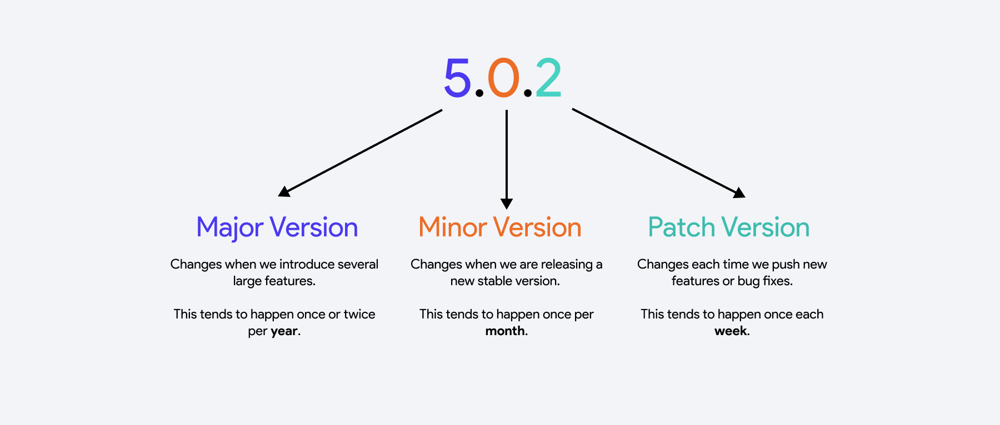
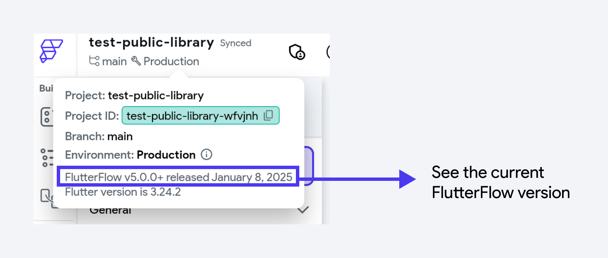
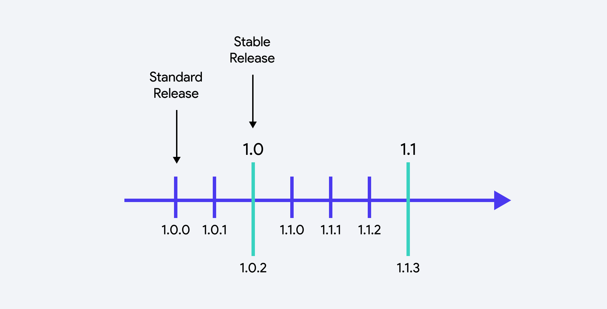

# Pinning Projects to Stable FlutterFlow Versions

FlutterFlow is constantly evolving to provide new features, address bugs, and keep up-to-date with Flutter and third-party packages. However, frequent updates can introduce unwanted changes that break existing projects—especially those that rely on custom code with external dependencies.

To mitigate these issues, FlutterFlow offers a **version management** system that allows you to pin your project to a particular [*stable release*](#stable-release-corresponds-to-minor-version) of FlutterFlow. Projects pinned to a stable release will **not automatically receive the latest FlutterFlow updates**, giving you more control over your development workflow. 

However, pinning to a stable release means that you will not be able to use the latest features and there may be bugs that are not fixed until subsequent releases. **We only recommend doing this if you have a complex app with custom code dependencies.**

:::info
Currently, the ability to pin a FlutterFlow project to a stable version is only available to **Enterprise** users.
:::

## When should you pin your project to a stable version?

Pinning your project to a stable version of FlutterFlow offers the following benefits:

- **Prevents Unexpected Breakages:** FlutterFlow updates can introduce errors into your project—particularly when you have custom code. Pinning to a stable release reduces the risk of unexpected changes to your project.
- **Gives Control Over Update Timing:** FlutterFlow updates might occur at inopportune times (e.g. right before you plan to release a new version of your application). Pinning your project to a stable version allows you to choose **when** to move your project to a newer release.

## Key Concepts

To understand FlutterFlow's version management system, it's important to understand **Semantic Versioning**. 

FlutterFlow tends to release a new version of the product each week. When a new version is released, the overall version number is incremented. 

The version number consists of three parts:

- **Major Version:** Incremented when introducing substantial changes that significantly alter the product.
- **Minor Version:** Incremented for changes that notably enhance or modify the FlutterFlow development experience—such as upgrading to a new Flutter version or adding a large feature.
- **Patch Version:** Incremented with routine releases that include new features, improvements, or bug fixes. 

You can see what version of FlutterFlow you are using by looking at the top left hand corner of the builder. 

#### Standard Release [Corresponds to Patch Version]

A **Standard Release** of FlutterFlow is released approximately every week. However, this is subject to change based on user needs.

When your project is **not pinned** to a stable release (default behavior), you will automatically use the **latest standard release.**

#### Stable Release [Corresponds to Minor Version]

A **Stable Release** of FlutterFlow is released each time a new **Minor Version** of FlutterFlow is created. This happens when:

- New features have undergone more testing
- There has been significant changes to project code generation
- There has been an update to the underlying Flutter or Pubspec dependency versions

Stable releases are usually deployed each month. A stable release will correspond with an underlying standard release (i.e. 1.0 corresponds to 1.0.2 in the above diagram). 

:::note
Each stable release will be supported for **6 months** before you are forced to upgrade to the next stable version. 
:::

## Pinning Your Project

To pin your project, navigate to **Settings and Integrations > General > App Details >Version Pinning** section and select the stable release you want to lock into. Once you update the pin your project to a stable version, you can only edit the project using that version of FlutterFlow.

:::info
You can only pin a project to a stable version if you are the **Project Owner**.
:::

### Modifying the Pinned Version

You have several options when it comes to modifying pinned version of your project:

- **Upgrade to more recent Stable Version**: When a new stable version is released, you will see it as an option in the dropdown shown above. You can upgrade the pinned version to a more recent stable version whenever they become available. Newer stable versions will have higher numbers (i.e., 5.1 is newer than 5.0)
- **Downgrade to a previous Stable Version:** You can downgrade to a prior stable release (i.e., downgrade from 5.1 to 5.0), however, **changes made since upgrading will be lost** (i.e., changes made after modifying pinned version from 5.0 to 5.1). Therefore, we recommend [commiting](https://docs.flutterflow.io/collaboration/branching/#create-commits) all changes on the main branch before upgrading - plus testing after upgrading so you can quickly downgrade if necessary.
- **Set to *Latest Version* (Unpinned):**  You can unpin your project by setting it to the *Latest Version* which will use the latest [standard release](#standard-release-corresponds-to-patch-version).
- **Opt-in to the *Next Stable*:** Your project may be on a standard version that does not have a corresponding stable version (i.e., you are on 5.0.1 but the 5.0 stable will correspond to 5.0.4). In that case, you can choose to opt-in to the *Next Stable Version*. This will pin your project to the next stable version once it becomes available. 

### Accessing the Proper Stable Version
As mentioned above, once you update the pin your project to a stable version, you can only edit the project using that version of FlutterFlow.

- **For Web**: You will be automatically redirected to the URL for the stable version that your project is pinned to when you open a project from the FlutterFlow dashboard (i.e. navigating to app.flutterflow.io or enterprise-[region].flutterflow.io).
- **For Desktop**: You will [**install**](https://www.flutterflow.io/desktop) the dedicated desktop application for the pinned stable release. The desktop app for stable releases won’t auto-update, you will need to install a new version when you upgrade your project to a new stable version.

## Recommended FlutterFlow Version Workflow

If you have a complex app with custom code that depends on specific versions of package dependencies, it may be helpful to pin your project to a specific version. This is the workflow we recommend for managing the version of your projects.

1. If you think your project should be pinned to a stable release, choose to [pin the project to the current (if available) or next stable release](#modifying-the-pinned-version). 
2. When a new stable version is released, you can choose when you would like to upgrade based on your own release schedule and development process. For instance, you might wait until you're not actively developing a new feature, or you could check the release notes first to see if there are must-have features that would prompt you to upgrade sooner.
3. When you’re ready to upgrade, commit all your changes on main to save your progress. Create a new branch from the main branch, [update the pinned version](#modifying-the-pinned-version), and test all functionalities to ensure compatibility. If any modifications are needed, make those changes in the new branch.
4. Run your app on the platforms you support—using a simulator, emulator, or physical device to ensure everything works as intended. See the [Local Run documentation](https://docs.flutterflow.io/testing/local-run/) for details.
4. If everything looks good, you can merge the new branch into the main branch. However, to merge branches successfully, ensure that both the main branch and the new branch are pinned to the same FlutterFlow version! If for some reason your app is not working as expected, you can choose to leave or close the branch until you are ready to make the modifications needed to support the latest FlutterFlow version (i.e. upgrade dependencies/custom code).

:::tip
See the video [**here**](https://youtu.be/8Y1uyCC_dXE) for guidance on updating [**dependencies**](../../../ff-concepts/adding-customization/custom-code.md#manage-dependencies).
:::

## Version Management with Libraries

[Libraries](../libraries.md) have their own versions, and each library version corresponds to a specific FlutterFlow version. The FlutterFlow version of the library version is determined by the version used (pinned or otherwise) when the project was updated.

Library projects can also be pinned to a specific version, ensuring that all library versions use that FlutterFlow release until the pinned version is changed.

:::info
When you import a library into a project or another library, the library’s version must be lower than the version used for the project it’s being imported into; otherwise, you will encounter an error.
:::

## FAQs

What happens if I downgrade to a lower version of FlutterFlow after making changes in a higher version?

Any changes made in a higher version will be lost when you revert to a lower version (e.g., you made changes when you upgraded from 5.0 to 5.1, but then you want to downgrade back to 5.0). 
**To avoid data loss, thoroughly test your app after upgrading to ensure you want to continue with the updated version.**

Can I edit my project in multiple versions of FlutterFlow?

No. If your project is not pinned to a specific version, you’ll always use the latest FlutterFlow release. If your project is pinned to a specific version of FlutterFlow, you will be prompted to edit the project in that version.

How often are new stable versions released?

We aim to release new stable versions of FlutterFlow approximately once a month.

How can I see what's included in a new stable version?

We’re currently working on displaying release notes directly in the product, so you can easily review what’s been added or changed in each new stable version.

What if there are bugs in the FlutterFlow version I’m using?

If critical bugs arise, we may provide hotfixes or patches for older FlutterFlow versions. However, some fixes depend on updating the underlying Flutter framework or related dependencies, which isn’t always feasible for older versions. This is a risk of staying on an older version of FlutterFlow as opposed to always using the latest.

Can I change the pinned version to be different for various branches in my project?

Yes, you can pin different versions for different branches. We recommend first creating a new branch, updating it to a later version, making any necessary changes, and verifying that everything works as expected before merging it into your main branch.

However, to merge branches successfully, ensure that both the main branch and the new branch are pinned to the same FlutterFlow version.

What happens if there is no stable version available for me to pin my project to?

If your project was created and edited on a [standard release](#standard-release-corresponds-to-patch-version) that does not correspond to a [stable version](#stable-release-corresponds-to-minor-version), you may not see an earlier stable version to downgrade to - because this would reset the state of your project. Instead, you can choose to opt-in to the [*next stable release*](#pinning-your-project). 

What is the recommended approach if I have multiple projects and libraries that I am working on?

If you choose to pin your project to a stable version of FlutterFlow, we recommend pinning all your projects and dependencies to the same version - and trying to upgrade all projects to the next version around the same time. This makes it easier to ensure compatibilities between projects and libraries that depend on each other. Additionally, this makes it easier to have a single FlutterFlow desktop environment that you are working within. 

