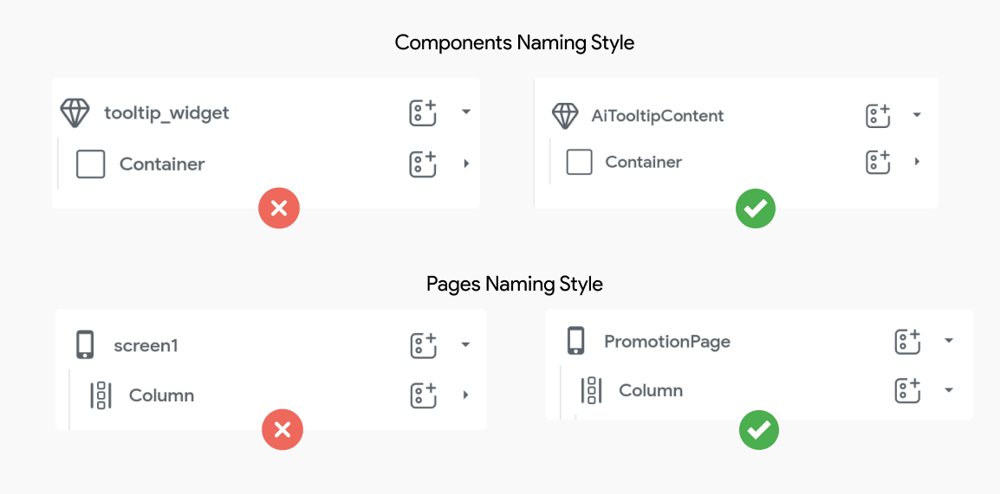
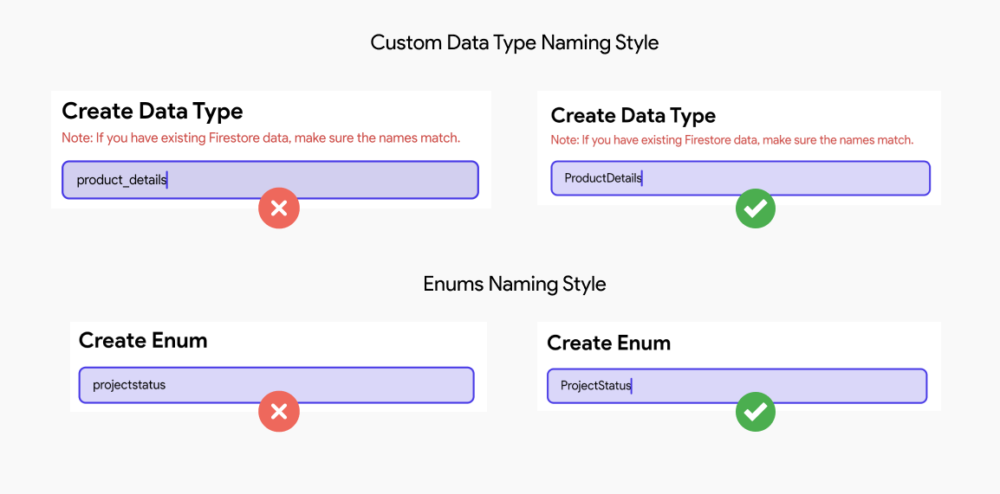
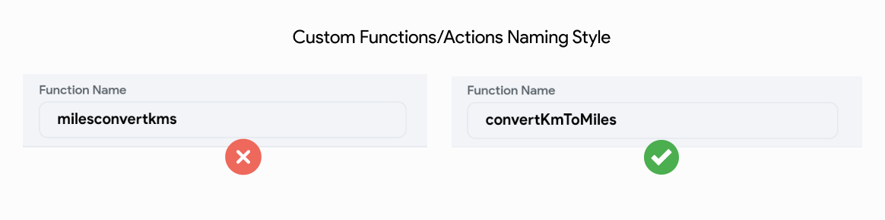

# Naming Variables & Functions

To make your code more maintainable, readable, and consistent, it’s essential to adopt clear naming conventions for variables, functions, and components.

Best practices for naming conventions in app development (especially for projects using Flutter), aim to improve code readability, maintainability, and consistency across the application. Here are some general guidelines tailored for different aspects of a Flutter project:

Various naming styles (as suggested by [Dart Effective Style Guide](https://dart.dev/effective-dart/style#identifiers)):

- **UpperCamelCase** (also known as PascalCase) names capitalize the first letter of each word, including the first.

- **lowerCamelCase** (also known as camelCase) names capitalize the first letter of each word, except the first which is always lowercase, even if it's an acronym.

- **lowercase_with_underscores** (also known as snake_case) names use only lowercase letters, even for acronyms, and separate words with _.

**General Principles**
- **Be Consistent:** Whatever conventions you choose, apply them consistently across the project.
- **Be Descriptive:** Names should be self-explanatory, reducing the need for additional comments to explain what a variable, function, or class does.
- **Avoid Abbreviations:** Unless it's a well-known abbreviation, spell out words to avoid confusion.

## Variable Naming Convention
This section outlines naming conventions for pages, components, state variables, custom data types, enums, and constants to ensure clarity and consistency throughout the project.

### Pages & Components
Use **UpperCamelCase** for all widgets, components, pages, and screen names to maintain consistency and readability. FlutterFlow ensures clarity by automatically adding "Widget" to widget names when generating code. For components, you can suffix the name with "Component" to clearly distinguish them. 

Similarly, for pages and screens, include "Page" or "Screen" in the name to indicate their purpose. This approach aligns with Dart conventions for class names and ensures a well-organized project structure.

:::tip[Do's]
- **Use UpperCamelCase for Names:** Always use **UpperCamelCase** for widgets, components, pages, and screens. Examples: `CustomButton`, `UserProfilePage`, `MainViewComponent`.

- **Include "Screen" or "Page" in Page Names:** Use "Screen" or "Page" in file names to identify UI screens or pages. Examples: `LoginScreen`, `SettingsPage`.

- **Use Prefixes for Clarity When Necessary:** Add a prefix if it significantly improves clarity or prevents naming conflicts. Example: `AdminUserProfile` (to differentiate it from `CustomerUserProfile` or `UserProfile`).

- **Be Descriptive and Clear in File Names:** Ensure names are descriptive enough to convey their purpose at a glance. Examples: `OrderConfirmationScreen`, `ProductDetailsPage`.
:::

:::danger[Don'ts]
- **Don’t Use Unnecessary Prefixes:** Avoid prefixes that do not add clarity or are redundant. Bad Example: `AppPrimaryButton` (if `PrimaryButton` is sufficient).

- **Don’t Add "Widget" Explicitly:** Avoid adding "Widget" to class or component names manually, as FlutterFlow already appends it during code generation. Bad Examples: `ButtonWidget`, `ProfileCardWidget`.

- **Don’t Use LowerCamelCase for Class Names:** Reserve **lowerCamelCase** for variables and methods, not for components, or pages. Bad Examples: `loginButton`, `userProfile`.

- **Don’t Mix Naming Conventions:** Maintain consistency with UpperCamelCase for all widgets, components, pages, and screens. Bad Examples: `userLogin`, `Profilecard`, `headerView`.

- **Don’t Use Generic Names Without Purpose:** Avoid overly generic names that do not clearly convey the file’s intent. Bad Examples: `Main`, `View`, `Screen1`.

:::

Note that the style guidelines for Pages and Components also apply to **[Custom Widgets](../ff-concepts/adding-customization/custom-widgets.md)**, as Pages and Components created in FlutterFlow are internally generated as widgets.

### Custom Data Types & Enums

When naming custom data types and enums, use **UpperCamelCase** for consistency and clarity. Ensure that names are descriptive, providing a clear representation of the entity or purpose.

:::tip[Do's]

- **Use UpperCamelCase for Custom Data Types:** Name your custom data types using **UpperCamelCase**. Ensure that names are clear, concise, and descriptive, reflecting the entity they represent. Good Examples: `UserModel`, `ProductDetails`, `OrderItem`.

- **Use consistent naming for Enum Names and Values:** Use **UpperCamelCase** for the enum name such as, `Status`, `ConnectionState`, `UserRole` and **lowerCamelCase** for its values e.g., `{active, inactive, pending}`. This approach aligns with Dart's enum naming guidelines and ensures consistency.

- **Use Plural Names for Lists:** If the data type represents a List, use a plural name to clarify its purpose. Good Example: `OrderItems` (to represent multiple `OrderItem` objects).
:::

:::danger[Don'ts]

- **Don’t Use All Lowercase or Mixed Case for Custom Data Types:** Avoid using all lowercase or inconsistent casing in data model class names, as it reduces readability. Bad Example: `usermodel`, `product_details`.

- **Don’t Use Vague or Non-Descriptive Names**: Avoid using generic or unclear names that do not clearly describe the data entity. Bad Example: `DataModel`, `Entity`, `Item`.

- **Don’t Mix Naming Conventions for Enums:** Maintain consistent capitalization between enum names and their values. Bad Example: `enum UserRole { Admin, EDITOR, viewer }`
:::

For datatype fields, we use the same convention as [State variables](#variables). 

### Constants

Flutter prefers using a lowercase `k` prefix for constants to indicate their immutability, especially for project-specific constants. This approach is more concise and aligns with Dart's common practices. Use **SCREAMING_SNAKE_CASE** only when contributing to global or legacy projects where it is already in use.

:::tip[Do's]
- **Start Constants with a k Prefix:** Always use a lowercase `k` followed by **UpperCamelCase** for constants in FlutterFlow projects.
- **Use Descriptive and Contextual Names:** Clearly describe the purpose of the constant. Avoid using abbreviations unless they are widely understood. Examples: `kDefaultPadding`, `kMaxUploadSizeMb`
:::

:::danger[Don'ts]
- **Don’t Omit the k Prefix for Constants:** Avoid using plain names for constants in a Flutter-specific project, as they might conflict with variables or methods. Bad Examples: `padding`, `uploadSize`.
- **Don’t Use Vague or Generic Names:** Avoid using names that fail to describe the purpose of the constant. Bad Examples: `VALUE`, `DATA`, `X`, `Y`.
:::

### Variables

State variable & Data Type field names follow the **lowerCamelCase** naming style to align with Dart's conventions.

:::tip[Do's]
- **Be Descriptive and Clear:** Use variable names that clearly describe their purpose, avoiding generic or vague terms. Examples: `isFormValid`, `errorMessage`, `availableProducts`.
- **Prefix Boolean Variables with `is`, `has`, or `should`:** For readability, use prefixes that denote the variable's purpose when naming Boolean values. Examples: `isActive`, `hasErrors`, `shouldReload`.
- **Use Consistent Prefixes to denote state:** When managing UI or asynchronous state, use prefixes like `current`, `selected`, or `pending` for better context. Examples: `currentTabIndex`, `selectedUserId`, `pendingAction`.
:::

:::danger[Don'ts]
- **Don’t Use Abbreviations or Single Letters:** Avoid abbreviations or single-character names that obscure the variable's intent. Bad Examples: `usrNm`, `f`, `cnt`.
- **Don’t Use Generic Names:** Avoid using generic terms that do not convey the variable’s purpose. Bad Examples: `data`, `value`, `temp`.
- **Don’t Start Variables with Uppercase:** Follow Dart conventions by starting variable names with lowercase. Bad Examples: `UserName`, `IsLoading`.
:::

## Function Naming Convention
This section defines naming conventions for custom functions, actions, and action blocks to maintain consistency, readability, and ease of understanding across the codebase.

### Custom Functions & Actions

Custom functions and custom actions created in the Custom Code tab of FlutterFlow should follow the **lowerCamelCase** naming convention. These typically reflect an action or behavior.

:::tip[Do's]
- **Be descriptive and concise:** Use clear, meaningful names that describe the action or purpose of the function (e.g., `validateForm` instead of `doCheck`, or `fetchUserData` instead of `userData`).
- **Use action-oriented names:** Start with verbs to indicate behavior (e.g., `submitForm`, `processPayment`).
:::

:::danger[Dont's]
- **Avoid using underscores or spaces:** Names like `fetch_user_data` do not align with **lowerCamelCase** conventions.
- **Avoid redundant prefixes or suffixes:** There’s no need to prefix with `custom` or suffix with `Func` unless absolutely necessary for clarity (e.g., `customSubmitFormFunc` is redundant).
- **Don’t use overly generic names:** Avoid vague terms like `doSomething` or `functionOne`, which don’t provide context.
:::

Note that **[Action Blocks](../resources/control-flow/functions/action-blocks.md)** should follow the same naming convention as custom actions, as they are both technically Dart functions internally in the generated code.
