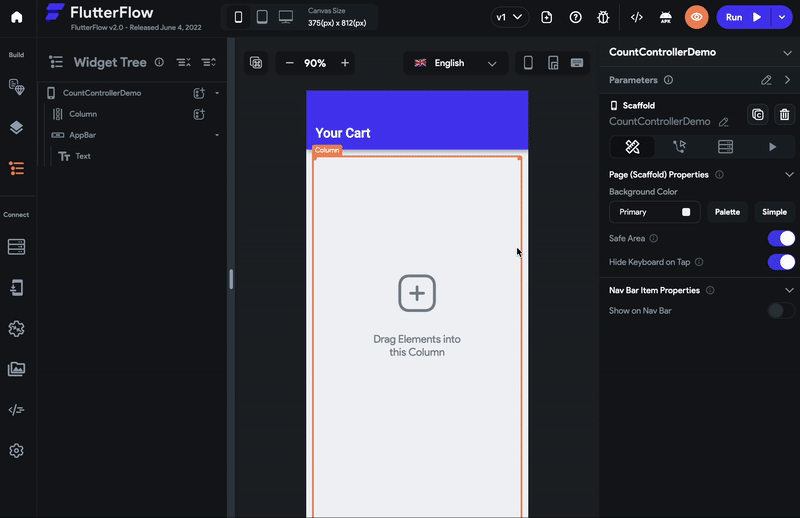
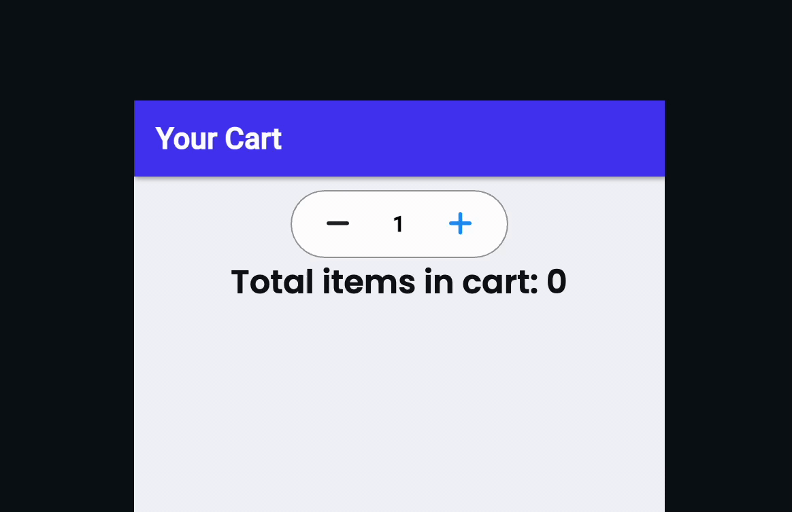
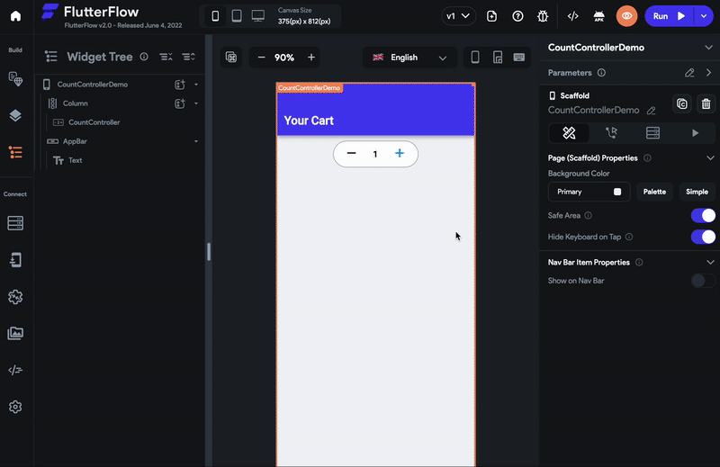

# CountController

The CountController widget is used to increment and decrement the count or number.

You could use the CountController widget to set the quantity of any product when buying in an e-commerce app.

## Adding CountController to your project

Here's an example of how you can use a CountController widget in your project:

1. First, drag the **CountController** widget from the **Form Elements** tab (in the Widget Panel) or add it directly from the widget tree.
2. Move to the properties panel (in the right) and scroll down to the **Count Controller Properties**.
3. The number on CountController appears as soon as it is loaded, called the Initial Count, 0 by default. To change this initial count, enter the value in the **Initial Count** input box. You can also set this value dynamically by having it **Set from Variable**. This can be used to display the default quantity of a product in an E-commerce app.
4. The Step Size property sets the value by which the count should be increased or decreased. The default value is 1. To change this, enter the value in the **Step Size** input box.
5. To allow users to set the valid count or quantity, you can limit the CountController range (min and max count) by specifying the value in the **Minimum** and **Maximum** input boxes.

## Trigger action on count change

Let's see how to trigger an action when the count changes on this widget. This is helpful when you want to update the latest count in your backend (make API call, create/update Firestore document) as the count changes.

To do so:

1. Select **CountController**, select **Actions** from the Properties panel (the right menu), and click **+ Add Action**.
2. You will notice that the **Type of Action** (aka callback) is already set to **On Count Changed**. That means actions added under this will be called whenever the count changes.
3. Now you can add any action here.

Here is an example of updating the count in an [app state variable](../../../../resources/data-representation/app-state).

## Customizing CountController

The Properties Panel can be used to customize the appearance and behavior of your widget.

### Customizing icon

To customize the decrement icon:

1. Select the **CountController** widget from the widget tree or the canvas area.
2. Move to the properties panel, and find the **Style Properties** section.
3. To change the icon, click on the already selected icon and then search and select the new icon.
4. To change the icon size, enter the value in the **Icon Size** property.
5. To change the icon color, find the **Icon Color** property, click on the box next to the selected color, select the color, and click **Use Color** or click on **Unset** and enter a Hex Code directly.

