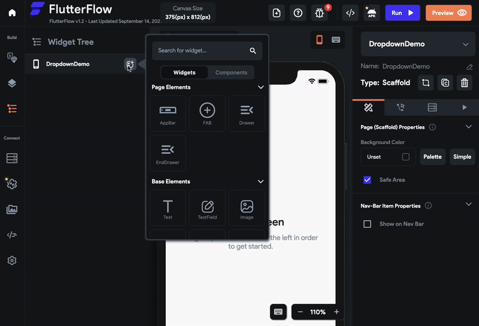
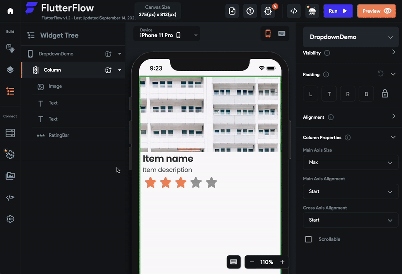
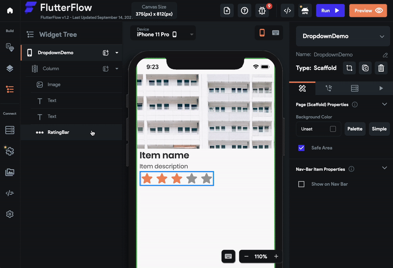
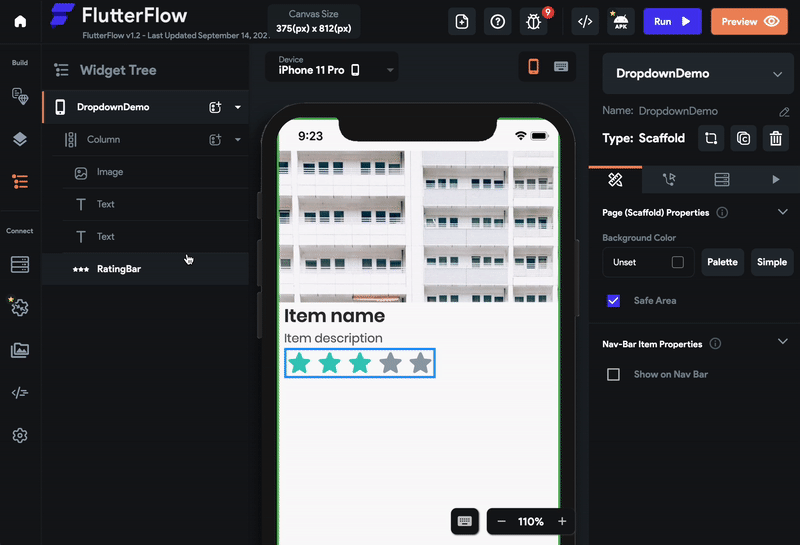
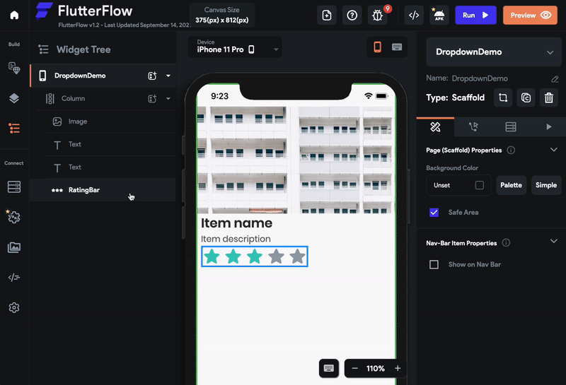

# RatingBar

The RatingBar widget is used to show a rating or collect ratings from users (this is an interactive RatingBar). For example, you can use the RatingBar widget inside an e-commerce app to show ratings for a product.

## Adding a RatingBar to Your Project

Here's an example of how you can use the RatingBar widget in your project:

1. First, drag the **Column** widget from the **Layout Elements** tab (in the Widget Panel) or add it directly from the widget tree. Set its **Cross Axis Alignment** to **Start**.
2. Now add one **Image** widget inside the column and set its **Width** property to **inf** and **Height** property to 200.
3. Add a **Text** widget (Inside the Column). Change the **name** to **Item Name** and the **Theme Style** to **Title 1.** Set the **Left Padding** to 10.
4. Add another **Text** widget. Change the **name** to **Item Description** and the **Theme Style** to **Subtitle 2.** Set the **Left Padding** to 10.
5. Finally, add the **RatingBar** widget from the **Form Elements** tab or add it directly from the widget tree.

### Collectings Ratings from Users (Interactive RatingBar)

To collect ratings from users:

1. Select **RatingBar** from the widget tree or from the canvas area.
2. Move to the Property Editor and scroll down to the **Rating Bar Properties** section.
3. Find the **Interactive** property and checkmark it (click on it).

### Setting The Rating Value

The Rating can be set by inputting an amount or set from a variable. This is only for a RatingBar that is not interactive.

To manually set the Rating value for the RatingBar:

1. Select **RatingBar** from the widget tree or from the canvas area.
2. Move to the Property Editor and scroll down to the **Rating Bar Properties** section.
3. Find the **Rating** property and change the default value.

:::info
You can also enter the value in decimal such as 1.5. When a decimal is used, a portion of the icon will be colored.
:::

### Customize the Icon

Here's an example of how you can customize the icons appearing in the RatingBar:

1. Select **RatingBar** from the widget tree or from the canvas area.
2. Move to the Property Editor and scroll down to the **Rating Bar Properties** section.
3. Find the **Icon Count** property and change the value to 10.
4. Set the **Icon Size** property to 30.
5. Find the **Icon Selector** property below, Click on the **Start Rounded** button, then search and select the icon name with **FontAwesome.smile**.

### Changing the Rated/Unrated Color

To change the rated and unrated color (color for icons that are not filled in) for the RatingBar:

1. Select **RatingBar** from the widget tree or from the canvas area.
2. Move to the Property Editor and scroll down to the **Rating Bar Properties** section.
3. Now, find the **Rated Color** property, Click on the box next to **Secondary**, select the color, and then click **Use Selected Color** or click on **Secondary** and enter a Hex Code directly. You can also choose the color by clicking on the Palette and Simple button.
4. Similarly, set the **Unrated** **Color** as well.

### Add Padding between Icons

To add padding between icons:

1. Select **RatingBar** from the widget tree or from the canvas area.
2. Move to the Property Editor and scroll down to the **Rating Bar Properties** section.
3. Find the **Icon Padding** property and enter the values.

:::info
Use the Lock button to change the Left, Top, Right and Bottom padding all at the same time. Unlocking will allow you to modify each value separately.
:::

### Changing the Axis

In a very rare case, you may want to make all icons (inside the RatingBar) appear vertically. This can be done using the Axis property.

To change the Axis:

1. Select **RatingBar** from the widget tree or from the canvas area.
2. Move to the Property Editor and scroll down to the **Rating Bar Properties** section.
3. Find the **Axis** dropdown and change it to **Vertical**.

## Trigger action on change

See how to [trigger an action when a selection changes](../../../../../resources/ui-building-blocks/widgets/widget-commonalities#trigger-action-on-selection-change) on this widget.