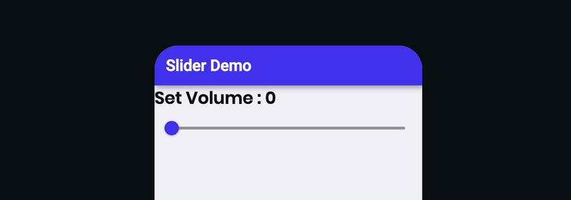
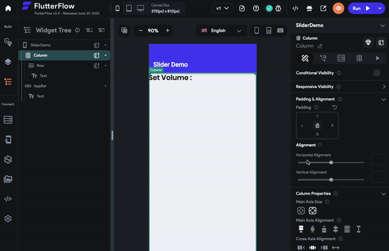
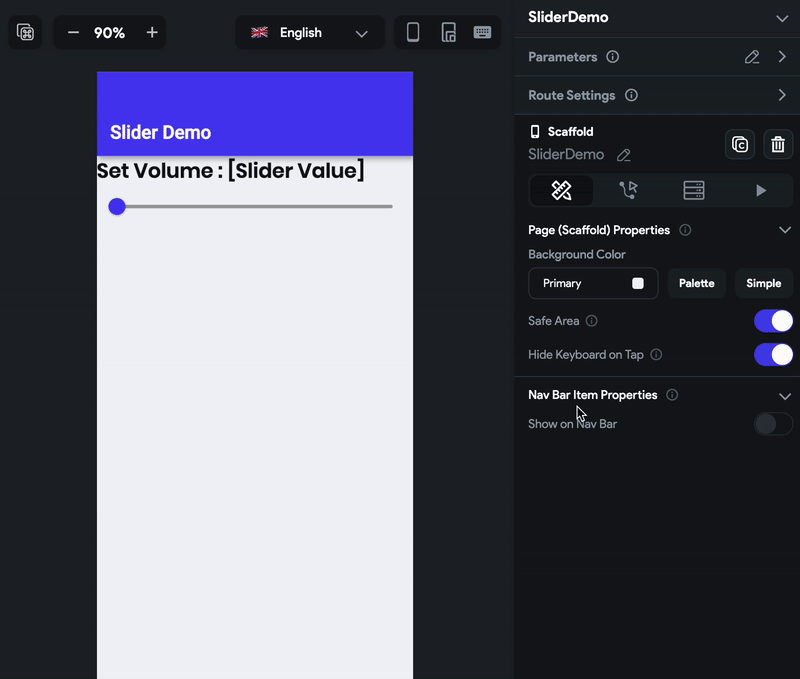
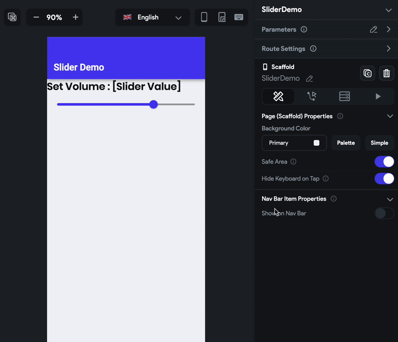
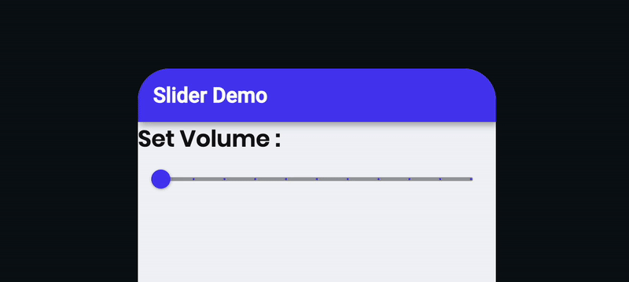

# Slider

The Slider widget is used to select a single value from a range of values. You define the min and max value for the slider, and users can choose the value between the specified range by dragging the slider thumb (sliding circle).

For example, you can use the Slider widget to allow users to set the volume, set the donation amount, etc.

## Adding Slider

Let's build an example of using the Slider widget and retrieve its value in a Text widget.

The steps to build the example are as follows:

1. First, add the **Slider** widget from the **Form Elements** tab or add it directly from the widget tree.
2. Now, add the **Text** widget to display the slider value.
3. Keep the **Text** widget selected, Move to the properties panel, and click on the **Set from Variable**. This will open a new panel.
    1. Set **Source** to **Widget State**.
    2. Set the **Available Options** to **Slider**. If you add multiple sliders, the names would be like Slider1, Slider2, and so on.
    3. Set the **Number Format Option** if you wish to.
    4. Click **Confirm**.

## Setting initial value

Sometimes you might want to display the slider with the default value. For example, showing the volume slider with the audible volume value. You can do so by setting the initial value for the Slider.

## Customization

You can customize the appearance and behavior of the widget using the various properties available under the properties panel.

### Setting platform type

You can set the platform type to *Adaptive or Android* for **this widget. Selecting the Adaptive type will display the widget in its native style. That means the widget will show iOS-style rendering when running on iOS devices and Android-style rendering when running on Android devices.

To set the platform type:

1. Select the **Slider** widget from the widget tree or the canvas area.
2. Move to the properties panel and open the **Platform** section.
3. Set the **Platform Type** among the **Android** or **Adaptive**.

### Defining slider range

You can define the slider range by setting the min and max values.

To set the min and max values:

1. Select the **Slider** widget from the widget tree or the canvas area.
2. Move to the properties panel and scroll down to the **Slider Properties** section.
3. Find the **Min** property and enter the value. This will be the start value of the range.
4. Find the **Max** property and enter the value. This will be the end value of the range.

### Setting step size

By default, you can move and stop the slider thumb at any place on the slider track. To make the slider thumb stop at a specific interval, you can set the step size value.

:::info
If the range is not evenly divisible by the step size, the slider thumb will stop at the closest value in the range.
:::

To set the step size:

1. Select the **Slider** widget from the widget tree or the canvas area.
2. Move to the properties panel and scroll down to the **Slider Properties** section.
3. Find the **Step Size** property and enter the value.

### Changing color

To change the slider colors:

1. Select the **Slider** widget from the widget tree or the canvas area.
2. Move to the properties panel and scroll down to the **Slider Properties** section.
3. To change the active color, find the **Active Color** property, click on the box next to the already selected color, select the color, and then click **Use Color** or click on an already selected color ****and enter a Hex Code directly. You can also choose the color by clicking the **Palette** and **Simple** button.
4. To change the inactive color, find the **Inactive Color** property, click on the box next to the already selected color, select the color, and then click **Use Color** or click on an already selected color ****and enter a Hex Code directly. You can also choose the color by clicking the **Palette** and **Simple** button.

### Showing slider value

You can show the slider value while moving the slider thumb on the track. The value appears as a tooltip above the slider thumb.

To show the slider value:

1. Select the **Slider** widget from the widget tree or the canvas area.
2. Move to the properties panel and scroll down to the **Slider Properties** section.
3. Find the **Show Value** property and turn on the toggle.

## Trigger action on change

See how to [trigger an action when a selection changes](../../../../../resources/ui-building-blocks/widgets/widget-commonalities#trigger-action-on-selection-change) on this widget.