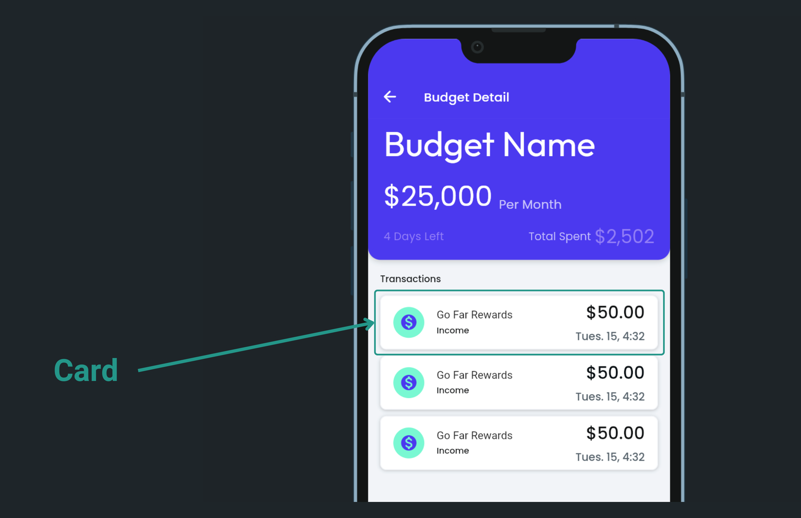

# Card

The [Card](https://api.flutter.dev/flutter/material/Card-class.html) widget is used to represent some related information in a box with rounded corners and a slight shadow for a 3D effect. For example, you can use a Card widget to show a Business card, restaurant information, movie details, etc.

The Card widget is often used with a List to display the item information for a specific record.

## Adding Card Widget

Here's an example of how you can use a Card widget in your project:

1. Open the [Widget Palette](../../../../intro/ff-ui/widget-palette.md) and locate the **Card** 
   widget under the **Layout Elements** tab. You can drag it into your desired location or add it directly from the widget tree or canvas area.
2. Start with adding a `Row` or `Column` widget inside the Card and build the UI as per your requirements.

<iframe src="https://www.loom.
com/embed/c2827a818b9549da997adf5e45e85f0f?sid=555f628d-9dbd-4874-9237-2c2b9b679c84" frameborder="0" allow="accelerometer; autoplay; clipboard-write; encrypted-media; gyroscope; picture-in-picture; web-share" referrerpolicy="strict-origin-when-cross-origin" allowfullscreen></iframe>

## Customizing

You can customize the appearance and behavior of this widget using the various properties 
available under the Properties Panel.

### Styling the Card

Styling helps you customize a widget that matches your design. The Card widget allows you to customize the background color, elevation, and rounded corners.

Here's how you stylize the Card widget:

1. Select the **Card** widget and move to the **Properties Panel > Card Properties**.
2. To change the background color, [modify the Color](../../../../resources/ui-building-blocks/widgets/widget-commonalities.md#change-color) property.
3. To change the elevation (depth or Z-axis), enter the value in the **Elevation** property.
4. To create the rounded border, use the **Border Radius** property. For uniform curvature on all sides, use the **Uniform Radius** option by sliding the adjustment bar or inputting your preferred value directly.

<iframe src="https://www.loom.
com/embed/8a33e1d3778d4d5ca35419966364b576?sid=6cde742f-b0b4-4385-bdf0-8d499df04c29" frameborder="0" allow="accelerometer; autoplay; clipboard-write; encrypted-media; gyroscope; picture-in-picture; web-share" referrerpolicy="strict-origin-when-cross-origin" allowfullscreen></iframe>

