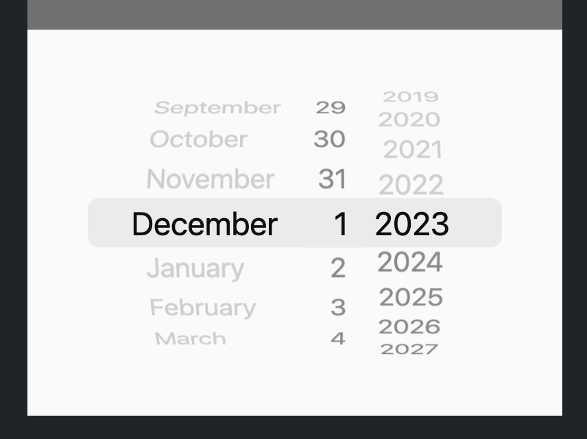
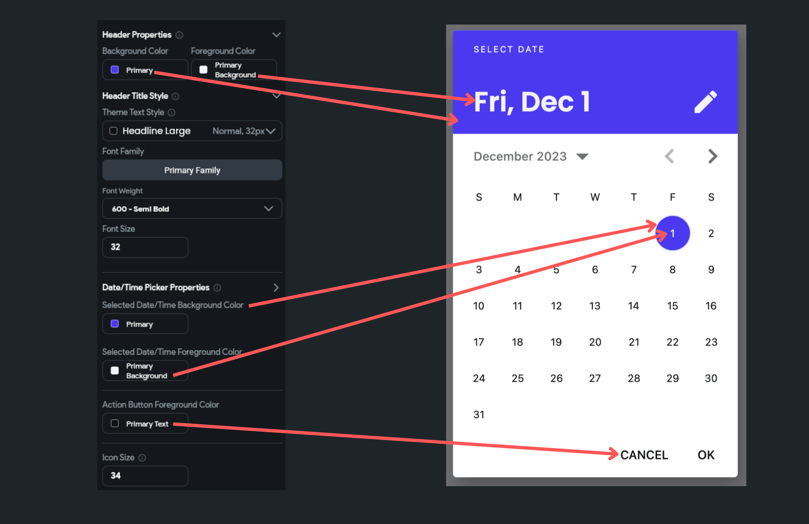

# DateTime Picker
This action allows the user to select a date and time. You could use it to schedule appointments, set a reminder for a specific date, choose travel dates and times, etc.

When this action is triggered, it opens the graphical calendar and clock interface that the user can interact with to select a specific date and time.

    <iframe 
        src="https://demo.arcade.software/HyKZpuo986EOfdG7IrQC?embed&show_copy_link=true"
        title=""
        style={{
            position: 'absolute',
            top: 0,
            left: 0,
            width: '100%',
            height: '100%',
            colorScheme: 'light'
        }}
        frameborder="0"
        loading="lazy"
        webkitAllowFullScreen
        mozAllowFullScreen
        allowFullScreen
        allow="clipboard-write">
    </iframe>

## Types Date/Time Picker

You can choose to open the following types of *Date/Time* picker dialog:

- **Date**: Allows you to only select a date.
- **Date+Time**: Allows you to select the date followed by the time.
- **Time**: Allows you to only select a time.

## Adding Date/Time Picker [Action]

Follow the steps below to add this action to any widget.

1. Select the **Widget** (e.g., Container, Button, etc.) on which you want to add the action.
2. Select **Actions** from the properties panel (the right menu), If it's the first action, click **+ Add Action** button. Otherwise, click the "**+**" button below the previous action tile (inside *Action Flow Editor*) and select **Add Action**.
3. Search and select the **Date/Time Picker** (under *Widget/UI Interactions*) action.
4. Set the [Date/Time picker type](#types-datetime-picker).
5. By default, the picker shows the current date/time. You can change this by adjusting the **Default Date/Time**.
6. To define the range of selectable dates, use the **Minimum Date/Time** and **Maximum Date/Time** properties. Click on **Unset** to specify your dates.
7. Control whether the past and future dates/times are selectable with **Allow Past Date/Time** and **Allow Future Date/Time**. **Tip**: If you explicitly set the min or max date, this option will be disabled.
8. For an iOS-style display, activate the **Use Cupertino-style** toggle.

9. For more personalized styling, turn off **Use Default Theme** and tweak the settings in the **Appearance Properties** section.

:::info
After the user has selected the desired date and time, the picker will close automatically, and the selected date/time can then be accessed via the ***Widget State > Date Picked**.*
:::

Here's an example of adding the date time picker action and displaying the value in a Text widget.

    <iframe 
        src="https://www.loom.com/embed/ffcbf0422511433b93bef7b08f7501a5?sid=cebeb57a-5bbc-41c4-9604-c9ba2b1aad32"
        title=""
        style={{
            position: 'absolute',
            top: 0,
            left: 0,
            width: '100%',
            height: '100%',
            colorScheme: 'light'
        }}
        frameborder="0"
        loading="lazy"
        webkitAllowFullScreen
        mozAllowFullScreen
        allowFullScreen
        allow="clipboard-write">
    </iframe>

